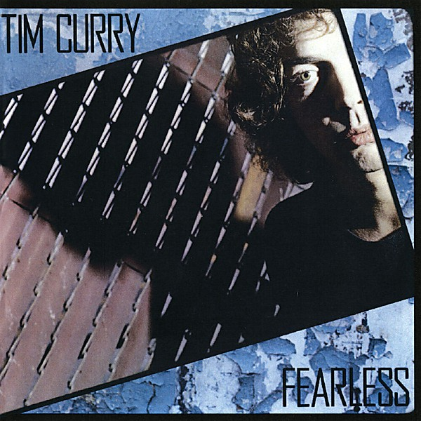

# Fearless

By **Tim Curry**

## Album Data

- **Catalog:** Beets
- **Format:** Digital, Album
- **Album:** Fearless
- **Artist:** Tim Curry
- **Albumartist:** Tim Curry
- **Genre:** Rock
- **MusicBrainz Album Artist ID:** [33ce4a70-005d-4563-bb6e-2d253fab9842](https://musicbrainz.org/artist/33ce4a70-005d-4563-bb6e-2d253fab9842)
- **MusicBrainz Album ID:** [38878d75-0ba6-47c6-b934-cc99bed3e96b](https://musicbrainz.org/release/38878d75-0ba6-47c6-b934-cc99bed3e96b)
- **MusicBrainz Release Group ID:** [b33afb38-6606-3cb4-b28b-96dc58b69c80](https://musicbrainz.org/release-group/b33afb38-6606-3cb4-b28b-96dc58b69c80)
- **Year:** 1979
- **Catalog #:** 
- **Label:** A&M Records
- **Total Tracks:** 09

## Album Tracks

### Track 01 - Right On the Money

- **Artist:** Tim Curry
- **Format:** MP3
- **Genre:** Rock
- **Length:** 3:14
- **MusicBrainz Track ID:** [8673853b-2b44-4926-b055-1a4f29a0202c](https://musicbrainz.org/recording/8673853b-2b44-4926-b055-1a4f29a0202c)
- **Title:** Right On the Money
- **Track:** 01
- **Year:** 1979

### Track 02 - Hide This Face

- **Artist:** Tim Curry
- **Format:** MP3
- **Genre:** Rock
- **Length:** 2:55
- **MusicBrainz Track ID:** [d0093bd7-ca69-4111-bec0-cc1360f78898](https://musicbrainz.org/recording/d0093bd7-ca69-4111-bec0-cc1360f78898)
- **Title:** Hide This Face
- **Track:** 02
- **Year:** 1979

### Track 03 - I Do the Rock

- **Artist:** Tim Curry
- **Format:** MP3
- **Genre:** New Wave
- **Length:** 4:45
- **MusicBrainz Track ID:** [96982688-5fd4-413f-b80a-bfe98b93cb67](https://musicbrainz.org/recording/96982688-5fd4-413f-b80a-bfe98b93cb67)
- **Title:** I Do the Rock
- **Track:** 03
- **Year:** 1979

### Track 04 - S.O.S

- **Artist:** Tim Curry
- **Format:** MP3
- **Genre:** Rock
- **Length:** 4:16
- **MusicBrainz Track ID:** [cd3681fb-5cb1-4863-b7a0-517e0e897359](https://musicbrainz.org/recording/cd3681fb-5cb1-4863-b7a0-517e0e897359)
- **Title:** S.O.S
- **Track:** 04
- **Year:** 1979

### Track 05 - Cold Blue Steel and Sweet Fire

- **Artist:** Tim Curry
- **Format:** MP3
- **Genre:** New Wave
- **Length:** 3:37
- **MusicBrainz Track ID:** [278e16d3-1fb7-4c70-81e3-9b28574ee4e7](https://musicbrainz.org/recording/278e16d3-1fb7-4c70-81e3-9b28574ee4e7)
- **Title:** Cold Blue Steel and Sweet Fire
- **Track:** 05
- **Year:** 1979

### Track 06 - Paradise Garage

- **Artist:** Tim Curry
- **Format:** MP3
- **Genre:** Rock
- **Length:** 6:11
- **MusicBrainz Track ID:** [0aec534e-23e2-43cb-92d4-ead05b2e3553](https://musicbrainz.org/recording/0aec534e-23e2-43cb-92d4-ead05b2e3553)
- **Title:** Paradise Garage
- **Track:** 06
- **Year:** 1979

### Track 07 - No Love On the Street

- **Artist:** Tim Curry
- **Format:** MP3
- **Genre:** Rock
- **Length:** 4:51
- **MusicBrainz Track ID:** [a17fec81-81f3-47c1-87ed-46ec081413f9](https://musicbrainz.org/recording/a17fec81-81f3-47c1-87ed-46ec081413f9)
- **Title:** No Love On the Street
- **Track:** 07
- **Year:** 1979

### Track 08 - Something Short of Paradise

- **Artist:** Tim Curry
- **Format:** MP3
- **Genre:** Rock
- **Length:** 3:21
- **MusicBrainz Track ID:** [f3ed5754-03b2-4c87-b672-91c0e2afa641](https://musicbrainz.org/recording/f3ed5754-03b2-4c87-b672-91c0e2afa641)
- **Title:** Something Short of Paradise
- **Track:** 08
- **Year:** 1979

### Track 09 - Charge It

- **Artist:** Tim Curry
- **Format:** MP3
- **Genre:** Rock
- **Length:** 5:17
- **MusicBrainz Track ID:** [920224cc-d88f-4f0f-ba61-e6ba46ffcf21](https://musicbrainz.org/recording/920224cc-d88f-4f0f-ba61-e6ba46ffcf21)
- **Title:** Charge It
- **Track:** 09
- **Year:** 1979

## See also

- [Vinyl: Fearless](../../Vinyl/Tim_Curry/Fearless.md)
- [Vinyl: ](../../Vinyl/Tim_Curry/Tim_Curry.md)
