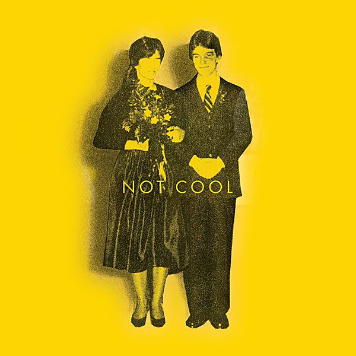

# They Will Bury You

By **Tim Easton**

## Album Data

- **Catalog:** Beets
- **Format:** Digital, Album
- **Album:** They Will Bury You
- **Artist:** Tim Easton
- **Albumartist:** Tim Easton
- **Genre:** Folk Rock
- **MusicBrainz Album Artist ID:** [b1a5d6ef-60fb-476e-b381-c867b92f0384](https://musicbrainz.org/artist/b1a5d6ef-60fb-476e-b381-c867b92f0384)
- **MusicBrainz Album ID:** [8132507d-ebe2-4794-a62b-53b4412d5760](https://musicbrainz.org/release/8132507d-ebe2-4794-a62b-53b4412d5760)
- **MusicBrainz Release Group ID:** [09f8cf96-8f0c-3266-a3e1-38fc4e7c19b4](https://musicbrainz.org/release-group/09f8cf96-8f0c-3266-a3e1-38fc4e7c19b4)
- **Year:** 2000
- **Catalog #:** 
- **Label:** 
- **Total Tracks:** 04

## Album Tracks

### Track 01 - They Will Bury You

- **Artist:** Tim Easton
- **Format:** ALAC
- **Genre:** Rock And Roll
- **Length:** 2:31
- **MusicBrainz Track ID:** [42e0327e-6f66-40cc-aa06-2b24fbebc2dd](https://musicbrainz.org/recording/42e0327e-6f66-40cc-aa06-2b24fbebc2dd)
- **Title:** They Will Bury You
- **Track:** 01
- **Year:** 2000

### Track 02 - Lexington Jail

- **Artist:** Tim Easton
- **Format:** ALAC
- **Genre:** Folk Rock
- **Length:** 3:08
- **MusicBrainz Track ID:** [1a4eb115-8a5a-4dc6-8af5-9074334c14db](https://musicbrainz.org/recording/1a4eb115-8a5a-4dc6-8af5-9074334c14db)
- **Title:** Lexington Jail
- **Track:** 02
- **Year:** 2000

### Track 03 - Kettle

- **Artist:** Tim Easton
- **Format:** ALAC
- **Genre:** Folk Rock
- **Length:** 2:58
- **MusicBrainz Track ID:** [b521bd4b-d56a-42a8-aa82-6e4f0bc78124](https://musicbrainz.org/recording/b521bd4b-d56a-42a8-aa82-6e4f0bc78124)
- **Title:** Kettle
- **Track:** 03
- **Year:** 2000

### Track 04 - Goin' on a Drunk

- **Artist:** Tim Easton
- **Format:** ALAC
- **Genre:** Folk Rock
- **Length:** 2:26
- **MusicBrainz Track ID:** [7c9e2dc4-6642-423a-87f1-a1ca9380059c](https://musicbrainz.org/recording/7c9e2dc4-6642-423a-87f1-a1ca9380059c)
- **Title:** Goin' on a Drunk
- **Track:** 04
- **Year:** 2000

## See also

- [Vinyl: They Will Bury You](../../Vinyl/Tim_Easton/They_Will_Bury_You.md)
- [Vinyl: ](../../Vinyl/Tim_Easton/Tim_Easton.md)
