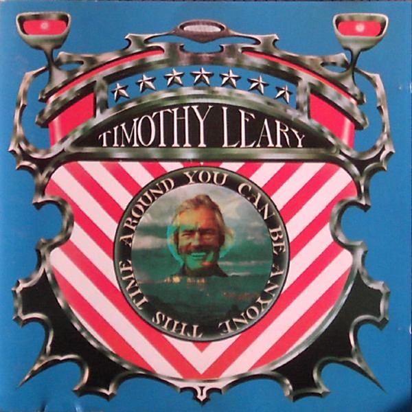

# You Can Be Anyone This Time Around

By **Timothy Leary**

## Album Data

- **Catalog:** Beets
- **Format:** Digital, Album
- **Album:** You Can Be Anyone This Time Around
- **Artist:** Timothy Leary
- **Albumartist:** Timothy Leary
- **Genre:** Psychedelic Rock
- **MusicBrainz Album Artist ID:** [0530b969-4f0c-4594-b970-181a8361abb6](https://musicbrainz.org/artist/0530b969-4f0c-4594-b970-181a8361abb6)
- **MusicBrainz Album ID:** [8ccabcf9-2701-4c49-b383-58caab8d7c0d](https://musicbrainz.org/release/8ccabcf9-2701-4c49-b383-58caab8d7c0d)
- **MusicBrainz Release Group ID:** [b4a642ff-82c1-3b72-9495-7fba86934d90](https://musicbrainz.org/release-group/b4a642ff-82c1-3b72-9495-7fba86934d90)
- **Year:** 1992
- **Catalog #:** 
- **Label:** 
- **Total Tracks:** 00

## Album Tracks

### Track 00 - Afterlife

- **Artist:** Timothy Leary
- **Format:** AAC
- **Genre:** Psychedelic Rock
- **Length:** 1:40
- **MusicBrainz Track ID:** 
- **Title:** Afterlife
- **Track:** 00
- **Year:** 0000

### Track 01 - Afterlife

- **Artist:** Timothy Leary
- **Format:** AAC
- **Genre:** Psychedelic Rock
- **Length:** 1:39
- **MusicBrainz Track ID:** 
- **Title:** Afterlife
- **Track:** 01
- **Year:** 1997

### Track 02 - Beyond Life

- **Artist:** Timothy Leary
- **Format:** AAC
- **Genre:** Psychedelic Rock
- **Length:** 5:42
- **MusicBrainz Track ID:** 
- **Title:** Beyond Life
- **Track:** 02
- **Year:** 1997

### Track 03 - While Birds Sing

- **Artist:** Timothy Leary
- **Format:** AAC
- **Genre:** Psychedelic Rock
- **Length:** 7:31
- **MusicBrainz Track ID:** 
- **Title:** While Birds Sing
- **Track:** 03
- **Year:** 1997

### Track 04 - Fifty Million Years

- **Artist:** Timothy Leary
- **Format:** AAC
- **Genre:** Psychedelic Rock
- **Length:** 5:40
- **MusicBrainz Track ID:** 
- **Title:** Fifty Million Years
- **Track:** 04
- **Year:** 1997

### Track 05 - Star Light

- **Artist:** Timothy Leary
- **Format:** AAC
- **Genre:** Psychedelic Rock
- **Length:** 4:47
- **MusicBrainz Track ID:** 
- **Title:** Star Light
- **Track:** 05
- **Year:** 1997

### Track 06 - Eternal Note

- **Artist:** Timothy Leary
- **Format:** AAC
- **Genre:** Psychedelic Rock
- **Length:** 5:31
- **MusicBrainz Track ID:** 
- **Title:** Eternal Note
- **Track:** 06
- **Year:** 1997

### Track 07 - Why Not? Why Not? Why Not?

- **Artist:** Timothy Leary
- **Format:** AAC
- **Genre:** Psychedelic Rock
- **Length:** 5:33
- **MusicBrainz Track ID:** 
- **Title:** Why Not? Why Not? Why Not?
- **Track:** 07
- **Year:** 1997

### Track 08 - Goodbye, Goodbye

- **Artist:** Timothy Leary
- **Format:** AAC
- **Genre:** Psychedelic Rock
- **Length:** 6:29
- **MusicBrainz Track ID:** 
- **Title:** Goodbye, Goodbye
- **Track:** 08
- **Year:** 1997

### Track 09 - Legend Of A Mind (Timothy Leary Lives)

- **Artist:** Timothy Leary
- **Format:** AAC
- **Genre:** Psychedelic Rock
- **Length:** 7:22
- **MusicBrainz Track ID:** 
- **Title:** Legend Of A Mind (Timothy Leary Lives)
- **Track:** 09
- **Year:** 1997

### Track 10 - A Tale Of The Tribe

- **Artist:** Timothy Leary
- **Format:** AAC
- **Genre:** Psychedelic Rock
- **Length:** 8:02
- **MusicBrainz Track ID:** 
- **Title:** A Tale Of The Tribe
- **Track:** 10
- **Year:** 1997

### Track 11 - Lion's Mouth

- **Artist:** Timothy Leary
- **Format:** AAC
- **Genre:** Psychedelic Rock
- **Length:** 10:15
- **MusicBrainz Track ID:** 
- **Title:** Lion's Mouth
- **Track:** 11
- **Year:** 1997

## See also

- [Beyond Life With Timothy Leary](Beyond_Life_With_Timothy_Leary.md)
