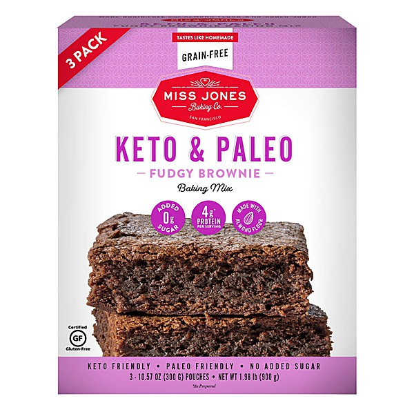

# Best of Bootie 2009 v.2

By **Titus Jones**

## Album Data

- **Catalog:** Beets
- **Format:** Digital, Album
- **Album:** Best of Bootie 2009 v.2
- **Artist:** Titus Jones
- **Albumartist:** Titus Jones
- **Genre:** Pop
- **MusicBrainz Album Artist ID:** 
- **MusicBrainz Album ID:** 
- **MusicBrainz Release Group ID:** 
- **Year:** 2009
- **Catalog #:** 
- **Label:** 
- **Total Tracks:** 22

## Album Tracks

### Track 03 - Good Girls Burn Miami (Sean Kingston vs. Cobra Starship vs. Lady Gaga vs. Shakira vs. LMFAO)

- **Artist:** Titus Jones
- **Format:** MP3
- **Genre:** Pop
- **Length:** 3:31
- **MusicBrainz Track ID:** [2e70a759-3fc9-4ee3-911b-e2bfa56f05ba](https://musicbrainz.org/recording/2e70a759-3fc9-4ee3-911b-e2bfa56f05ba)
- **Title:** Good Girls Burn Miami (Sean Kingston vs. Cobra Starship vs. Lady Gaga vs. Shakira vs. LMFAO)
- **Track:** 03
- **Year:** 2009

### Track 13 - A Circus of Heartbreakin' Divas (Pat Benatar vs. Beyoncé vs. 3Oh!3 vs. Britney Spears vs. Christina Aguilera vs. M.I.A.)

- **Artist:** Titus Jones
- **Format:** MP3
- **Genre:** Electropop
- **Length:** 2:56
- **MusicBrainz Track ID:** [29fb51dd-0017-40d7-8955-b6ed0251656b](https://musicbrainz.org/recording/29fb51dd-0017-40d7-8955-b6ed0251656b)
- **Title:** A Circus of Heartbreakin' Divas (Pat Benatar vs. Beyoncé vs. 3Oh!3 vs. Britney Spears vs. Christina Aguilera vs. M.I.A.)
- **Track:** 13
- **Year:** 2009

