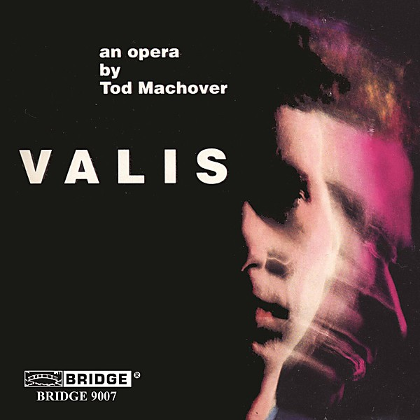

# Valis

By **Tod Machover**

## Album Data

- **Catalog:** Beets
- **Format:** Digital, Album
- **Album:** Valis
- **Artist:** Tod Machover
- **Albumartist:** Tod Machover
- **Genre:** Opera
- **MusicBrainz Album Artist ID:** 
- **MusicBrainz Album ID:** 
- **MusicBrainz Release Group ID:** 
- **Year:** 0000
- **Catalog #:** 
- **Label:** 
- **Total Tracks:** 22

## Album Tracks

### Track 01 - Explosion And Overture

- **Artist:** Tod Machover
- **Format:** ALAC
- **Genre:** Opera
- **Length:** 3:22
- **MusicBrainz Track ID:** 
- **Title:** Explosion And Overture
- **Track:** 01
- **Year:** 0000

### Track 02 - First Narrative

- **Artist:** Tod Machover
- **Format:** ALAC
- **Genre:** Opera
- **Length:** 3:51
- **MusicBrainz Track ID:** 
- **Title:** First Narrative
- **Track:** 02
- **Year:** 0000

### Track 03 - Fat's Sacrament

- **Artist:** Tod Machover
- **Format:** ALAC
- **Genre:** Opera
- **Length:** 1:24
- **MusicBrainz Track ID:** 
- **Title:** Fat's Sacrament
- **Track:** 03
- **Year:** 0000

### Track 04 - Beach Scene

- **Artist:** Tod Machover
- **Format:** ALAC
- **Genre:** Opera
- **Length:** 2:34
- **MusicBrainz Track ID:** 
- **Title:** Beach Scene
- **Track:** 04
- **Year:** 0000

### Track 05 - Fat's Dream

- **Artist:** Tod Machover
- **Format:** ALAC
- **Genre:** Opera
- **Length:** 10:20
- **MusicBrainz Track ID:** 
- **Title:** Fat's Dream
- **Track:** 05
- **Year:** 0000

### Track 06 - Loneliness Transition

- **Artist:** Tod Machover
- **Format:** ALAC
- **Genre:** Opera
- **Length:** 3:34
- **MusicBrainz Track ID:** 
- **Title:** Loneliness Transition
- **Track:** 06
- **Year:** 0000

### Track 07 - Dr. Stone Scene

- **Artist:** Tod Machover
- **Format:** ALAC
- **Genre:** Opera
- **Length:** 1:30
- **MusicBrainz Track ID:** 
- **Title:** Dr. Stone Scene
- **Track:** 07
- **Year:** 0000

### Track 08 - Dr. Stone's Aria

- **Artist:** Tod Machover
- **Format:** ALAC
- **Genre:** Opera
- **Length:** 3:59
- **MusicBrainz Track ID:** 
- **Title:** Dr. Stone's Aria
- **Track:** 08
- **Year:** 0000

### Track 09 - Exegesis I

- **Artist:** Tod Machover
- **Format:** ALAC
- **Genre:** Opera
- **Length:** 1:28
- **MusicBrainz Track ID:** 
- **Title:** Exegesis I
- **Track:** 09
- **Year:** 0000

### Track 10 - Exegesis II

- **Artist:** Tod Machover
- **Format:** ALAC
- **Genre:** Opera
- **Length:** 1:31
- **MusicBrainz Track ID:** 
- **Title:** Exegesis II
- **Track:** 10
- **Year:** 0000

### Track 11 - Gesegnet Song

- **Artist:** Tod Machover
- **Format:** ALAC
- **Genre:** Opera
- **Length:** 1:38
- **MusicBrainz Track ID:** 
- **Title:** Gesegnet Song
- **Track:** 11
- **Year:** 0000

### Track 12 - Parsifal Narrative

- **Artist:** Tod Machover
- **Format:** ALAC
- **Genre:** Opera
- **Length:** 1:39
- **MusicBrainz Track ID:** 
- **Title:** Parsifal Narrative
- **Track:** 12
- **Year:** 0000

### Track 13 - Finale I

- **Artist:** Tod Machover
- **Format:** ALAC
- **Genre:** Opera
- **Length:** 2:20
- **MusicBrainz Track ID:** 
- **Title:** Finale I
- **Track:** 13
- **Year:** 0000

### Track 14 - VALIS Song

- **Artist:** Tod Machover
- **Format:** ALAC
- **Genre:** Opera
- **Length:** 4:25
- **MusicBrainz Track ID:** 
- **Title:** VALIS Song
- **Track:** 14
- **Year:** 0000

### Track 15 - Lampton Scene

- **Artist:** Tod Machover
- **Format:** ALAC
- **Genre:** Opera
- **Length:** 4:21
- **MusicBrainz Track ID:** 
- **Title:** Lampton Scene
- **Track:** 15
- **Year:** 0000

### Track 16 - Suffering Song

- **Artist:** Tod Machover
- **Format:** ALAC
- **Genre:** Opera
- **Length:** 3:47
- **MusicBrainz Track ID:** 
- **Title:** Suffering Song
- **Track:** 16
- **Year:** 0000

### Track 17 - Mini's Solo

- **Artist:** Tod Machover
- **Format:** ALAC
- **Genre:** Opera
- **Length:** 1:36
- **MusicBrainz Track ID:** 
- **Title:** Mini's Solo
- **Track:** 17
- **Year:** 0000

### Track 18 - Sophia's Scene

- **Artist:** Tod Machover
- **Format:** ALAC
- **Genre:** Opera
- **Length:** 2:41
- **MusicBrainz Track ID:** 
- **Title:** Sophia's Scene
- **Track:** 18
- **Year:** 0000

### Track 19 - Sophia's Aria

- **Artist:** Tod Machover
- **Format:** ALAC
- **Genre:** Opera
- **Length:** 6:43
- **MusicBrainz Track ID:** 
- **Title:** Sophia's Aria
- **Track:** 19
- **Year:** 0000

### Track 20 - Finale II

- **Artist:** Tod Machover
- **Format:** ALAC
- **Genre:** Opera
- **Length:** 10:30
- **MusicBrainz Track ID:** 
- **Title:** Finale II
- **Track:** 20
- **Year:** 0000

### Track 21 - Slippers Song

- **Artist:** Tod Machover
- **Format:** ALAC
- **Genre:** Opera
- **Length:** 2:38
- **MusicBrainz Track ID:** 
- **Title:** Slippers Song
- **Track:** 21
- **Year:** 0000

### Track 22 - Final Narrative

- **Artist:** Tod Machover
- **Format:** ALAC
- **Genre:** Opera
- **Length:** 1:29
- **MusicBrainz Track ID:** 
- **Title:** Final Narrative
- **Track:** 22
- **Year:** 0000

