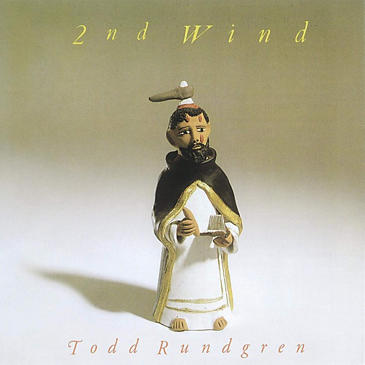

# 2nd Wind

By **Todd Rundgren**

## Album Data

- **Catalog:** Beets
- **Format:** Digital, Album
- **Album:** 2nd Wind
- **Artist:** Todd Rundgren
- **Albumartist:** Todd Rundgren
- **Genre:** Soft Rock
- **MusicBrainz Album Artist ID:** [1a9a8ca0-ea8e-4e9e-96aa-288155bb2c5d](https://musicbrainz.org/artist/1a9a8ca0-ea8e-4e9e-96aa-288155bb2c5d)
- **MusicBrainz Album ID:** [edf324b3-7cb0-4ced-ab18-e79456f09a93](https://musicbrainz.org/release/edf324b3-7cb0-4ced-ab18-e79456f09a93)
- **MusicBrainz Release Group ID:** [9c367c6c-5e41-31b5-96c9-bc4559eb5489](https://musicbrainz.org/release-group/9c367c6c-5e41-31b5-96c9-bc4559eb5489)
- **Year:** 1991
- **Catalog #:** GCD382
- **Label:** Gigatone Entertainment
- **Total Tracks:** 15

## Album Tracks

### Track 01 - Prime Time (remix)

- **Artist:** Todd Rundgren
- **Format:** AAC
- **Genre:** Soft Rock
- **Length:** 3:29
- **MusicBrainz Track ID:** [238f15ae-61d1-4fe8-a3d7-dac5afd6c55e](https://musicbrainz.org/recording/238f15ae-61d1-4fe8-a3d7-dac5afd6c55e)
- **Title:** Prime Time (remix)
- **Track:** 01
- **Year:** 2011

### Track 02 - Dancing Barefoot

- **Artist:** Todd Rundgren
- **Format:** AAC
- **Genre:** Soft Rock
- **Length:** 3:56
- **MusicBrainz Track ID:** [493ae27a-f63f-4d82-8d76-67f40fcdc877](https://musicbrainz.org/recording/493ae27a-f63f-4d82-8d76-67f40fcdc877)
- **Title:** Dancing Barefoot
- **Track:** 02
- **Year:** 2011

### Track 03 - Two Out Of Three Ain't Bad

- **Artist:** Todd Rundgren
- **Format:** AAC
- **Genre:** Soft Rock
- **Length:** 3:21
- **MusicBrainz Track ID:** [ad6a8ed9-c94f-40b3-81c2-7319354e067a](https://musicbrainz.org/recording/ad6a8ed9-c94f-40b3-81c2-7319354e067a)
- **Title:** Two Out Of Three Ain't Bad
- **Track:** 03
- **Year:** 2011

### Track 04 - Chasing Your Ghost

- **Artist:** Todd Rundgren
- **Format:** AAC
- **Genre:** Soft Rock
- **Length:** 3:29
- **MusicBrainz Track ID:** [d5a293e3-1112-49db-82f4-dd3a807978d6](https://musicbrainz.org/recording/d5a293e3-1112-49db-82f4-dd3a807978d6)
- **Title:** Chasing Your Ghost
- **Track:** 04
- **Year:** 2011

### Track 05 - Love My Way

- **Artist:** Todd Rundgren
- **Format:** AAC
- **Genre:** Soft Rock
- **Length:** 4:31
- **MusicBrainz Track ID:** [ecd034c6-d1b2-4435-bbe5-8145968ca6fb](https://musicbrainz.org/recording/ecd034c6-d1b2-4435-bbe5-8145968ca6fb)
- **Title:** Love My Way
- **Track:** 05
- **Year:** 2011

### Track 06 - Personality Crisis

- **Artist:** Todd Rundgren
- **Format:** AAC
- **Genre:** Soft Rock
- **Length:** 3:53
- **MusicBrainz Track ID:** [b9cec2a3-aa95-4739-9c38-3ae444a967af](https://musicbrainz.org/recording/b9cec2a3-aa95-4739-9c38-3ae444a967af)
- **Title:** Personality Crisis
- **Track:** 06
- **Year:** 2011

### Track 07 - Is It A Star?

- **Artist:** Todd Rundgren
- **Format:** AAC
- **Genre:** Soft Rock
- **Length:** 3:38
- **MusicBrainz Track ID:** [4abfb066-b40f-4fb0-b2f3-3420d9462a60](https://musicbrainz.org/recording/4abfb066-b40f-4fb0-b2f3-3420d9462a60)
- **Title:** Is It A Star?
- **Track:** 07
- **Year:** 2011

### Track 08 - Tell Me Your Dreams

- **Artist:** Todd Rundgren
- **Format:** AAC
- **Genre:** Soft Rock
- **Length:** 3:50
- **MusicBrainz Track ID:** [519b28c2-655b-404b-b126-0829f976aee2](https://musicbrainz.org/recording/519b28c2-655b-404b-b126-0829f976aee2)
- **Title:** Tell Me Your Dreams
- **Track:** 08
- **Year:** 2011

### Track 09 - Take It All

- **Artist:** Todd Rundgren
- **Format:** AAC
- **Genre:** Soft Rock
- **Length:** 4:08
- **MusicBrainz Track ID:** [dc13ab22-a248-4f7d-a8c5-b6410106e5f5](https://musicbrainz.org/recording/dc13ab22-a248-4f7d-a8c5-b6410106e5f5)
- **Title:** Take It All
- **Track:** 09
- **Year:** 2011

### Track 10 - I Can't Take It

- **Artist:** Todd Rundgren
- **Format:** AAC
- **Genre:** Soft Rock
- **Length:** 3:11
- **MusicBrainz Track ID:** [f49892f5-3862-4213-b141-05891714640a](https://musicbrainz.org/recording/f49892f5-3862-4213-b141-05891714640a)
- **Title:** I Can't Take It
- **Track:** 10
- **Year:** 2011

### Track 11 - Dear God

- **Artist:** Todd Rundgren
- **Format:** AAC
- **Genre:** Soft Rock
- **Length:** 3:59
- **MusicBrainz Track ID:** [9d203261-59ec-4c44-9b35-7a7e77955540](https://musicbrainz.org/recording/9d203261-59ec-4c44-9b35-7a7e77955540)
- **Title:** Dear God
- **Track:** 11
- **Year:** 2011

### Track 12 - Out Of My Mind

- **Artist:** Todd Rundgren
- **Format:** AAC
- **Genre:** Soft Rock
- **Length:** 3:27
- **MusicBrainz Track ID:** [fff59354-6058-4d0e-b9af-066504300235](https://musicbrainz.org/recording/fff59354-6058-4d0e-b9af-066504300235)
- **Title:** Out Of My Mind
- **Track:** 12
- **Year:** 2011

### Track 13 - Everything

- **Artist:** Todd Rundgren
- **Format:** AAC
- **Genre:** Soft Rock
- **Length:** 4:25
- **MusicBrainz Track ID:** [abf54d42-c4d9-4e90-b76a-dd81d9e0e4f0](https://musicbrainz.org/recording/abf54d42-c4d9-4e90-b76a-dd81d9e0e4f0)
- **Title:** Everything
- **Track:** 13
- **Year:** 2011

### Track 14 - Walk Like A Man

- **Artist:** Todd Rundgren
- **Format:** AAC
- **Genre:** Soft Rock
- **Length:** 3:26
- **MusicBrainz Track ID:** [78bd3354-9ef6-4458-a0df-984b08c391ab](https://musicbrainz.org/recording/78bd3354-9ef6-4458-a0df-984b08c391ab)
- **Title:** Walk Like A Man
- **Track:** 14
- **Year:** 2011

### Track 15 - Nothing To Lose

- **Artist:** Todd Rundgren
- **Format:** AAC
- **Genre:** Soft Rock
- **Length:** 3:05
- **MusicBrainz Track ID:** [bfb8595b-6c86-4d14-b5c8-03603994ee87](https://musicbrainz.org/recording/bfb8595b-6c86-4d14-b5c8-03603994ee87)
- **Title:** Nothing To Lose
- **Track:** 15
- **Year:** 2011

## See also

- [Almost Famous](Almost_Famous.md)
- [Arena](Arena.md)
- [At the BBC 1972-1982](At_the_BBC_1972-1982.md)
- [A Wizard, a True Star](A_Wizard__a_True_Star.md)
- [A Wizard/A True Star](A_Wizard-A_True_Star.md)
- [Box O' Todd](Box_O_Todd.md)
- [Faithful](Faithful.md)
- [Grok This](Grok_This.md)
- [Initiation](Initiation.md)
- [No World Order](No_World_Order.md)
- [[Re]Production]([Re]Production.md)
- [State [Disc 2]](State_[Disc_2].md)
- [State](State.md)
- [The Ever Popular Tortured Artist Effect](The_Ever_Popular_Tortured_Artist_Effect.md)
- [Todd](Todd.md)
- [Todd Rundgren](Todd_Rundgren.md)
- [Todd Rundgren's Johnson](Todd_Rundgrens_Johnson.md)
- [Todd Rundgren vs. Utopia](Todd_Rundgren_vs_Utopia.md)
- [White Knight](White_Knight.md)
- [With a Twist...](With_a_Twist.md)
- [CD: Todd](../../CD/Todd_Rundgren/Todd.md)
- [CD: ](../../CD/Todd_Rundgren/Todd_Rundgren.md)
- [Roon: A Cappella](../../Roon/Todd_Rundgren/A_Cappella.md)
- [Roon: An Elpee's Worth of Productions](../../Roon/Todd_Rundgren/An_Elpees_Worth_of_Productions.md)
- [Roon: Arena](../../Roon/Todd_Rundgren/Arena.md)
- [Roon: A Wizard / A True Star](../../Roon/Todd_Rundgren/A_Wizard_-_A_True_Star.md)
- [Roon: Deface The Music](../../Roon/Todd_Rundgren/Deface_The_Music.md)
- [Roon: Faithful](../../Roon/Todd_Rundgren/Faithful.md)
- [Roon: Initiation](../../Roon/Todd_Rundgren/Initiation.md)
- [Roon: RA](../../Roon/Todd_Rundgren/RA.md)
- [Roon: Second Wind (Live at the Palace of Fine Arts Theatre, San Francisco, CA, July 1990)](../../Roon/Todd_Rundgren/Second_Wind_Live_at_the_Palace_of_Fine_Arts_Theatre__San_Francisco__CA__July_1990.md)
- [Roon: Something / Anything?](../../Roon/Todd_Rundgren/Something_-_Anything.md)
- [Roon: State Theater New Jersey 2005 (Live)](../../Roon/Todd_Rundgren/State_Theater_New_Jersey_2005_Live.md)
- [Roon: Swing To The Right](../../Roon/Todd_Rundgren/Swing_To_The_Right.md)
- [Roon: The 70's Collection](../../Roon/Todd_Rundgren/The_70s_Collection.md)
- [Roon: Todd](../../Roon/Todd_Rundgren/Todd.md)
- [Roon: Todd Rundgren at the BBC](../../Roon/Todd_Rundgren/Todd_Rundgren_at_the_BBC-_1972-1982.md)
- [Roon: Todd Rundgren's Utopia](../../Roon/Todd_Rundgren/Todd_Rundgrens_Utopia.md)
- [Roon: White Knight](../../Roon/Todd_Rundgren/White_Knight.md)
- [Vinyl: "A Wizard, A True Star"](../../Vinyl/Todd_Rundgren/A_Wizard__A_True_Star.md)
- [Vinyl: Time Heals](../../Vinyl/Todd_Rundgren/Time_Heals.md)
- [Vinyl: Todd](../../Vinyl/Todd_Rundgren/Todd.md)
- [Vinyl: ](../../Vinyl/Todd_Rundgren/Todd_Rundgren.md)
