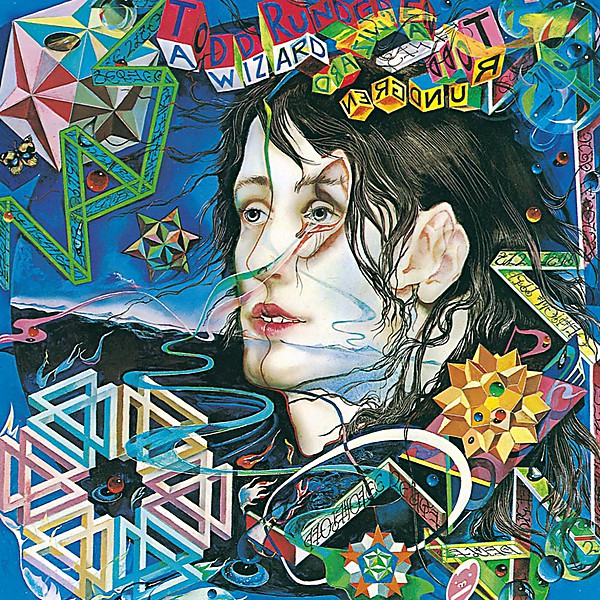

# A Wizard/A True Star

By **Todd Rundgren**

## Album Data

- **Catalog:** Beets
- **Format:** Digital, Album
- **Album:** A Wizard/A True Star
- **Artist:** Todd Rundgren
- **Albumartist:** Todd Rundgren
- **Genre:** Post-Rock
- **MusicBrainz Album Artist ID:** 
- **MusicBrainz Album ID:** 
- **MusicBrainz Release Group ID:** 
- **Year:** 1983
- **Catalog #:** 
- **Label:** 
- **Total Tracks:** 00

## Album Tracks

### Track 00 - It Wouldn't Have Made Any Diff

- **Artist:** Todd Rundgren
- **Format:** AAC
- **Genre:** Soft Rock
- **Length:** 3:51
- **MusicBrainz Track ID:** 
- **Title:** It Wouldn't Have Made Any Diff
- **Track:** 00
- **Year:** 2000

