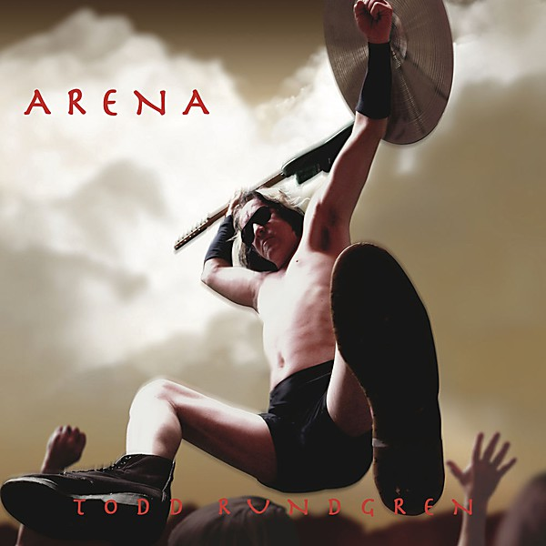

# Arena

By **Todd Rundgren**

## Album Data

- **Catalog:** Beets
- **Format:** Digital, Album
- **Album:** Arena
- **Artist:** Todd Rundgren
- **Albumartist:** Todd Rundgren
- **Genre:** Soft Rock
- **MusicBrainz Album Artist ID:** [1a9a8ca0-ea8e-4e9e-96aa-288155bb2c5d](https://musicbrainz.org/artist/1a9a8ca0-ea8e-4e9e-96aa-288155bb2c5d)
- **MusicBrainz Album ID:** [654745b2-6c92-416d-a576-0a643f3765a2](https://musicbrainz.org/release/654745b2-6c92-416d-a576-0a643f3765a2)
- **MusicBrainz Release Group ID:** [7853d8ba-c3f2-3123-a186-a4ce6ad48c31](https://musicbrainz.org/release-group/7853d8ba-c3f2-3123-a186-a4ce6ad48c31)
- **Year:** 2008
- **Catalog #:** R2 71266
- **Label:** Forward
- **Total Tracks:** 16

## Album Tracks

### Track 01 - Worldwide Epiphany 1.0

- **Artist:** Todd Rundgren
- **Format:** MP3
- **Genre:** Rock
- **Length:** 1:19
- **MusicBrainz Track ID:** [5228c760-0a73-4dd2-9d68-5bdfe63eb463](https://musicbrainz.org/recording/5228c760-0a73-4dd2-9d68-5bdfe63eb463)
- **Title:** Worldwide Epiphany 1.0
- **Track:** 01
- **Year:** 1993

### Track 02 - No World Order 1.0

- **Artist:** Todd Rundgren
- **Format:** MP3
- **Genre:** Rock
- **Length:** 0:57
- **MusicBrainz Track ID:** [5d1699ac-f16b-4f58-b3c3-8974db132805](https://musicbrainz.org/recording/5d1699ac-f16b-4f58-b3c3-8974db132805)
- **Title:** No World Order 1.0
- **Track:** 02
- **Year:** 1993

### Track 03 - Worldwide Epiphany 1.1

- **Artist:** Todd Rundgren
- **Format:** MP3
- **Genre:** Rock
- **Length:** 1:21
- **MusicBrainz Track ID:** [bfa3432f-3758-4c8e-a387-ef0da5b33342](https://musicbrainz.org/recording/bfa3432f-3758-4c8e-a387-ef0da5b33342)
- **Title:** Worldwide Epiphany 1.1
- **Track:** 03
- **Year:** 1993

### Track 04 - Day Job 1.0

- **Artist:** Todd Rundgren
- **Format:** MP3
- **Genre:** Rock
- **Length:** 4:24
- **MusicBrainz Track ID:** [ea6deb5d-56bd-4cd0-b4b6-efcb15139f53](https://musicbrainz.org/recording/ea6deb5d-56bd-4cd0-b4b6-efcb15139f53)
- **Title:** Day Job 1.0
- **Track:** 04
- **Year:** 1993

### Track 05 - Property 1.0

- **Artist:** Todd Rundgren
- **Format:** MP3
- **Genre:** Rock
- **Length:** 4:30
- **MusicBrainz Track ID:** [c03afd85-f70f-48ae-91b7-eb2fa02498fb](https://musicbrainz.org/recording/c03afd85-f70f-48ae-91b7-eb2fa02498fb)
- **Title:** Property 1.0
- **Track:** 05
- **Year:** 1993

### Track 06 - Fascist Christ 1.0

- **Artist:** Todd Rundgren
- **Format:** MP3
- **Genre:** Rock
- **Length:** 5:35
- **MusicBrainz Track ID:** [29fdc7d1-b3c5-4b50-ad94-ad036a6f3a05](https://musicbrainz.org/recording/29fdc7d1-b3c5-4b50-ad94-ad036a6f3a05)
- **Title:** Fascist Christ 1.0
- **Track:** 06
- **Year:** 1993

### Track 07 - Love Thing 1.0

- **Artist:** Todd Rundgren
- **Format:** MP3
- **Genre:** Rock
- **Length:** 3:44
- **MusicBrainz Track ID:** [25153bd3-a1e8-41c9-bf39-5e48d3975872](https://musicbrainz.org/recording/25153bd3-a1e8-41c9-bf39-5e48d3975872)
- **Title:** Love Thing 1.0
- **Track:** 07
- **Year:** 1993

### Track 08 - Time Stood Still 1.0

- **Artist:** Todd Rundgren
- **Format:** MP3
- **Genre:** Rock
- **Length:** 1:41
- **MusicBrainz Track ID:** [a51f6911-5903-4e4d-ae59-51e76a91824a](https://musicbrainz.org/recording/a51f6911-5903-4e4d-ae59-51e76a91824a)
- **Title:** Time Stood Still 1.0
- **Track:** 08
- **Year:** 1993

### Track 09 - Proactivity 1.0

- **Artist:** Todd Rundgren
- **Format:** MP3
- **Genre:** Rock
- **Length:** 2:54
- **MusicBrainz Track ID:** [94247ece-0ad4-441a-8321-e8dbbed12d1d](https://musicbrainz.org/recording/94247ece-0ad4-441a-8321-e8dbbed12d1d)
- **Title:** Proactivity 1.0
- **Track:** 09
- **Year:** 1993

### Track 10 - No World Order 1.1

- **Artist:** Todd Rundgren
- **Format:** MP3
- **Genre:** Rock
- **Length:** 6:21
- **MusicBrainz Track ID:** [913c2147-9714-466d-8633-f6f2d0261464](https://musicbrainz.org/recording/913c2147-9714-466d-8633-f6f2d0261464)
- **Title:** No World Order 1.1
- **Track:** 10
- **Year:** 1993

### Track 11 - Worldwide Epiphany 1.2

- **Artist:** Todd Rundgren
- **Format:** MP3
- **Genre:** Rock
- **Length:** 4:23
- **MusicBrainz Track ID:** [c74f0192-1a9e-434f-9ba1-707dd3a3da78](https://musicbrainz.org/recording/c74f0192-1a9e-434f-9ba1-707dd3a3da78)
- **Title:** Worldwide Epiphany 1.2
- **Track:** 11
- **Year:** 1993

### Track 12 - Time Stood Still 1.1

- **Artist:** Todd Rundgren
- **Format:** MP3
- **Genre:** Rock
- **Length:** 0:38
- **MusicBrainz Track ID:** [bba214d3-884a-4ed9-a421-8570fe6e06ff](https://musicbrainz.org/recording/bba214d3-884a-4ed9-a421-8570fe6e06ff)
- **Title:** Time Stood Still 1.1
- **Track:** 12
- **Year:** 1993

### Track 13 - Love Thing 1.1

- **Artist:** Todd Rundgren
- **Format:** MP3
- **Genre:** Rock
- **Length:** 1:35
- **MusicBrainz Track ID:** [783b6996-50fa-4bdb-a042-c9679c08c8a4](https://musicbrainz.org/recording/783b6996-50fa-4bdb-a042-c9679c08c8a4)
- **Title:** Love Thing 1.1
- **Track:** 13
- **Year:** 1993

### Track 14 - Time Stood Still 1.2

- **Artist:** Todd Rundgren
- **Format:** MP3
- **Genre:** Rock
- **Length:** 2:33
- **MusicBrainz Track ID:** [adcd7486-bce9-4bd5-b71d-9de261757451](https://musicbrainz.org/recording/adcd7486-bce9-4bd5-b71d-9de261757451)
- **Title:** Time Stood Still 1.2
- **Track:** 14
- **Year:** 1993

### Track 15 - Word Made Flesh 1.0

- **Artist:** Todd Rundgren
- **Format:** MP3
- **Genre:** Rock
- **Length:** 4:36
- **MusicBrainz Track ID:** [4a7efff1-76c9-4859-b484-993ed6da3132](https://musicbrainz.org/recording/4a7efff1-76c9-4859-b484-993ed6da3132)
- **Title:** Word Made Flesh 1.0
- **Track:** 15
- **Year:** 1993

### Track 16 - Fever Broke 1.0

- **Artist:** Todd Rundgren
- **Format:** MP3
- **Genre:** Rock
- **Length:** 6:30
- **MusicBrainz Track ID:** [cf6d551c-a1f5-4f73-923d-fffb0012fe26](https://musicbrainz.org/recording/cf6d551c-a1f5-4f73-923d-fffb0012fe26)
- **Title:** Fever Broke 1.0
- **Track:** 16
- **Year:** 1993

## See also

- [2nd Wind](2nd_Wind.md)
- [Almost Famous](Almost_Famous.md)
- [At the BBC 1972-1982](At_the_BBC_1972-1982.md)
- [A Wizard, a True Star](A_Wizard__a_True_Star.md)
- [A Wizard/A True Star](A_Wizard-A_True_Star.md)
- [Box O' Todd](Box_O_Todd.md)
- [Faithful](Faithful.md)
- [Grok This](Grok_This.md)
- [Initiation](Initiation.md)
- [No World Order](No_World_Order.md)
- [[Re]Production]([Re]Production.md)
- [State [Disc 2]](State_[Disc_2].md)
- [State](State.md)
- [The Ever Popular Tortured Artist Effect](The_Ever_Popular_Tortured_Artist_Effect.md)
- [Todd](Todd.md)
- [Todd Rundgren](Todd_Rundgren.md)
- [Todd Rundgren's Johnson](Todd_Rundgrens_Johnson.md)
- [Todd Rundgren vs. Utopia](Todd_Rundgren_vs_Utopia.md)
- [White Knight](White_Knight.md)
- [With a Twist...](With_a_Twist.md)
- [CD: Todd](../../CD/Todd_Rundgren/Todd.md)
- [CD: ](../../CD/Todd_Rundgren/Todd_Rundgren.md)
- [Roon: A Cappella](../../Roon/Todd_Rundgren/A_Cappella.md)
- [Roon: An Elpee's Worth of Productions](../../Roon/Todd_Rundgren/An_Elpees_Worth_of_Productions.md)
- [Roon: Arena](../../Roon/Todd_Rundgren/Arena.md)
- [Roon: A Wizard / A True Star](../../Roon/Todd_Rundgren/A_Wizard_-_A_True_Star.md)
- [Roon: Deface The Music](../../Roon/Todd_Rundgren/Deface_The_Music.md)
- [Roon: Faithful](../../Roon/Todd_Rundgren/Faithful.md)
- [Roon: Initiation](../../Roon/Todd_Rundgren/Initiation.md)
- [Roon: RA](../../Roon/Todd_Rundgren/RA.md)
- [Roon: Second Wind (Live at the Palace of Fine Arts Theatre, San Francisco, CA, July 1990)](../../Roon/Todd_Rundgren/Second_Wind_Live_at_the_Palace_of_Fine_Arts_Theatre__San_Francisco__CA__July_1990.md)
- [Roon: Something / Anything?](../../Roon/Todd_Rundgren/Something_-_Anything.md)
- [Roon: State Theater New Jersey 2005 (Live)](../../Roon/Todd_Rundgren/State_Theater_New_Jersey_2005_Live.md)
- [Roon: Swing To The Right](../../Roon/Todd_Rundgren/Swing_To_The_Right.md)
- [Roon: The 70's Collection](../../Roon/Todd_Rundgren/The_70s_Collection.md)
- [Roon: Todd](../../Roon/Todd_Rundgren/Todd.md)
- [Roon: Todd Rundgren at the BBC](../../Roon/Todd_Rundgren/Todd_Rundgren_at_the_BBC-_1972-1982.md)
- [Roon: Todd Rundgren's Utopia](../../Roon/Todd_Rundgren/Todd_Rundgrens_Utopia.md)
- [Roon: White Knight](../../Roon/Todd_Rundgren/White_Knight.md)
- [Vinyl: "A Wizard, A True Star"](../../Vinyl/Todd_Rundgren/A_Wizard__A_True_Star.md)
- [Vinyl: Time Heals](../../Vinyl/Todd_Rundgren/Time_Heals.md)
- [Vinyl: Todd](../../Vinyl/Todd_Rundgren/Todd.md)
- [Vinyl: ](../../Vinyl/Todd_Rundgren/Todd_Rundgren.md)
