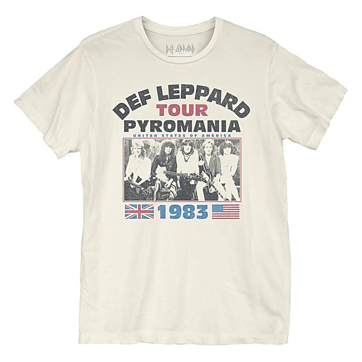

# At the BBC 1972-1982

By **Todd Rundgren**

## Album Data

- **Catalog:** Beets
- **Format:** Digital, Album
- **Album:** At the BBC 1972-1982
- **Artist:** Todd Rundgren
- **Albumartist:** Todd Rundgren
- **Genre:** Soft Rock
- **MusicBrainz Album Artist ID:** 
- **MusicBrainz Album ID:** 
- **MusicBrainz Release Group ID:** 
- **Year:** 0000
- **Catalog #:** 
- **Label:** 
- **Total Tracks:** 11

## Album Tracks

### Track 01 - Introductions (live Counterpart 11.11.73)

- **Artist:** Todd Rundgren
- **Format:** ALAC
- **Genre:** Soft Rock
- **Length:** 0:41
- **MusicBrainz Track ID:** 
- **Title:** Introductions (live Counterpart 11.11.73)
- **Track:** 01
- **Year:** 1973

### Track 02 - I Saw the Light (live Counterpart 11.11.73)

- **Artist:** Todd Rundgren
- **Format:** ALAC
- **Genre:** Soft Rock
- **Length:** 3:51
- **MusicBrainz Track ID:** 
- **Title:** I Saw the Light (live Counterpart 11.11.73)
- **Track:** 02
- **Year:** 1973

### Track 03 - A Dream Goes on Forever (live Counterpart 11.11.73)

- **Artist:** Todd Rundgren
- **Format:** ALAC
- **Genre:** Soft Rock
- **Length:** 2:48
- **MusicBrainz Track ID:** 
- **Title:** A Dream Goes on Forever (live Counterpart 11.11.73)
- **Track:** 03
- **Year:** 1973

### Track 04 - Piss Aaron (live Counterpart 11.11.73)

- **Artist:** Todd Rundgren
- **Format:** ALAC
- **Genre:** Soft Rock
- **Length:** 7:47
- **MusicBrainz Track ID:** 
- **Title:** Piss Aaron (live Counterpart 11.11.73)
- **Track:** 04
- **Year:** 1973

### Track 05 - Lord Chancellor's Nightmare Song (live Counterpart 11.11.73)

- **Artist:** Todd Rundgren
- **Format:** ALAC
- **Genre:** Soft Rock
- **Length:** 3:26
- **MusicBrainz Track ID:** 
- **Title:** Lord Chancellor's Nightmare Song (live Counterpart 11.11.73)
- **Track:** 05
- **Year:** 1973

### Track 06 - Utopia Them (live Counterpart 11.11.73)

- **Artist:** Todd Rundgren
- **Format:** ALAC
- **Genre:** Soft Rock
- **Length:** 4:27
- **MusicBrainz Track ID:** 
- **Title:** Utopia Them (live Counterpart 11.11.73)
- **Track:** 06
- **Year:** 1973

### Track 07 - Banter (live Counterpart 11.11.73)

- **Artist:** Todd Rundgren
- **Format:** ALAC
- **Genre:** Soft Rock
- **Length:** 0:16
- **MusicBrainz Track ID:** 
- **Title:** Banter (live Counterpart 11.11.73)
- **Track:** 07
- **Year:** 1973

### Track 08 - Utopia Them (live Counterpart 11.11.73)

- **Artist:** Todd Rundgren
- **Format:** ALAC
- **Genre:** Soft Rock
- **Length:** 14:11
- **MusicBrainz Track ID:** 
- **Title:** Utopia Them (live Counterpart 11.11.73)
- **Track:** 08
- **Year:** 1973

### Track 09 - Black Maria (live Counterpart 11.11.73)

- **Artist:** Todd Rundgren
- **Format:** ALAC
- **Genre:** Soft Rock
- **Length:** 6:26
- **MusicBrainz Track ID:** 
- **Title:** Black Maria (live Counterpart 11.11.73)
- **Track:** 09
- **Year:** 1973

### Track 10 - Hungry For Love (live Counterpart 11.11.73)

- **Artist:** Todd Rundgren
- **Format:** ALAC
- **Genre:** Soft Rock
- **Length:** 2:26
- **MusicBrainz Track ID:** 
- **Title:** Hungry For Love (live Counterpart 11.11.73)
- **Track:** 10
- **Year:** 1973

### Track 11 - The Ikon (live Counterpart 11.11.73)

- **Artist:** Todd Rundgren
- **Format:** ALAC
- **Genre:** Soft Rock
- **Length:** 9:23
- **MusicBrainz Track ID:** 
- **Title:** The Ikon (live Counterpart 11.11.73)
- **Track:** 11
- **Year:** 1973

### Track 01 - Banter & Soundcheck (Live From Philadelphia '71)

- **Artist:** Todd Rundgren & The Hello People
- **Format:** ALAC
- **Genre:** Soft Rock
- **Length:** 2:04
- **MusicBrainz Track ID:** 
- **Title:** Banter & Soundcheck (Live From Philadelphia '71)
- **Track:** 01
- **Year:** 1971

### Track 02 - Believe In Me (Live From Philadelphia '71)

- **Artist:** Todd Rundgren & The Hello People
- **Format:** ALAC
- **Genre:** Soft Rock
- **Length:** 2:51
- **MusicBrainz Track ID:** 
- **Title:** Believe In Me (Live From Philadelphia '71)
- **Track:** 02
- **Year:** 1971

### Track 03 - Lady On The Terrace (Live From Philadelphia '71)

- **Artist:** Todd Rundgren & The Hello People
- **Format:** ALAC
- **Genre:** Soft Rock
- **Length:** 4:47
- **MusicBrainz Track ID:** 
- **Title:** Lady On The Terrace (Live From Philadelphia '71)
- **Track:** 03
- **Year:** 1971

### Track 04 - I Got My Pipe (Live From Philadelphia '71)

- **Artist:** Todd Rundgren & The Hello People
- **Format:** ALAC
- **Genre:** Soft Rock
- **Length:** 5:36
- **MusicBrainz Track ID:** 
- **Title:** I Got My Pipe (Live From Philadelphia '71)
- **Track:** 04
- **Year:** 1971

### Track 05 - It Wouldn't Have Make Any Difference (Live From Philadelphia '71)

- **Artist:** Todd Rundgren & The Hello People
- **Format:** ALAC
- **Genre:** Soft Rock
- **Length:** 4:19
- **MusicBrainz Track ID:** 
- **Title:** It Wouldn't Have Make Any Difference (Live From Philadelphia '71)
- **Track:** 05
- **Year:** 1971

### Track 06 - Rock All Over Again (Live From Philadelphia '71)

- **Artist:** Todd Rundgren & The Hello People
- **Format:** ALAC
- **Genre:** Soft Rock
- **Length:** 3:18
- **MusicBrainz Track ID:** 
- **Title:** Rock All Over Again (Live From Philadelphia '71)
- **Track:** 06
- **Year:** 1971

### Track 07 - Everybody In The Congregation (Live From Philadelphia '71)

- **Artist:** Todd Rundgren & The Hello People
- **Format:** ALAC
- **Genre:** Soft Rock
- **Length:** 4:50
- **MusicBrainz Track ID:** 
- **Title:** Everybody In The Congregation (Live From Philadelphia '71)
- **Track:** 07
- **Year:** 1971

### Track 08 - Broke Down & Busted (Live From Philadelphia '71)

- **Artist:** Todd Rundgren & The Hello People
- **Format:** ALAC
- **Genre:** Soft Rock
- **Length:** 5:17
- **MusicBrainz Track ID:** 
- **Title:** Broke Down & Busted (Live From Philadelphia '71)
- **Track:** 08
- **Year:** 1971

### Track 09 - Tonight I Want To Love Me A Stranger (Live From Philadelphia '71)

- **Artist:** Todd Rundgren & The Hello People
- **Format:** ALAC
- **Genre:** Soft Rock
- **Length:** 4:29
- **MusicBrainz Track ID:** 
- **Title:** Tonight I Want To Love Me A Stranger (Live From Philadelphia '71)
- **Track:** 09
- **Year:** 1971

### Track 10 - Ooh, Baby Baby (Live From Philadelphia '71)

- **Artist:** Todd Rundgren & The Hello People
- **Format:** ALAC
- **Genre:** Soft Rock
- **Length:** 4:16
- **MusicBrainz Track ID:** 
- **Title:** Ooh, Baby Baby (Live From Philadelphia '71)
- **Track:** 10
- **Year:** 1971

### Track 11 - Hold Me Tight (Expert) (Live From Philadelphia '71)

- **Artist:** Todd Rundgren & The Hello People
- **Format:** ALAC
- **Genre:** Soft Rock
- **Length:** 2:52
- **MusicBrainz Track ID:** 
- **Title:** Hold Me Tight (Expert) (Live From Philadelphia '71)
- **Track:** 11
- **Year:** 1971

### Track 12 - Before I Grow Too Old (Live From Philadelphia '71)

- **Artist:** Todd Rundgren & The Hello People
- **Format:** ALAC
- **Genre:** Soft Rock
- **Length:** 3:00
- **MusicBrainz Track ID:** 
- **Title:** Before I Grow Too Old (Live From Philadelphia '71)
- **Track:** 12
- **Year:** 1971

### Track 13 - Be Nice To Me (Live From Philadelphia '71)

- **Artist:** Todd Rundgren & The Hello People
- **Format:** ALAC
- **Genre:** Soft Rock
- **Length:** 4:26
- **MusicBrainz Track ID:** 
- **Title:** Be Nice To Me (Live From Philadelphia '71)
- **Track:** 13
- **Year:** 1971

### Track 14 - I'm Feelin' Better (Live From Philadelphia '71)

- **Artist:** Todd Rundgren & The Hello People
- **Format:** ALAC
- **Genre:** Soft Rock
- **Length:** 4:11
- **MusicBrainz Track ID:** 
- **Title:** I'm Feelin' Better (Live From Philadelphia '71)
- **Track:** 14
- **Year:** 1971

### Track 15 - The Ballad (Denny & Jean) (Live From Philadelphia '71)

- **Artist:** Todd Rundgren & The Hello People
- **Format:** ALAC
- **Genre:** Soft Rock
- **Length:** 3:25
- **MusicBrainz Track ID:** 
- **Title:** The Ballad (Denny & Jean) (Live From Philadelphia '71)
- **Track:** 15
- **Year:** 1971

### Track 01 - Broke Down And Busted (Live From Ultrasonic Studios '72)

- **Artist:** Todd Rundgren & The Hello People
- **Format:** ALAC
- **Genre:** Soft Rock
- **Length:** 5:27
- **MusicBrainz Track ID:** 
- **Title:** Broke Down And Busted (Live From Ultrasonic Studios '72)
- **Track:** 01
- **Year:** 1972

### Track 02 - Georgia Swing (Live From Ultrasonic Studios '72)

- **Artist:** Todd Rundgren & The Hello People
- **Format:** ALAC
- **Genre:** Soft Rock
- **Length:** 3:42
- **MusicBrainz Track ID:** 
- **Title:** Georgia Swing (Live From Ultrasonic Studios '72)
- **Track:** 02
- **Year:** 1972

### Track 03 - Outside Love (Live From Ultrasonic Studios '72)

- **Artist:** Todd Rundgren & The Hello People
- **Format:** ALAC
- **Genre:** Soft Rock
- **Length:** 5:55
- **MusicBrainz Track ID:** 
- **Title:** Outside Love (Live From Ultrasonic Studios '72)
- **Track:** 03
- **Year:** 1972

### Track 04 - Piss Aaron (Live From Ultrasonic Studios '72)

- **Artist:** Todd Rundgren & The Hello People
- **Format:** ALAC
- **Genre:** Soft Rock
- **Length:** 4:27
- **MusicBrainz Track ID:** 
- **Title:** Piss Aaron (Live From Ultrasonic Studios '72)
- **Track:** 04
- **Year:** 1972

### Track 05 - A Dream Goes On Forever (Live From Ultrasonic Studios '72)

- **Artist:** Todd Rundgren & The Hello People
- **Format:** ALAC
- **Genre:** Soft Rock
- **Length:** 2:32
- **MusicBrainz Track ID:** 
- **Title:** A Dream Goes On Forever (Live From Ultrasonic Studios '72)
- **Track:** 05
- **Year:** 1972

### Track 06 - I Saw The Light (Live From Ultrasonic Studios '72)

- **Artist:** Todd Rundgren & The Hello People
- **Format:** ALAC
- **Genre:** Soft Rock
- **Length:** 3:39
- **MusicBrainz Track ID:** 
- **Title:** I Saw The Light (Live From Ultrasonic Studios '72)
- **Track:** 06
- **Year:** 1972

### Track 07 - It Wouldn't Have Made Any Difference (Live From Ultrasonic Studios '72)

- **Artist:** Todd Rundgren & The Hello People
- **Format:** ALAC
- **Genre:** Soft Rock
- **Length:** 4:44
- **MusicBrainz Track ID:** 
- **Title:** It Wouldn't Have Made Any Difference (Live From Ultrasonic Studios '72)
- **Track:** 07
- **Year:** 1972

### Track 08 - Good To Be Alive (Live From Ultrasonic Studios '72)

- **Artist:** Todd Rundgren & The Hello People
- **Format:** ALAC
- **Genre:** Soft Rock
- **Length:** 4:13
- **MusicBrainz Track ID:** 
- **Title:** Good To Be Alive (Live From Ultrasonic Studios '72)
- **Track:** 08
- **Year:** 1972

### Track 09 - Mad Red Ant Lady (Live From Ultrasonic Studios '72)

- **Artist:** Todd Rundgren & The Hello People
- **Format:** ALAC
- **Genre:** Soft Rock
- **Length:** 9:02
- **MusicBrainz Track ID:** 
- **Title:** Mad Red Ant Lady (Live From Ultrasonic Studios '72)
- **Track:** 09
- **Year:** 1972

### Track 10 - Heat And Blaze (Live From Ultrasonic Studios '72)

- **Artist:** Todd Rundgren & The Hello People
- **Format:** ALAC
- **Genre:** Soft Rock
- **Length:** 3:44
- **MusicBrainz Track ID:** 
- **Title:** Heat And Blaze (Live From Ultrasonic Studios '72)
- **Track:** 10
- **Year:** 1972

### Track 11 - Lady On A Terrace (Live From Ultrasonic Studios '72)

- **Artist:** Todd Rundgren & The Hello People
- **Format:** ALAC
- **Genre:** Soft Rock
- **Length:** 5:25
- **MusicBrainz Track ID:** 
- **Title:** Lady On A Terrace (Live From Ultrasonic Studios '72)
- **Track:** 11
- **Year:** 1972

### Track 12 - S.L.U.T. (Live From Ultrasonic Studios '72)

- **Artist:** Todd Rundgren & The Hello People
- **Format:** ALAC
- **Genre:** Soft Rock
- **Length:** 3:18
- **MusicBrainz Track ID:** 
- **Title:** S.L.U.T. (Live From Ultrasonic Studios '72)
- **Track:** 12
- **Year:** 1972

## See also

- [2nd Wind](2nd_Wind.md)
- [Almost Famous](Almost_Famous.md)
- [Arena](Arena.md)
- [A Wizard, a True Star](A_Wizard__a_True_Star.md)
- [A Wizard/A True Star](A_Wizard-A_True_Star.md)
- [Box O' Todd](Box_O_Todd.md)
- [Faithful](Faithful.md)
- [Grok This](Grok_This.md)
- [Initiation](Initiation.md)
- [No World Order](No_World_Order.md)
- [[Re]Production]([Re]Production.md)
- [State [Disc 2]](State_[Disc_2].md)
- [State](State.md)
- [The Ever Popular Tortured Artist Effect](The_Ever_Popular_Tortured_Artist_Effect.md)
- [Todd](Todd.md)
- [Todd Rundgren](Todd_Rundgren.md)
- [Todd Rundgren's Johnson](Todd_Rundgrens_Johnson.md)
- [Todd Rundgren vs. Utopia](Todd_Rundgren_vs_Utopia.md)
- [White Knight](White_Knight.md)
- [With a Twist...](With_a_Twist.md)
- [CD: Todd](../../CD/Todd_Rundgren/Todd.md)
- [CD: ](../../CD/Todd_Rundgren/Todd_Rundgren.md)
- [Roon: A Cappella](../../Roon/Todd_Rundgren/A_Cappella.md)
- [Roon: An Elpee's Worth of Productions](../../Roon/Todd_Rundgren/An_Elpees_Worth_of_Productions.md)
- [Roon: Arena](../../Roon/Todd_Rundgren/Arena.md)
- [Roon: A Wizard / A True Star](../../Roon/Todd_Rundgren/A_Wizard_-_A_True_Star.md)
- [Roon: Deface The Music](../../Roon/Todd_Rundgren/Deface_The_Music.md)
- [Roon: Faithful](../../Roon/Todd_Rundgren/Faithful.md)
- [Roon: Initiation](../../Roon/Todd_Rundgren/Initiation.md)
- [Roon: RA](../../Roon/Todd_Rundgren/RA.md)
- [Roon: Second Wind (Live at the Palace of Fine Arts Theatre, San Francisco, CA, July 1990)](../../Roon/Todd_Rundgren/Second_Wind_Live_at_the_Palace_of_Fine_Arts_Theatre__San_Francisco__CA__July_1990.md)
- [Roon: Something / Anything?](../../Roon/Todd_Rundgren/Something_-_Anything.md)
- [Roon: State Theater New Jersey 2005 (Live)](../../Roon/Todd_Rundgren/State_Theater_New_Jersey_2005_Live.md)
- [Roon: Swing To The Right](../../Roon/Todd_Rundgren/Swing_To_The_Right.md)
- [Roon: The 70's Collection](../../Roon/Todd_Rundgren/The_70s_Collection.md)
- [Roon: Todd](../../Roon/Todd_Rundgren/Todd.md)
- [Roon: Todd Rundgren at the BBC](../../Roon/Todd_Rundgren/Todd_Rundgren_at_the_BBC-_1972-1982.md)
- [Roon: Todd Rundgren's Utopia](../../Roon/Todd_Rundgren/Todd_Rundgrens_Utopia.md)
- [Roon: White Knight](../../Roon/Todd_Rundgren/White_Knight.md)
- [Vinyl: "A Wizard, A True Star"](../../Vinyl/Todd_Rundgren/A_Wizard__A_True_Star.md)
- [Vinyl: Time Heals](../../Vinyl/Todd_Rundgren/Time_Heals.md)
- [Vinyl: Todd](../../Vinyl/Todd_Rundgren/Todd.md)
- [Vinyl: ](../../Vinyl/Todd_Rundgren/Todd_Rundgren.md)
