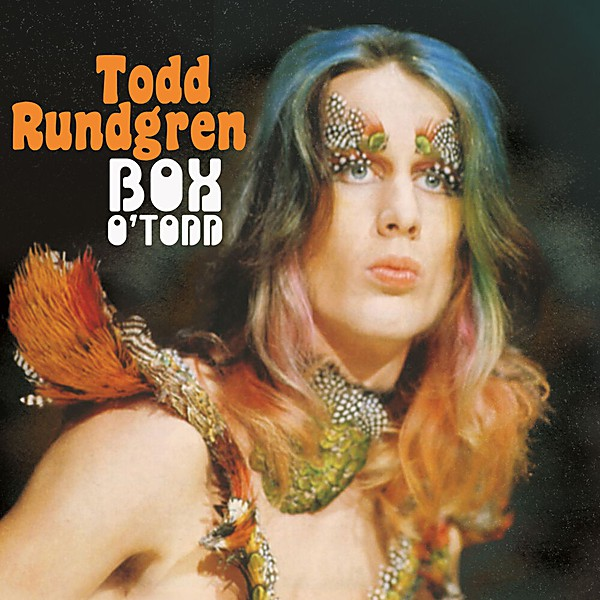

# Box O' Todd

By **Todd Rundgren**

## Album Data

- **Catalog:** Beets
- **Format:** Digital, Album
- **Album:** Box O' Todd
- **Artist:** Todd Rundgren
- **Albumartist:** Todd Rundgren
- **Genre:** Soft Rock
- **MusicBrainz Album Artist ID:** 
- **MusicBrainz Album ID:** 
- **MusicBrainz Release Group ID:** 
- **Year:** 1971
- **Catalog #:** 
- **Label:** 
- **Total Tracks:** 12

## Album Tracks

### Track 01 - Happenings Ten Years Time Ago

- **Artist:** Todd Rundgren
- **Format:** ALAC
- **Genre:** Psychedelic Rock
- **Length:** 3:13
- **MusicBrainz Track ID:** 
- **Title:** Happenings Ten Years Time Ago
- **Track:** 01
- **Year:** 2005

### Track 02 - Good Vibrations

- **Artist:** Todd Rundgren
- **Format:** ALAC
- **Genre:** Surf Rock
- **Length:** 3:44
- **MusicBrainz Track ID:** 
- **Title:** Good Vibrations
- **Track:** 02
- **Year:** 2005

### Track 03 - Rain

- **Artist:** Todd Rundgren
- **Format:** ALAC
- **Genre:** Psychedelic Rock
- **Length:** 3:17
- **MusicBrainz Track ID:** 
- **Title:** Rain
- **Track:** 03
- **Year:** 2005

### Track 04 - Most Likely You Go Your Way [And I'll Go Mine]

- **Artist:** Todd Rundgren
- **Format:** ALAC
- **Genre:** Soft Rock
- **Length:** 3:27
- **MusicBrainz Track ID:** 
- **Title:** Most Likely You Go Your Way [And I'll Go Mine]
- **Track:** 04
- **Year:** 2005

### Track 05 - If 6 Was 9

- **Artist:** Todd Rundgren
- **Format:** ALAC
- **Genre:** Soft Rock
- **Length:** 4:55
- **MusicBrainz Track ID:** 
- **Title:** If 6 Was 9
- **Track:** 05
- **Year:** 2005

### Track 06 - Strawberry Fields Forever

- **Artist:** Todd Rundgren
- **Format:** ALAC
- **Genre:** Psychedelic Rock
- **Length:** 3:53
- **MusicBrainz Track ID:** 
- **Title:** Strawberry Fields Forever
- **Track:** 06
- **Year:** 2005

### Track 07 - Black And White

- **Artist:** Todd Rundgren
- **Format:** ALAC
- **Genre:** Psychedelic Rock
- **Length:** 4:44
- **MusicBrainz Track ID:** 
- **Title:** Black And White
- **Track:** 07
- **Year:** 2005

### Track 08 - Love Of The Common Man

- **Artist:** Todd Rundgren
- **Format:** AAC
- **Genre:** Soft Rock
- **Length:** 3:39
- **MusicBrainz Track ID:** 
- **Title:** Love Of The Common Man
- **Track:** 08
- **Year:** 2005

### Track 08 - Love Of The Common Man

- **Artist:** Todd Rundgren
- **Format:** ALAC
- **Genre:** Soft Rock
- **Length:** 3:36
- **MusicBrainz Track ID:** 
- **Title:** Love Of The Common Man
- **Track:** 08
- **Year:** 2005

### Track 09 - When I Pray

- **Artist:** Todd Rundgren
- **Format:** ALAC
- **Genre:** Rock
- **Length:** 2:59
- **MusicBrainz Track ID:** 
- **Title:** When I Pray
- **Track:** 09
- **Year:** 2005

### Track 10 - Cliché

- **Artist:** Todd Rundgren
- **Format:** ALAC
- **Genre:** Soft Rock
- **Length:** 4:01
- **MusicBrainz Track ID:** 
- **Title:** Cliché
- **Track:** 10
- **Year:** 2005

### Track 11 - The Verb "To Love"

- **Artist:** Todd Rundgren
- **Format:** ALAC
- **Genre:** Progressive Rock
- **Length:** 7:25
- **MusicBrainz Track ID:** 
- **Title:** The Verb "To Love"
- **Track:** 11
- **Year:** 2005

### Track 12 - Boogies [Hamburger Hell]

- **Artist:** Todd Rundgren
- **Format:** ALAC
- **Genre:** Rock
- **Length:** 5:06
- **MusicBrainz Track ID:** 
- **Title:** Boogies [Hamburger Hell]
- **Track:** 12
- **Year:** 2005

## See also

- [2nd Wind](2nd_Wind.md)
- [Almost Famous](Almost_Famous.md)
- [Arena](Arena.md)
- [At the BBC 1972-1982](At_the_BBC_1972-1982.md)
- [A Wizard, a True Star](A_Wizard__a_True_Star.md)
- [A Wizard/A True Star](A_Wizard-A_True_Star.md)
- [Faithful](Faithful.md)
- [Grok This](Grok_This.md)
- [Initiation](Initiation.md)
- [No World Order](No_World_Order.md)
- [[Re]Production]([Re]Production.md)
- [State [Disc 2]](State_[Disc_2].md)
- [State](State.md)
- [The Ever Popular Tortured Artist Effect](The_Ever_Popular_Tortured_Artist_Effect.md)
- [Todd](Todd.md)
- [Todd Rundgren](Todd_Rundgren.md)
- [Todd Rundgren's Johnson](Todd_Rundgrens_Johnson.md)
- [Todd Rundgren vs. Utopia](Todd_Rundgren_vs_Utopia.md)
- [White Knight](White_Knight.md)
- [With a Twist...](With_a_Twist.md)
- [CD: Todd](../../CD/Todd_Rundgren/Todd.md)
- [CD: ](../../CD/Todd_Rundgren/Todd_Rundgren.md)
- [Roon: A Cappella](../../Roon/Todd_Rundgren/A_Cappella.md)
- [Roon: An Elpee's Worth of Productions](../../Roon/Todd_Rundgren/An_Elpees_Worth_of_Productions.md)
- [Roon: Arena](../../Roon/Todd_Rundgren/Arena.md)
- [Roon: A Wizard / A True Star](../../Roon/Todd_Rundgren/A_Wizard_-_A_True_Star.md)
- [Roon: Deface The Music](../../Roon/Todd_Rundgren/Deface_The_Music.md)
- [Roon: Faithful](../../Roon/Todd_Rundgren/Faithful.md)
- [Roon: Initiation](../../Roon/Todd_Rundgren/Initiation.md)
- [Roon: RA](../../Roon/Todd_Rundgren/RA.md)
- [Roon: Second Wind (Live at the Palace of Fine Arts Theatre, San Francisco, CA, July 1990)](../../Roon/Todd_Rundgren/Second_Wind_Live_at_the_Palace_of_Fine_Arts_Theatre__San_Francisco__CA__July_1990.md)
- [Roon: Something / Anything?](../../Roon/Todd_Rundgren/Something_-_Anything.md)
- [Roon: State Theater New Jersey 2005 (Live)](../../Roon/Todd_Rundgren/State_Theater_New_Jersey_2005_Live.md)
- [Roon: Swing To The Right](../../Roon/Todd_Rundgren/Swing_To_The_Right.md)
- [Roon: The 70's Collection](../../Roon/Todd_Rundgren/The_70s_Collection.md)
- [Roon: Todd](../../Roon/Todd_Rundgren/Todd.md)
- [Roon: Todd Rundgren at the BBC](../../Roon/Todd_Rundgren/Todd_Rundgren_at_the_BBC-_1972-1982.md)
- [Roon: Todd Rundgren's Utopia](../../Roon/Todd_Rundgren/Todd_Rundgrens_Utopia.md)
- [Roon: White Knight](../../Roon/Todd_Rundgren/White_Knight.md)
- [Vinyl: "A Wizard, A True Star"](../../Vinyl/Todd_Rundgren/A_Wizard__A_True_Star.md)
- [Vinyl: Time Heals](../../Vinyl/Todd_Rundgren/Time_Heals.md)
- [Vinyl: Todd](../../Vinyl/Todd_Rundgren/Todd.md)
- [Vinyl: ](../../Vinyl/Todd_Rundgren/Todd_Rundgren.md)
