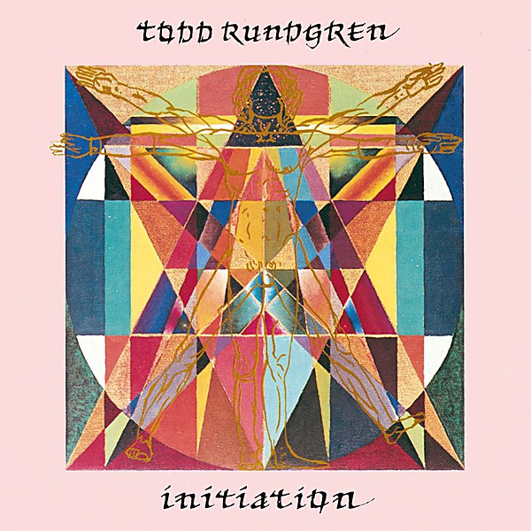

# Initiation

By **Todd Rundgren**

## Album Data

- **Catalog:** Beets
- **Format:** Digital, Album
- **Album:** Initiation
- **Artist:** Todd Rundgren
- **Albumartist:** Todd Rundgren
- **Genre:** Soft Rock
- **MusicBrainz Album Artist ID:** 
- **MusicBrainz Album ID:** 
- **MusicBrainz Release Group ID:** 
- **Year:** 1975
- **Catalog #:** 
- **Label:** 
- **Total Tracks:** 14

## Album Tracks

### Track 01 - Another Life

- **Artist:** Todd Rundgren & The Metropole Orchestra
- **Format:** AAC
- **Genre:** Soft Rock
- **Length:** 7:02
- **MusicBrainz Track ID:** 
- **Title:** Another Life
- **Track:** 01
- **Year:** 2013

### Track 02 - Hello, It's Me

- **Artist:** Todd Rundgren & The Metropole Orchestra
- **Format:** AAC
- **Genre:** Soft Rock
- **Length:** 4:47
- **MusicBrainz Track ID:** 
- **Title:** Hello, It's Me
- **Track:** 02
- **Year:** 2013

### Track 03 - Pretending To Care

- **Artist:** Todd Rundgren & The Metropole Orchestra
- **Format:** AAC
- **Genre:** Soft Rock
- **Length:** 4:51
- **MusicBrainz Track ID:** 
- **Title:** Pretending To Care
- **Track:** 03
- **Year:** 2013

### Track 04 - Flamingo

- **Artist:** Todd Rundgren & The Metropole Orchestra
- **Format:** AAC
- **Genre:** Soft Rock
- **Length:** 3:09
- **MusicBrainz Track ID:** 
- **Title:** Flamingo
- **Track:** 04
- **Year:** 2013

### Track 05 - Frogs

- **Artist:** Todd Rundgren & The Metropole Orchestra
- **Format:** AAC
- **Genre:** Soft Rock
- **Length:** 3:51
- **MusicBrainz Track ID:** 
- **Title:** Frogs
- **Track:** 05
- **Year:** 2013

### Track 06 - If I Have To Be Alone

- **Artist:** Todd Rundgren & The Metropole Orchestra
- **Format:** AAC
- **Genre:** Soft Rock
- **Length:** 3:56
- **MusicBrainz Track ID:** 
- **Title:** If I Have To Be Alone
- **Track:** 06
- **Year:** 2013

### Track 07 - Love In Disguise

- **Artist:** Todd Rundgren & The Metropole Orchestra
- **Format:** AAC
- **Genre:** Soft Rock
- **Length:** 4:08
- **MusicBrainz Track ID:** 
- **Title:** Love In Disguise
- **Track:** 07
- **Year:** 2013

### Track 08 - Love Science

- **Artist:** Todd Rundgren & The Metropole Orchestra
- **Format:** AAC
- **Genre:** Soft Rock
- **Length:** 5:35
- **MusicBrainz Track ID:** 
- **Title:** Love Science
- **Track:** 08
- **Year:** 2013

### Track 09 - Mammon

- **Artist:** Todd Rundgren & The Metropole Orchestra
- **Format:** AAC
- **Genre:** Soft Rock
- **Length:** 4:47
- **MusicBrainz Track ID:** 
- **Title:** Mammon
- **Track:** 09
- **Year:** 2013

### Track 10 - Fascist Christ

- **Artist:** Todd Rundgren & The Metropole Orchestra
- **Format:** AAC
- **Genre:** Soft Rock
- **Length:** 7:48
- **MusicBrainz Track ID:** 
- **Title:** Fascist Christ
- **Track:** 10
- **Year:** 2013

### Track 11 - We Gotta Get You A Woman

- **Artist:** Todd Rundgren & The Metropole Orchestra
- **Format:** AAC
- **Genre:** Soft Rock
- **Length:** 3:44
- **MusicBrainz Track ID:** 
- **Title:** We Gotta Get You A Woman
- **Track:** 11
- **Year:** 2013

### Track 12 - Bag Lady

- **Artist:** Todd Rundgren & The Metropole Orchestra
- **Format:** AAC
- **Genre:** Soft Rock
- **Length:** 4:12
- **MusicBrainz Track ID:** 
- **Title:** Bag Lady
- **Track:** 12
- **Year:** 2013

### Track 13 - Can We Still Be Friends

- **Artist:** Todd Rundgren & The Metropole Orchestra
- **Format:** AAC
- **Genre:** Soft Rock
- **Length:** 4:19
- **MusicBrainz Track ID:** 
- **Title:** Can We Still Be Friends
- **Track:** 13
- **Year:** 2013

### Track 14 - Fade Away

- **Artist:** Todd Rundgren & The Metropole Orchestra
- **Format:** AAC
- **Genre:** Soft Rock
- **Length:** 3:52
- **MusicBrainz Track ID:** 
- **Title:** Fade Away
- **Track:** 14
- **Year:** 2013

## See also

- [2nd Wind](2nd_Wind.md)
- [Almost Famous](Almost_Famous.md)
- [Arena](Arena.md)
- [At the BBC 1972-1982](At_the_BBC_1972-1982.md)
- [A Wizard, a True Star](A_Wizard__a_True_Star.md)
- [A Wizard/A True Star](A_Wizard-A_True_Star.md)
- [Box O' Todd](Box_O_Todd.md)
- [Faithful](Faithful.md)
- [Grok This](Grok_This.md)
- [No World Order](No_World_Order.md)
- [[Re]Production]([Re]Production.md)
- [State [Disc 2]](State_[Disc_2].md)
- [State](State.md)
- [The Ever Popular Tortured Artist Effect](The_Ever_Popular_Tortured_Artist_Effect.md)
- [Todd](Todd.md)
- [Todd Rundgren](Todd_Rundgren.md)
- [Todd Rundgren's Johnson](Todd_Rundgrens_Johnson.md)
- [Todd Rundgren vs. Utopia](Todd_Rundgren_vs_Utopia.md)
- [White Knight](White_Knight.md)
- [With a Twist...](With_a_Twist.md)
- [CD: Todd](../../CD/Todd_Rundgren/Todd.md)
- [CD: ](../../CD/Todd_Rundgren/Todd_Rundgren.md)
- [Roon: A Cappella](../../Roon/Todd_Rundgren/A_Cappella.md)
- [Roon: An Elpee's Worth of Productions](../../Roon/Todd_Rundgren/An_Elpees_Worth_of_Productions.md)
- [Roon: Arena](../../Roon/Todd_Rundgren/Arena.md)
- [Roon: A Wizard / A True Star](../../Roon/Todd_Rundgren/A_Wizard_-_A_True_Star.md)
- [Roon: Deface The Music](../../Roon/Todd_Rundgren/Deface_The_Music.md)
- [Roon: Faithful](../../Roon/Todd_Rundgren/Faithful.md)
- [Roon: Initiation](../../Roon/Todd_Rundgren/Initiation.md)
- [Roon: RA](../../Roon/Todd_Rundgren/RA.md)
- [Roon: Second Wind (Live at the Palace of Fine Arts Theatre, San Francisco, CA, July 1990)](../../Roon/Todd_Rundgren/Second_Wind_Live_at_the_Palace_of_Fine_Arts_Theatre__San_Francisco__CA__July_1990.md)
- [Roon: Something / Anything?](../../Roon/Todd_Rundgren/Something_-_Anything.md)
- [Roon: State Theater New Jersey 2005 (Live)](../../Roon/Todd_Rundgren/State_Theater_New_Jersey_2005_Live.md)
- [Roon: Swing To The Right](../../Roon/Todd_Rundgren/Swing_To_The_Right.md)
- [Roon: The 70's Collection](../../Roon/Todd_Rundgren/The_70s_Collection.md)
- [Roon: Todd](../../Roon/Todd_Rundgren/Todd.md)
- [Roon: Todd Rundgren at the BBC](../../Roon/Todd_Rundgren/Todd_Rundgren_at_the_BBC-_1972-1982.md)
- [Roon: Todd Rundgren's Utopia](../../Roon/Todd_Rundgren/Todd_Rundgrens_Utopia.md)
- [Roon: White Knight](../../Roon/Todd_Rundgren/White_Knight.md)
- [Vinyl: "A Wizard, A True Star"](../../Vinyl/Todd_Rundgren/A_Wizard__A_True_Star.md)
- [Vinyl: Time Heals](../../Vinyl/Todd_Rundgren/Time_Heals.md)
- [Vinyl: Todd](../../Vinyl/Todd_Rundgren/Todd.md)
- [Vinyl: ](../../Vinyl/Todd_Rundgren/Todd_Rundgren.md)
