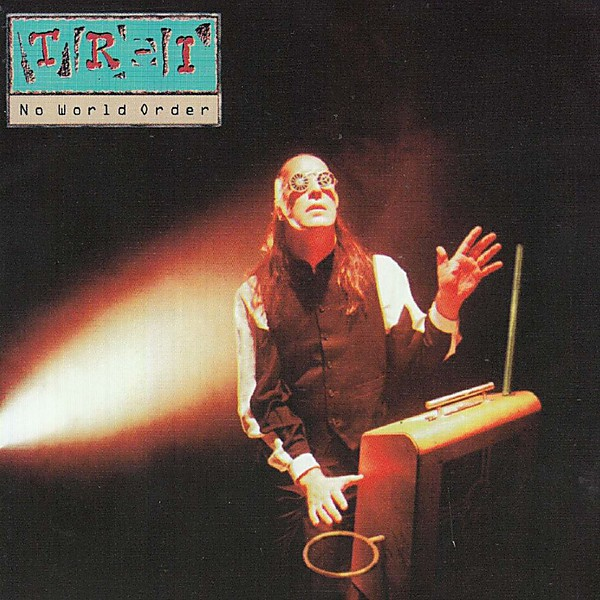

# No World Order

By **Todd Rundgren**

## Album Data

- **Catalog:** Beets
- **Format:** Digital, Album
- **Album:** No World Order
- **Artist:** Todd Rundgren
- **Albumartist:** Todd Rundgren
- **Genre:** Rock
- **MusicBrainz Album Artist ID:** [1a9a8ca0-ea8e-4e9e-96aa-288155bb2c5d](https://musicbrainz.org/artist/1a9a8ca0-ea8e-4e9e-96aa-288155bb2c5d)
- **MusicBrainz Album ID:** [934c62f5-7dc7-4924-b685-24ca181be80b](https://musicbrainz.org/release/934c62f5-7dc7-4924-b685-24ca181be80b)
- **MusicBrainz Release Group ID:** [90212abc-c235-3c9c-9c72-259ec9d5a1a8](https://musicbrainz.org/release-group/90212abc-c235-3c9c-9c72-259ec9d5a1a8)
- **Year:** 1993
- **Catalog #:** EANTCD1017
- **Label:** Esoteric Antenna
- **Total Tracks:** 10

## Album Tracks

### Track 01 - Imagination

- **Artist:** Todd Rundgren
- **Format:** AAC
- **Genre:** Soft Rock
- **Length:** 8:10
- **MusicBrainz Track ID:** [55aadc9c-d211-4977-93c8-6055a058f3c0](https://musicbrainz.org/recording/55aadc9c-d211-4977-93c8-6055a058f3c0)
- **Title:** Imagination
- **Track:** 01
- **Year:** 2013

### Track 02 - Serious

- **Artist:** Todd Rundgren
- **Format:** AAC
- **Genre:** Soft Rock
- **Length:** 4:13
- **MusicBrainz Track ID:** [3f76700c-84f8-4e3f-903e-9ec66e7fd4c9](https://musicbrainz.org/recording/3f76700c-84f8-4e3f-903e-9ec66e7fd4c9)
- **Title:** Serious
- **Track:** 02
- **Year:** 2013

### Track 03 - In My Mouth

- **Artist:** Todd Rundgren
- **Format:** AAC
- **Genre:** Soft Rock
- **Length:** 4:16
- **MusicBrainz Track ID:** [f341fe98-5012-41e1-9e31-cf5bb91c37f5](https://musicbrainz.org/recording/f341fe98-5012-41e1-9e31-cf5bb91c37f5)
- **Title:** In My Mouth
- **Track:** 03
- **Year:** 2013

### Track 04 - Ping Me

- **Artist:** Todd Rundgren
- **Format:** AAC
- **Genre:** Soft Rock
- **Length:** 4:40
- **MusicBrainz Track ID:** [68ef20a1-98e6-45e4-81b9-360f17ab3016](https://musicbrainz.org/recording/68ef20a1-98e6-45e4-81b9-360f17ab3016)
- **Title:** Ping Me
- **Track:** 04
- **Year:** 2013

### Track 05 - Angry Bird

- **Artist:** Todd Rundgren
- **Format:** AAC
- **Genre:** Soft Rock
- **Length:** 4:18
- **MusicBrainz Track ID:** [ef559076-943d-40ea-b400-011d61c33030](https://musicbrainz.org/recording/ef559076-943d-40ea-b400-011d61c33030)
- **Title:** Angry Bird
- **Track:** 05
- **Year:** 2013

### Track 06 - Smoke

- **Artist:** Todd Rundgren
- **Format:** AAC
- **Genre:** Soft Rock
- **Length:** 5:48
- **MusicBrainz Track ID:** [9d268f77-13f6-4817-bd35-28e0b9b69514](https://musicbrainz.org/recording/9d268f77-13f6-4817-bd35-28e0b9b69514)
- **Title:** Smoke
- **Track:** 06
- **Year:** 2013

### Track 07 - Collide-A-Scope

- **Artist:** Todd Rundgren
- **Format:** AAC
- **Genre:** Soft Rock
- **Length:** 5:19
- **MusicBrainz Track ID:** [c8addd64-6ea8-41b2-8eef-e29f4fc9b4b4](https://musicbrainz.org/recording/c8addd64-6ea8-41b2-8eef-e29f4fc9b4b4)
- **Title:** Collide-A-Scope
- **Track:** 07
- **Year:** 2013

### Track 08 - Something From Nothing

- **Artist:** Todd Rundgren
- **Format:** AAC
- **Genre:** Soft Rock
- **Length:** 4:23
- **MusicBrainz Track ID:** [77e040b5-2f34-4733-a6d7-6120ad75198b](https://musicbrainz.org/recording/77e040b5-2f34-4733-a6d7-6120ad75198b)
- **Title:** Something From Nothing
- **Track:** 08
- **Year:** 2013

### Track 09 - Party Liquor

- **Artist:** Todd Rundgren
- **Format:** AAC
- **Genre:** Soft Rock
- **Length:** 4:17
- **MusicBrainz Track ID:** [a4ad3ca9-22e9-40d1-8e46-6d989bbed235](https://musicbrainz.org/recording/a4ad3ca9-22e9-40d1-8e46-6d989bbed235)
- **Title:** Party Liquor
- **Track:** 09
- **Year:** 2013

### Track 10 - Sir Reality

- **Artist:** Todd Rundgren
- **Format:** AAC
- **Genre:** Soft Rock
- **Length:** 6:22
- **MusicBrainz Track ID:** [f8a65d99-2fe8-4ecb-9bf4-466f9960fb6b](https://musicbrainz.org/recording/f8a65d99-2fe8-4ecb-9bf4-466f9960fb6b)
- **Title:** Sir Reality
- **Track:** 10
- **Year:** 2013

## See also

- [2nd Wind](2nd_Wind.md)
- [Almost Famous](Almost_Famous.md)
- [Arena](Arena.md)
- [At the BBC 1972-1982](At_the_BBC_1972-1982.md)
- [A Wizard, a True Star](A_Wizard__a_True_Star.md)
- [A Wizard/A True Star](A_Wizard-A_True_Star.md)
- [Box O' Todd](Box_O_Todd.md)
- [Faithful](Faithful.md)
- [Grok This](Grok_This.md)
- [Initiation](Initiation.md)
- [[Re]Production]([Re]Production.md)
- [State [Disc 2]](State_[Disc_2].md)
- [State](State.md)
- [The Ever Popular Tortured Artist Effect](The_Ever_Popular_Tortured_Artist_Effect.md)
- [Todd](Todd.md)
- [Todd Rundgren](Todd_Rundgren.md)
- [Todd Rundgren's Johnson](Todd_Rundgrens_Johnson.md)
- [Todd Rundgren vs. Utopia](Todd_Rundgren_vs_Utopia.md)
- [White Knight](White_Knight.md)
- [With a Twist...](With_a_Twist.md)
- [CD: Todd](../../CD/Todd_Rundgren/Todd.md)
- [CD: ](../../CD/Todd_Rundgren/Todd_Rundgren.md)
- [Roon: A Cappella](../../Roon/Todd_Rundgren/A_Cappella.md)
- [Roon: An Elpee's Worth of Productions](../../Roon/Todd_Rundgren/An_Elpees_Worth_of_Productions.md)
- [Roon: Arena](../../Roon/Todd_Rundgren/Arena.md)
- [Roon: A Wizard / A True Star](../../Roon/Todd_Rundgren/A_Wizard_-_A_True_Star.md)
- [Roon: Deface The Music](../../Roon/Todd_Rundgren/Deface_The_Music.md)
- [Roon: Faithful](../../Roon/Todd_Rundgren/Faithful.md)
- [Roon: Initiation](../../Roon/Todd_Rundgren/Initiation.md)
- [Roon: RA](../../Roon/Todd_Rundgren/RA.md)
- [Roon: Second Wind (Live at the Palace of Fine Arts Theatre, San Francisco, CA, July 1990)](../../Roon/Todd_Rundgren/Second_Wind_Live_at_the_Palace_of_Fine_Arts_Theatre__San_Francisco__CA__July_1990.md)
- [Roon: Something / Anything?](../../Roon/Todd_Rundgren/Something_-_Anything.md)
- [Roon: State Theater New Jersey 2005 (Live)](../../Roon/Todd_Rundgren/State_Theater_New_Jersey_2005_Live.md)
- [Roon: Swing To The Right](../../Roon/Todd_Rundgren/Swing_To_The_Right.md)
- [Roon: The 70's Collection](../../Roon/Todd_Rundgren/The_70s_Collection.md)
- [Roon: Todd](../../Roon/Todd_Rundgren/Todd.md)
- [Roon: Todd Rundgren at the BBC](../../Roon/Todd_Rundgren/Todd_Rundgren_at_the_BBC-_1972-1982.md)
- [Roon: Todd Rundgren's Utopia](../../Roon/Todd_Rundgren/Todd_Rundgrens_Utopia.md)
- [Roon: White Knight](../../Roon/Todd_Rundgren/White_Knight.md)
- [Vinyl: "A Wizard, A True Star"](../../Vinyl/Todd_Rundgren/A_Wizard__A_True_Star.md)
- [Vinyl: Time Heals](../../Vinyl/Todd_Rundgren/Time_Heals.md)
- [Vinyl: Todd](../../Vinyl/Todd_Rundgren/Todd.md)
- [Vinyl: ](../../Vinyl/Todd_Rundgren/Todd_Rundgren.md)
