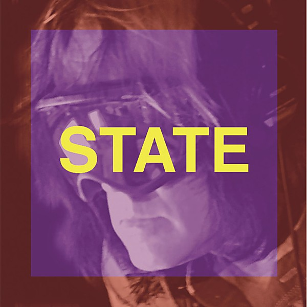

# State

By **Todd Rundgren**

## Album Data

- **Catalog:** Beets
- **Format:** Digital, Album
- **Album:** State
- **Artist:** Todd Rundgren
- **Albumartist:** Todd Rundgren
- **Genre:** Soft Rock
- **MusicBrainz Album Artist ID:** [1a9a8ca0-ea8e-4e9e-96aa-288155bb2c5d](https://musicbrainz.org/artist/1a9a8ca0-ea8e-4e9e-96aa-288155bb2c5d)
- **MusicBrainz Album ID:** [7469bd04-8664-4d2d-a148-4e1b0f7ca976](https://musicbrainz.org/release/7469bd04-8664-4d2d-a148-4e1b0f7ca976)
- **MusicBrainz Release Group ID:** [bf4b0591-431d-4a75-9bf9-c15f405cff82](https://musicbrainz.org/release-group/bf4b0591-431d-4a75-9bf9-c15f405cff82)
- **Year:** 2013
- **Catalog #:** R2CD 71108
- **Label:** Rhino
- **Total Tracks:** 17

## Album Tracks

### Track 01 - How About a Little Fanfare?

- **Artist:** Todd Rundgren
- **Format:** ALAC
- **Genre:** Techno
- **Length:** 1:03
- **MusicBrainz Track ID:** [d91611a8-771f-45a2-841c-5133c53dbc3e](https://musicbrainz.org/recording/d91611a8-771f-45a2-841c-5133c53dbc3e)
- **Title:** How About a Little Fanfare?
- **Track:** 01
- **Year:** 1991

### Track 02 - I Think You Know

- **Artist:** Todd Rundgren
- **Format:** ALAC
- **Genre:** Blue-Eyed Soul
- **Length:** 3:04
- **MusicBrainz Track ID:** [6e0fce4d-c08f-4554-81f3-0c0e72850bc0](https://musicbrainz.org/recording/6e0fce4d-c08f-4554-81f3-0c0e72850bc0)
- **Title:** I Think You Know
- **Track:** 02
- **Year:** 1991

### Track 03 - The Spark of Life

- **Artist:** Todd Rundgren
- **Format:** ALAC
- **Genre:** Soft Rock
- **Length:** 6:23
- **MusicBrainz Track ID:** [845aa299-56fa-4e4e-bc5d-09386734b1fb](https://musicbrainz.org/recording/845aa299-56fa-4e4e-bc5d-09386734b1fb)
- **Title:** The Spark of Life
- **Track:** 03
- **Year:** 1991

### Track 04 - An Elpee's Worth of Toons

- **Artist:** Todd Rundgren
- **Format:** ALAC
- **Genre:** Electronic
- **Length:** 2:09
- **MusicBrainz Track ID:** [6267b236-ec54-439f-a6b0-1d9f007bd235](https://musicbrainz.org/recording/6267b236-ec54-439f-a6b0-1d9f007bd235)
- **Title:** An Elpee's Worth of Toons
- **Track:** 04
- **Year:** 1991

### Track 05 - A Dream Goes on Forever

- **Artist:** Todd Rundgren
- **Format:** ALAC
- **Genre:** Blue-Eyed Soul
- **Length:** 2:21
- **MusicBrainz Track ID:** [9efec5a1-a833-4bb7-91fb-21636d5b9651](https://musicbrainz.org/recording/9efec5a1-a833-4bb7-91fb-21636d5b9651)
- **Title:** A Dream Goes on Forever
- **Track:** 05
- **Year:** 1991

### Track 06 - Lord Chancellor's Nightmare Song

- **Artist:** Todd Rundgren
- **Format:** ALAC
- **Genre:** Soft Rock
- **Length:** 3:32
- **MusicBrainz Track ID:** [600ecde4-881e-4ff1-a5af-a4539206406d](https://musicbrainz.org/recording/600ecde4-881e-4ff1-a5af-a4539206406d)
- **Title:** Lord Chancellor's Nightmare Song
- **Track:** 06
- **Year:** 1991

### Track 07 - Drunken Blue Rooster

- **Artist:** Todd Rundgren
- **Format:** ALAC
- **Genre:** Art Rock
- **Length:** 3:00
- **MusicBrainz Track ID:** [5d1baf57-ae7e-406d-a82a-ecb04a2ce597](https://musicbrainz.org/recording/5d1baf57-ae7e-406d-a82a-ecb04a2ce597)
- **Title:** Drunken Blue Rooster
- **Track:** 07
- **Year:** 1991

### Track 08 - The Last Ride

- **Artist:** Todd Rundgren
- **Format:** ALAC
- **Genre:** Blue-Eyed Soul
- **Length:** 4:48
- **MusicBrainz Track ID:** [e3017dcf-a5fa-4225-858c-0c781ded297b](https://musicbrainz.org/recording/e3017dcf-a5fa-4225-858c-0c781ded297b)
- **Title:** The Last Ride
- **Track:** 08
- **Year:** 1991

### Track 09 - Everybody's Going To Heaven / King Kong Reggae

- **Artist:** Todd Rundgren
- **Format:** ALAC
- **Genre:** Progressive Rock
- **Length:** 6:38
- **MusicBrainz Track ID:** [157a4112-5b61-417a-af70-f98a8ed6d78e](https://musicbrainz.org/recording/157a4112-5b61-417a-af70-f98a8ed6d78e)
- **Title:** Everybody's Going To Heaven / King Kong Reggae
- **Track:** 09
- **Year:** 1991

### Track 10 - Number 1 Lowest Common Denominator

- **Artist:** Todd Rundgren
- **Format:** ALAC
- **Genre:** Rock
- **Length:** 5:12
- **MusicBrainz Track ID:** [311919e6-ed65-495b-b5f0-649aa42de2dd](https://musicbrainz.org/recording/311919e6-ed65-495b-b5f0-649aa42de2dd)
- **Title:** Number 1 Lowest Common Denominator
- **Track:** 10
- **Year:** 1991

### Track 11 - Useless Begging

- **Artist:** Todd Rundgren
- **Format:** ALAC
- **Genre:** Blue-Eyed Soul
- **Length:** 3:40
- **MusicBrainz Track ID:** [720e0456-f5c3-40db-be1a-c3da94e022a5](https://musicbrainz.org/recording/720e0456-f5c3-40db-be1a-c3da94e022a5)
- **Title:** Useless Begging
- **Track:** 11
- **Year:** 1991

### Track 12 - Sidewalk Cafe

- **Artist:** Todd Rundgren
- **Format:** ALAC
- **Genre:** Rock
- **Length:** 2:15
- **MusicBrainz Track ID:** [fc1975be-2ef4-4346-a016-9747e98c6224](https://musicbrainz.org/recording/fc1975be-2ef4-4346-a016-9747e98c6224)
- **Title:** Sidewalk Cafe
- **Track:** 12
- **Year:** 1991

### Track 13 - Izzat Love?

- **Artist:** Todd Rundgren
- **Format:** ALAC
- **Genre:** Rock
- **Length:** 1:55
- **MusicBrainz Track ID:** [f5745005-c675-4b50-80c3-dadf4c94c541](https://musicbrainz.org/recording/f5745005-c675-4b50-80c3-dadf4c94c541)
- **Title:** Izzat Love?
- **Track:** 13
- **Year:** 1991

### Track 14 - Heavy Metal Kids

- **Artist:** Todd Rundgren
- **Format:** ALAC
- **Genre:** Heavy Metal
- **Length:** 4:16
- **MusicBrainz Track ID:** [789a6531-db3f-4d83-9623-6172d557a27a](https://musicbrainz.org/recording/789a6531-db3f-4d83-9623-6172d557a27a)
- **Title:** Heavy Metal Kids
- **Track:** 14
- **Year:** 1991

### Track 15 - In and Out the Chakras We Go

- **Artist:** Todd Rundgren
- **Format:** ALAC
- **Genre:** Soft Rock
- **Length:** 5:47
- **MusicBrainz Track ID:** [13ca6d06-55ed-40a1-9a5a-b0555d5eb6a6](https://musicbrainz.org/recording/13ca6d06-55ed-40a1-9a5a-b0555d5eb6a6)
- **Title:** In and Out the Chakras We Go
- **Track:** 15
- **Year:** 1991

### Track 16 - Don't You Ever Learn?

- **Artist:** Todd Rundgren
- **Format:** ALAC
- **Genre:** Art Rock
- **Length:** 6:06
- **MusicBrainz Track ID:** [88abfbb1-4b74-42f1-a5cd-336ca113dc29](https://musicbrainz.org/recording/88abfbb1-4b74-42f1-a5cd-336ca113dc29)
- **Title:** Don't You Ever Learn?
- **Track:** 16
- **Year:** 1991

### Track 17 - Sons of 1984

- **Artist:** Todd Rundgren
- **Format:** ALAC
- **Genre:** Art Rock
- **Length:** 4:34
- **MusicBrainz Track ID:** [701fba18-8cfa-42dc-bd9c-51b6c895f87c](https://musicbrainz.org/recording/701fba18-8cfa-42dc-bd9c-51b6c895f87c)
- **Title:** Sons of 1984
- **Track:** 17
- **Year:** 1991

## See also

- [2nd Wind](2nd_Wind.md)
- [Almost Famous](Almost_Famous.md)
- [Arena](Arena.md)
- [At the BBC 1972-1982](At_the_BBC_1972-1982.md)
- [A Wizard, a True Star](A_Wizard__a_True_Star.md)
- [A Wizard/A True Star](A_Wizard-A_True_Star.md)
- [Box O' Todd](Box_O_Todd.md)
- [Faithful](Faithful.md)
- [Grok This](Grok_This.md)
- [Initiation](Initiation.md)
- [No World Order](No_World_Order.md)
- [[Re]Production]([Re]Production.md)
- [State [Disc 2]](State_[Disc_2].md)
- [The Ever Popular Tortured Artist Effect](The_Ever_Popular_Tortured_Artist_Effect.md)
- [Todd](Todd.md)
- [Todd Rundgren](Todd_Rundgren.md)
- [Todd Rundgren's Johnson](Todd_Rundgrens_Johnson.md)
- [Todd Rundgren vs. Utopia](Todd_Rundgren_vs_Utopia.md)
- [White Knight](White_Knight.md)
- [With a Twist...](With_a_Twist.md)
- [CD: Todd](../../CD/Todd_Rundgren/Todd.md)
- [CD: ](../../CD/Todd_Rundgren/Todd_Rundgren.md)
- [Roon: A Cappella](../../Roon/Todd_Rundgren/A_Cappella.md)
- [Roon: An Elpee's Worth of Productions](../../Roon/Todd_Rundgren/An_Elpees_Worth_of_Productions.md)
- [Roon: Arena](../../Roon/Todd_Rundgren/Arena.md)
- [Roon: A Wizard / A True Star](../../Roon/Todd_Rundgren/A_Wizard_-_A_True_Star.md)
- [Roon: Deface The Music](../../Roon/Todd_Rundgren/Deface_The_Music.md)
- [Roon: Faithful](../../Roon/Todd_Rundgren/Faithful.md)
- [Roon: Initiation](../../Roon/Todd_Rundgren/Initiation.md)
- [Roon: RA](../../Roon/Todd_Rundgren/RA.md)
- [Roon: Second Wind (Live at the Palace of Fine Arts Theatre, San Francisco, CA, July 1990)](../../Roon/Todd_Rundgren/Second_Wind_Live_at_the_Palace_of_Fine_Arts_Theatre__San_Francisco__CA__July_1990.md)
- [Roon: Something / Anything?](../../Roon/Todd_Rundgren/Something_-_Anything.md)
- [Roon: State Theater New Jersey 2005 (Live)](../../Roon/Todd_Rundgren/State_Theater_New_Jersey_2005_Live.md)
- [Roon: Swing To The Right](../../Roon/Todd_Rundgren/Swing_To_The_Right.md)
- [Roon: The 70's Collection](../../Roon/Todd_Rundgren/The_70s_Collection.md)
- [Roon: Todd](../../Roon/Todd_Rundgren/Todd.md)
- [Roon: Todd Rundgren at the BBC](../../Roon/Todd_Rundgren/Todd_Rundgren_at_the_BBC-_1972-1982.md)
- [Roon: Todd Rundgren's Utopia](../../Roon/Todd_Rundgren/Todd_Rundgrens_Utopia.md)
- [Roon: White Knight](../../Roon/Todd_Rundgren/White_Knight.md)
- [Vinyl: "A Wizard, A True Star"](../../Vinyl/Todd_Rundgren/A_Wizard__A_True_Star.md)
- [Vinyl: Time Heals](../../Vinyl/Todd_Rundgren/Time_Heals.md)
- [Vinyl: Todd](../../Vinyl/Todd_Rundgren/Todd.md)
- [Vinyl: ](../../Vinyl/Todd_Rundgren/Todd_Rundgren.md)
