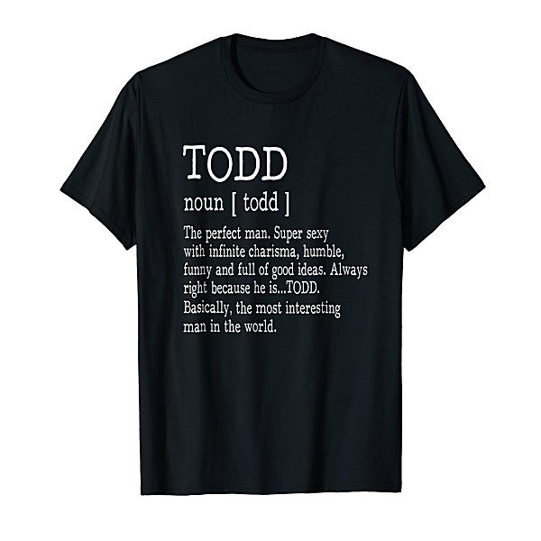

# State [Disc 2]

By **Todd Rundgren**

## Album Data

- **Catalog:** Beets
- **Format:** Digital, Album
- **Album:** State [Disc 2]
- **Artist:** Todd Rundgren
- **Albumartist:** Todd Rundgren
- **Genre:** Soft Rock
- **MusicBrainz Album Artist ID:** 
- **MusicBrainz Album ID:** 
- **MusicBrainz Release Group ID:** 
- **Year:** 2013
- **Catalog #:** 
- **Label:** 
- **Total Tracks:** 00

## Album Tracks

### Track 00 - Credits

- **Artist:** Todd Rundgren
- **Format:** AAC
- **Genre:** Soft Rock
- **Length:** 0:00
- **MusicBrainz Track ID:** 
- **Title:** Credits
- **Track:** 00
- **Year:** 1983

### Track 00 - Hideaway

- **Artist:** Todd Rundgren
- **Format:** AAC
- **Genre:** Soft Rock
- **Length:** 5:03
- **MusicBrainz Track ID:** 
- **Title:** Hideaway
- **Track:** 00
- **Year:** 1983

### Track 00 - T.E.P.T.A.E

- **Artist:** Todd Rundgren
- **Format:** AAC
- **Genre:** Soft Rock
- **Length:** 81:35
- **MusicBrainz Track ID:** 
- **Title:** T.E.P.T.A.E
- **Track:** 00
- **Year:** 1983

