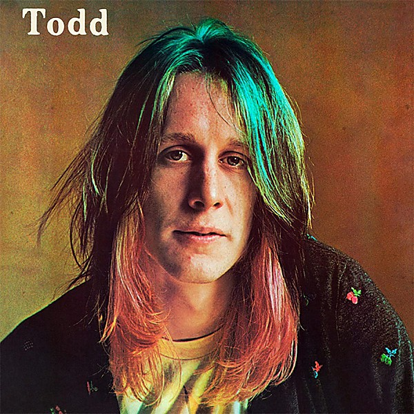

# Todd

By **Todd Rundgren**

## Album Data

- **Catalog:** Beets
- **Format:** Digital, Album
- **Album:** Todd
- **Artist:** Todd Rundgren
- **Albumartist:** Todd Rundgren
- **Genre:** Soft Rock
- **MusicBrainz Album Artist ID:** [1a9a8ca0-ea8e-4e9e-96aa-288155bb2c5d](https://musicbrainz.org/artist/1a9a8ca0-ea8e-4e9e-96aa-288155bb2c5d)
- **MusicBrainz Album ID:** [30915098-2d1c-302e-8284-d3d2e41509e5](https://musicbrainz.org/release/30915098-2d1c-302e-8284-d3d2e41509e5)
- **MusicBrainz Release Group ID:** [f9ad043f-a650-3c97-8a3e-54a6b56f1d5f](https://musicbrainz.org/release-group/f9ad043f-a650-3c97-8a3e-54a6b56f1d5f)
- **Year:** 1991
- **Catalog #:** MPCA-25762
- **Label:** MPCA Records
- **Total Tracks:** 12

## Album Tracks

### Track 01 - Dust My Broom

- **Artist:** Todd Rundgren
- **Format:** AAC
- **Genre:** Soft Rock
- **Length:** 2:47
- **MusicBrainz Track ID:** [ac31ee14-6e40-4a32-b5d3-84719f48a630](https://musicbrainz.org/recording/ac31ee14-6e40-4a32-b5d3-84719f48a630)
- **Title:** Dust My Broom
- **Track:** 01
- **Year:** 2011

### Track 02 - Stop Breakin' Down

- **Artist:** Todd Rundgren
- **Format:** AAC
- **Genre:** Soft Rock
- **Length:** 3:54
- **MusicBrainz Track ID:** [89e053a0-8d56-42d1-becb-0b3e6dd98a80](https://musicbrainz.org/recording/89e053a0-8d56-42d1-becb-0b3e6dd98a80)
- **Title:** Stop Breakin' Down
- **Track:** 02
- **Year:** 2011

### Track 03 - Kindhearted Woman Blues

- **Artist:** Todd Rundgren
- **Format:** AAC
- **Genre:** Soft Rock
- **Length:** 3:10
- **MusicBrainz Track ID:** [37198cae-2008-4ebf-8391-8c50457348b6](https://musicbrainz.org/recording/37198cae-2008-4ebf-8391-8c50457348b6)
- **Title:** Kindhearted Woman Blues
- **Track:** 03
- **Year:** 2011

### Track 04 - Walking Blues

- **Artist:** Todd Rundgren
- **Format:** AAC
- **Genre:** Soft Rock
- **Length:** 3:26
- **MusicBrainz Track ID:** [b10f78c0-8999-4e46-a3b2-98aa5f39bb15](https://musicbrainz.org/recording/b10f78c0-8999-4e46-a3b2-98aa5f39bb15)
- **Title:** Walking Blues
- **Track:** 04
- **Year:** 2011

### Track 05 - Love In Vain

- **Artist:** Todd Rundgren
- **Format:** AAC
- **Genre:** Soft Rock
- **Length:** 3:44
- **MusicBrainz Track ID:** [ee56f4dc-4fb2-474c-94a1-398392788062](https://musicbrainz.org/recording/ee56f4dc-4fb2-474c-94a1-398392788062)
- **Title:** Love In Vain
- **Track:** 05
- **Year:** 2011

### Track 06 - Last Fair Deal Gone Down

- **Artist:** Todd Rundgren
- **Format:** AAC
- **Genre:** Soft Rock
- **Length:** 2:55
- **MusicBrainz Track ID:** [df04c53f-99fa-42fa-b8f4-1b7794e1a18c](https://musicbrainz.org/recording/df04c53f-99fa-42fa-b8f4-1b7794e1a18c)
- **Title:** Last Fair Deal Gone Down
- **Track:** 06
- **Year:** 2011

### Track 07 - Sweet Home Chicago

- **Artist:** Todd Rundgren
- **Format:** AAC
- **Genre:** Soft Rock
- **Length:** 5:21
- **MusicBrainz Track ID:** [8edf88ed-1001-4242-ac24-c63b3278f1ee](https://musicbrainz.org/recording/8edf88ed-1001-4242-ac24-c63b3278f1ee)
- **Title:** Sweet Home Chicago
- **Track:** 07
- **Year:** 2011

### Track 08 - They're Red Hot

- **Artist:** Todd Rundgren
- **Format:** AAC
- **Genre:** Soft Rock
- **Length:** 2:40
- **MusicBrainz Track ID:** [7c8c4211-abb4-4162-b213-9d5de0e1e80b](https://musicbrainz.org/recording/7c8c4211-abb4-4162-b213-9d5de0e1e80b)
- **Title:** They're Red Hot
- **Track:** 08
- **Year:** 2011

### Track 09 - Come On In My Kitchen

- **Artist:** Todd Rundgren
- **Format:** AAC
- **Genre:** Soft Rock
- **Length:** 3:00
- **MusicBrainz Track ID:** [88c0bf61-185d-49ce-9d52-254d81c2202d](https://musicbrainz.org/recording/88c0bf61-185d-49ce-9d52-254d81c2202d)
- **Title:** Come On In My Kitchen
- **Track:** 09
- **Year:** 2011

### Track 10 - Hellhound On My Trail

- **Artist:** Todd Rundgren
- **Format:** AAC
- **Genre:** Soft Rock
- **Length:** 3:30
- **MusicBrainz Track ID:** [a55f8fd3-4cb4-4718-b9d2-55a77c048b1c](https://musicbrainz.org/recording/a55f8fd3-4cb4-4718-b9d2-55a77c048b1c)
- **Title:** Hellhound On My Trail
- **Track:** 10
- **Year:** 2011

### Track 11 - Traveling Riverside Blues

- **Artist:** Todd Rundgren
- **Format:** AAC
- **Genre:** Soft Rock
- **Length:** 3:00
- **MusicBrainz Track ID:** [bd508306-cd99-4e6b-b7e2-e088b7277d37](https://musicbrainz.org/recording/bd508306-cd99-4e6b-b7e2-e088b7277d37)
- **Title:** Traveling Riverside Blues
- **Track:** 11
- **Year:** 2011

### Track 12 - Crossroads Blues

- **Artist:** Todd Rundgren
- **Format:** AAC
- **Genre:** Soft Rock
- **Length:** 3:05
- **MusicBrainz Track ID:** [bd8b9e35-9010-4595-a9ca-61cb7fa62c4f](https://musicbrainz.org/recording/bd8b9e35-9010-4595-a9ca-61cb7fa62c4f)
- **Title:** Crossroads Blues
- **Track:** 12
- **Year:** 2011

## See also

- [2nd Wind](2nd_Wind.md)
- [Almost Famous](Almost_Famous.md)
- [Arena](Arena.md)
- [At the BBC 1972-1982](At_the_BBC_1972-1982.md)
- [A Wizard, a True Star](A_Wizard__a_True_Star.md)
- [A Wizard/A True Star](A_Wizard-A_True_Star.md)
- [Box O' Todd](Box_O_Todd.md)
- [Faithful](Faithful.md)
- [Grok This](Grok_This.md)
- [Initiation](Initiation.md)
- [No World Order](No_World_Order.md)
- [[Re]Production]([Re]Production.md)
- [State [Disc 2]](State_[Disc_2].md)
- [State](State.md)
- [The Ever Popular Tortured Artist Effect](The_Ever_Popular_Tortured_Artist_Effect.md)
- [Todd Rundgren](Todd_Rundgren.md)
- [Todd Rundgren's Johnson](Todd_Rundgrens_Johnson.md)
- [Todd Rundgren vs. Utopia](Todd_Rundgren_vs_Utopia.md)
- [White Knight](White_Knight.md)
- [With a Twist...](With_a_Twist.md)
- [CD: Todd](../../CD/Todd_Rundgren/Todd.md)
- [CD: ](../../CD/Todd_Rundgren/Todd_Rundgren.md)
- [Roon: A Cappella](../../Roon/Todd_Rundgren/A_Cappella.md)
- [Roon: An Elpee's Worth of Productions](../../Roon/Todd_Rundgren/An_Elpees_Worth_of_Productions.md)
- [Roon: Arena](../../Roon/Todd_Rundgren/Arena.md)
- [Roon: A Wizard / A True Star](../../Roon/Todd_Rundgren/A_Wizard_-_A_True_Star.md)
- [Roon: Deface The Music](../../Roon/Todd_Rundgren/Deface_The_Music.md)
- [Roon: Faithful](../../Roon/Todd_Rundgren/Faithful.md)
- [Roon: Initiation](../../Roon/Todd_Rundgren/Initiation.md)
- [Roon: RA](../../Roon/Todd_Rundgren/RA.md)
- [Roon: Second Wind (Live at the Palace of Fine Arts Theatre, San Francisco, CA, July 1990)](../../Roon/Todd_Rundgren/Second_Wind_Live_at_the_Palace_of_Fine_Arts_Theatre__San_Francisco__CA__July_1990.md)
- [Roon: Something / Anything?](../../Roon/Todd_Rundgren/Something_-_Anything.md)
- [Roon: State Theater New Jersey 2005 (Live)](../../Roon/Todd_Rundgren/State_Theater_New_Jersey_2005_Live.md)
- [Roon: Swing To The Right](../../Roon/Todd_Rundgren/Swing_To_The_Right.md)
- [Roon: The 70's Collection](../../Roon/Todd_Rundgren/The_70s_Collection.md)
- [Roon: Todd](../../Roon/Todd_Rundgren/Todd.md)
- [Roon: Todd Rundgren at the BBC](../../Roon/Todd_Rundgren/Todd_Rundgren_at_the_BBC-_1972-1982.md)
- [Roon: Todd Rundgren's Utopia](../../Roon/Todd_Rundgren/Todd_Rundgrens_Utopia.md)
- [Roon: White Knight](../../Roon/Todd_Rundgren/White_Knight.md)
- [Vinyl: "A Wizard, A True Star"](../../Vinyl/Todd_Rundgren/A_Wizard__A_True_Star.md)
- [Vinyl: Time Heals](../../Vinyl/Todd_Rundgren/Time_Heals.md)
- [Vinyl: Todd](../../Vinyl/Todd_Rundgren/Todd.md)
- [Vinyl: ](../../Vinyl/Todd_Rundgren/Todd_Rundgren.md)
