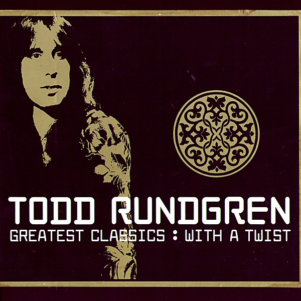

# Todd Rundgren

By **Todd Rundgren**

## Album Data

- **Catalog:** Beets
- **Format:** Digital, Album
- **Album:** Todd Rundgren
- **Artist:** Todd Rundgren
- **Albumartist:** Todd Rundgren
- **Genre:** Soft Rock
- **MusicBrainz Album Artist ID:** 
- **MusicBrainz Album ID:** 
- **MusicBrainz Release Group ID:** 
- **Year:** 0000
- **Catalog #:** 
- **Label:** 
- **Total Tracks:** 00

## Album Tracks

### Track 00 - 01-Love Is the Answer [Fredco Mix]

- **Artist:** Todd Rundgren
- **Format:** ALAC
- **Genre:** Soft Rock
- **Length:** 5:14
- **MusicBrainz Track ID:** 
- **Title:** 01-Love Is the Answer [Fredco Mix]
- **Track:** 00
- **Year:** 0000

### Track 00 - 02-Drive [Chemical Groove Mix]

- **Artist:** Todd Rundgren
- **Format:** ALAC
- **Genre:** Soft Rock
- **Length:** 4:58
- **MusicBrainz Track ID:** 
- **Title:** 02-Drive [Chemical Groove Mix]
- **Track:** 00
- **Year:** 0000

### Track 00 - 03-Something to Fall Back On [Jlab Mix]

- **Artist:** Todd Rundgren
- **Format:** ALAC
- **Genre:** Soft Rock
- **Length:** 4:53
- **MusicBrainz Track ID:** 
- **Title:** 03-Something to Fall Back On [Jlab Mix]
- **Track:** 00
- **Year:** 0000

### Track 00 - 04-Hello It's Me [Interface Mix]

- **Artist:** Todd Rundgren
- **Format:** ALAC
- **Genre:** Soft Rock
- **Length:** 4:01
- **MusicBrainz Track ID:** 
- **Title:** 04-Hello It's Me [Interface Mix]
- **Track:** 00
- **Year:** 0000

### Track 00 - 05-Bang the Drum All Day [Rosetta Stone Mix]

- **Artist:** Todd Rundgren
- **Format:** ALAC
- **Genre:** Soft Rock
- **Length:** 4:12
- **MusicBrainz Track ID:** 
- **Title:** 05-Bang the Drum All Day [Rosetta Stone Mix]
- **Track:** 00
- **Year:** 0000

### Track 00 - 06-Tiny Demons [Mission U.K. Mix]

- **Artist:** Todd Rundgren
- **Format:** ALAC
- **Genre:** Soft Rock
- **Length:** 4:23
- **MusicBrainz Track ID:** 
- **Title:** 06-Tiny Demons [Mission U.K. Mix]
- **Track:** 00
- **Year:** 0000

### Track 00 - 07-Mated [Switchblade Symphony Mix]

- **Artist:** Todd Rundgren
- **Format:** ALAC
- **Genre:** Soft Rock
- **Length:** 4:56
- **MusicBrainz Track ID:** 
- **Title:** 07-Mated [Switchblade Symphony Mix]
- **Track:** 00
- **Year:** 0000

### Track 00 - 08-A Dream Goes on Forever [Synical Mix]

- **Artist:** Todd Rundgren
- **Format:** ALAC
- **Genre:** Soft Rock
- **Length:** 3:06
- **MusicBrainz Track ID:** 
- **Title:** 08-A Dream Goes on Forever [Synical Mix]
- **Track:** 00
- **Year:** 0000

### Track 00 - 09-Time Heals [Decoding Jesus Mix]

- **Artist:** Todd Rundgren
- **Format:** ALAC
- **Genre:** Soft Rock
- **Length:** 4:03
- **MusicBrainz Track ID:** 
- **Title:** 09-Time Heals [Decoding Jesus Mix]
- **Track:** 00
- **Year:** 0000

### Track 00 - 10-Hello It's Me [!Tang-Pfoot Soul Dub Mix]

- **Artist:** Todd Rundgren
- **Format:** ALAC
- **Genre:** Soft Rock
- **Length:** 4:18
- **MusicBrainz Track ID:** 
- **Title:** 10-Hello It's Me [!Tang-Pfoot Soul Dub Mix]
- **Track:** 00
- **Year:** 0000

### Track 00 - 11-Lord Chancellor's Nightmare Song [Flow Mix]

- **Artist:** Todd Rundgren
- **Format:** ALAC
- **Genre:** Soft Rock
- **Length:** 4:26
- **MusicBrainz Track ID:** 
- **Title:** 11-Lord Chancellor's Nightmare Song [Flow Mix]
- **Track:** 00
- **Year:** 0000

### Track 00 - 12-Secret Society [Astralasia Mix]

- **Artist:** Todd Rundgren
- **Format:** ALAC
- **Genre:** Soft Rock
- **Length:** 4:51
- **MusicBrainz Track ID:** 
- **Title:** 12-Secret Society [Astralasia Mix]
- **Track:** 00
- **Year:** 0000

### Track 00 - 13-Emperor of the Highway [Spahn Ranch Mix]

- **Artist:** Todd Rundgren
- **Format:** ALAC
- **Genre:** Soft Rock
- **Length:** 1:29
- **MusicBrainz Track ID:** 
- **Title:** 13-Emperor of the Highway [Spahn Ranch Mix]
- **Track:** 00
- **Year:** 0000

### Track 00 - 14-Bang the Drum All Day [Skip Heller y Sus Orquestra sin Pagar]

- **Artist:** Todd Rundgren
- **Format:** ALAC
- **Genre:** Soft Rock
- **Length:** 3:30
- **MusicBrainz Track ID:** 
- **Title:** 14-Bang the Drum All Day [Skip Heller y Sus Orquestra sin Pagar]
- **Track:** 00
- **Year:** 0000

## See also

- [2nd Wind](2nd_Wind.md)
- [Almost Famous](Almost_Famous.md)
- [Arena](Arena.md)
- [At the BBC 1972-1982](At_the_BBC_1972-1982.md)
- [A Wizard, a True Star](A_Wizard__a_True_Star.md)
- [A Wizard/A True Star](A_Wizard-A_True_Star.md)
- [Box O' Todd](Box_O_Todd.md)
- [Faithful](Faithful.md)
- [Grok This](Grok_This.md)
- [Initiation](Initiation.md)
- [No World Order](No_World_Order.md)
- [[Re]Production]([Re]Production.md)
- [State [Disc 2]](State_[Disc_2].md)
- [State](State.md)
- [The Ever Popular Tortured Artist Effect](The_Ever_Popular_Tortured_Artist_Effect.md)
- [Todd](Todd.md)
- [Todd Rundgren's Johnson](Todd_Rundgrens_Johnson.md)
- [Todd Rundgren vs. Utopia](Todd_Rundgren_vs_Utopia.md)
- [White Knight](White_Knight.md)
- [With a Twist...](With_a_Twist.md)
- [CD: Todd](../../CD/Todd_Rundgren/Todd.md)
- [CD: ](../../CD/Todd_Rundgren/Todd_Rundgren.md)
- [Roon: A Cappella](../../Roon/Todd_Rundgren/A_Cappella.md)
- [Roon: An Elpee's Worth of Productions](../../Roon/Todd_Rundgren/An_Elpees_Worth_of_Productions.md)
- [Roon: Arena](../../Roon/Todd_Rundgren/Arena.md)
- [Roon: A Wizard / A True Star](../../Roon/Todd_Rundgren/A_Wizard_-_A_True_Star.md)
- [Roon: Deface The Music](../../Roon/Todd_Rundgren/Deface_The_Music.md)
- [Roon: Faithful](../../Roon/Todd_Rundgren/Faithful.md)
- [Roon: Initiation](../../Roon/Todd_Rundgren/Initiation.md)
- [Roon: RA](../../Roon/Todd_Rundgren/RA.md)
- [Roon: Second Wind (Live at the Palace of Fine Arts Theatre, San Francisco, CA, July 1990)](../../Roon/Todd_Rundgren/Second_Wind_Live_at_the_Palace_of_Fine_Arts_Theatre__San_Francisco__CA__July_1990.md)
- [Roon: Something / Anything?](../../Roon/Todd_Rundgren/Something_-_Anything.md)
- [Roon: State Theater New Jersey 2005 (Live)](../../Roon/Todd_Rundgren/State_Theater_New_Jersey_2005_Live.md)
- [Roon: Swing To The Right](../../Roon/Todd_Rundgren/Swing_To_The_Right.md)
- [Roon: The 70's Collection](../../Roon/Todd_Rundgren/The_70s_Collection.md)
- [Roon: Todd](../../Roon/Todd_Rundgren/Todd.md)
- [Roon: Todd Rundgren at the BBC](../../Roon/Todd_Rundgren/Todd_Rundgren_at_the_BBC-_1972-1982.md)
- [Roon: Todd Rundgren's Utopia](../../Roon/Todd_Rundgren/Todd_Rundgrens_Utopia.md)
- [Roon: White Knight](../../Roon/Todd_Rundgren/White_Knight.md)
- [Vinyl: "A Wizard, A True Star"](../../Vinyl/Todd_Rundgren/A_Wizard__A_True_Star.md)
- [Vinyl: Time Heals](../../Vinyl/Todd_Rundgren/Time_Heals.md)
- [Vinyl: Todd](../../Vinyl/Todd_Rundgren/Todd.md)
- [Vinyl: ](../../Vinyl/Todd_Rundgren/Todd_Rundgren.md)
