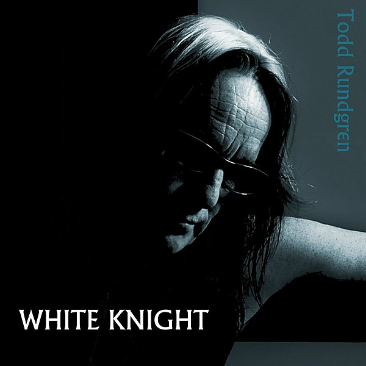

# White Knight

By **Todd Rundgren**

## Album Data

- **Catalog:** Beets
- **Format:** Digital, Album
- **Album:** White Knight
- **Artist:** Todd Rundgren
- **Albumartist:** Todd Rundgren
- **Genre:** Soft Rock
- **MusicBrainz Album Artist ID:** [1a9a8ca0-ea8e-4e9e-96aa-288155bb2c5d](https://musicbrainz.org/artist/1a9a8ca0-ea8e-4e9e-96aa-288155bb2c5d)
- **MusicBrainz Album ID:** [377a5cf5-5802-42af-af1d-d313e1256efd](https://musicbrainz.org/release/377a5cf5-5802-42af-af1d-d313e1256efd)
- **MusicBrainz Release Group ID:** [1d74ddd8-cedd-4fea-b047-582efc32fa29](https://musicbrainz.org/release-group/1d74ddd8-cedd-4fea-b047-582efc32fa29)
- **Year:** 2017
- **Catalog #:** 59866
- **Label:** Guardian Records
- **Total Tracks:** 11

## Album Tracks

### Track 01 - I Saw the Light

- **Artist:** Todd Rundgren
- **Format:** ALAC
- **Genre:** Soft Rock
- **Length:** 3:43
- **MusicBrainz Track ID:** [09cae3ee-e668-495c-8075-ee56ef287ff4](https://musicbrainz.org/recording/09cae3ee-e668-495c-8075-ee56ef287ff4)
- **Title:** I Saw the Light
- **Track:** 01
- **Year:** 1997

### Track 02 - Influenza

- **Artist:** Todd Rundgren
- **Format:** ALAC
- **Genre:** Rock
- **Length:** 4:21
- **MusicBrainz Track ID:** [f136ffd0-0651-4d2a-811a-236dd716eb32](https://musicbrainz.org/recording/f136ffd0-0651-4d2a-811a-236dd716eb32)
- **Title:** Influenza
- **Track:** 02
- **Year:** 1997

### Track 03 - Can We Still Be Friends?

- **Artist:** Todd Rundgren
- **Format:** ALAC
- **Genre:** Blue-Eyed Soul
- **Length:** 3:36
- **MusicBrainz Track ID:** [16069b03-955e-434d-bb95-bdad53ecad35](https://musicbrainz.org/recording/16069b03-955e-434d-bb95-bdad53ecad35)
- **Title:** Can We Still Be Friends?
- **Track:** 03
- **Year:** 1997

### Track 04 - Mated

- **Artist:** Todd Rundgren
- **Format:** ALAC
- **Genre:** Blue-Eyed Soul
- **Length:** 4:45
- **MusicBrainz Track ID:** [da3ae4fd-abe8-4831-b2d5-78c850545263](https://musicbrainz.org/recording/da3ae4fd-abe8-4831-b2d5-78c850545263)
- **Title:** Mated
- **Track:** 04
- **Year:** 1997

### Track 05 - It Wouldn't Have Made Any Difference

- **Artist:** Todd Rundgren
- **Format:** ALAC
- **Genre:** Blue-Eyed Soul
- **Length:** 4:20
- **MusicBrainz Track ID:** [3242ee05-46bc-4118-afce-ed65c73dbea1](https://musicbrainz.org/recording/3242ee05-46bc-4118-afce-ed65c73dbea1)
- **Title:** It Wouldn't Have Made Any Difference
- **Track:** 05
- **Year:** 1997

### Track 06 - Love Is the Answer

- **Artist:** Todd Rundgren
- **Format:** ALAC
- **Genre:** Soft Rock
- **Length:** 3:53
- **MusicBrainz Track ID:** [f5e69da9-6a27-4be2-a698-fd4c61b0c4de](https://musicbrainz.org/recording/f5e69da9-6a27-4be2-a698-fd4c61b0c4de)
- **Title:** Love Is the Answer
- **Track:** 06
- **Year:** 1997

### Track 07 - Fidelity

- **Artist:** Todd Rundgren
- **Format:** ALAC
- **Genre:** Rock
- **Length:** 4:00
- **MusicBrainz Track ID:** [22fc124b-d720-4b56-9a6c-b377e17b52ef](https://musicbrainz.org/recording/22fc124b-d720-4b56-9a6c-b377e17b52ef)
- **Title:** Fidelity
- **Track:** 07
- **Year:** 1997

### Track 08 - Never Neverland

- **Artist:** Todd Rundgren
- **Format:** ALAC
- **Genre:** Blue-Eyed Soul
- **Length:** 2:03
- **MusicBrainz Track ID:** [6378d06e-d986-430d-92a6-a71121cd83d7](https://musicbrainz.org/recording/6378d06e-d986-430d-92a6-a71121cd83d7)
- **Title:** Never Neverland
- **Track:** 08
- **Year:** 1997

### Track 09 - Hello, It's Me

- **Artist:** Todd Rundgren
- **Format:** ALAC
- **Genre:** Rock
- **Length:** 4:29
- **MusicBrainz Track ID:** [4cdb6c78-ffdf-4714-94a3-1d74140844f5](https://musicbrainz.org/recording/4cdb6c78-ffdf-4714-94a3-1d74140844f5)
- **Title:** Hello, It's Me
- **Track:** 09
- **Year:** 1997

### Track 10 - I Want You

- **Artist:** Todd Rundgren
- **Format:** ALAC
- **Genre:** Blue-Eyed Soul
- **Length:** 4:42
- **MusicBrainz Track ID:** [f65c4cfa-e6ba-4f98-b047-22b0a5b5af0a](https://musicbrainz.org/recording/f65c4cfa-e6ba-4f98-b047-22b0a5b5af0a)
- **Title:** I Want You
- **Track:** 10
- **Year:** 1997

### Track 11 - A Dream Goes on Forever

- **Artist:** Todd Rundgren
- **Format:** ALAC
- **Genre:** Blue-Eyed Soul
- **Length:** 2:59
- **MusicBrainz Track ID:** [bf3e7a83-be66-40d2-9a2d-e300149ecef6](https://musicbrainz.org/recording/bf3e7a83-be66-40d2-9a2d-e300149ecef6)
- **Title:** A Dream Goes on Forever
- **Track:** 11
- **Year:** 1997

