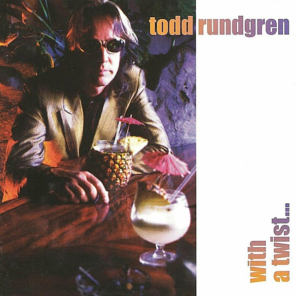

# With a Twist...

By **Todd Rundgren**

## Album Data

- **Catalog:** Beets
- **Format:** Digital, Album
- **Album:** With a Twist...
- **Artist:** Todd Rundgren
- **Albumartist:** Todd Rundgren
- **Genre:** Blue-Eyed Soul
- **MusicBrainz Album Artist ID:** [1a9a8ca0-ea8e-4e9e-96aa-288155bb2c5d](https://musicbrainz.org/artist/1a9a8ca0-ea8e-4e9e-96aa-288155bb2c5d)
- **MusicBrainz Album ID:** [8b11eb4a-e8d1-4639-bb76-19a26090af25](https://musicbrainz.org/release/8b11eb4a-e8d1-4639-bb76-19a26090af25)
- **MusicBrainz Release Group ID:** [f1756784-6ca3-33b8-80f1-82b6cf7f4e12](https://musicbrainz.org/release-group/f1756784-6ca3-33b8-80f1-82b6cf7f4e12)
- **Year:** 1997
- **Catalog #:** 
- **Label:** 
- **Total Tracks:** 19

## Album Tracks

### Track 07 - You Don’t Have to Camp Around

- **Artist:** Todd Rundgren
- **Format:** MP3
- **Genre:** Post-Rock
- **Length:** 1:03
- **MusicBrainz Track ID:** [763c438d-021a-444b-9be2-5ebd8dddd4b8](https://musicbrainz.org/recording/763c438d-021a-444b-9be2-5ebd8dddd4b8)
- **Title:** You Don’t Have to Camp Around
- **Track:** 07
- **Year:** 1983

### Track 13 - Sometimes I Don’t Know What to Feel

- **Artist:** Todd Rundgren
- **Format:** MP3
- **Genre:** Post-Rock
- **Length:** 4:15
- **MusicBrainz Track ID:** [4d7c89a2-f1ef-454c-802f-f52491ff1501](https://musicbrainz.org/recording/4d7c89a2-f1ef-454c-802f-f52491ff1501)
- **Title:** Sometimes I Don’t Know What to Feel
- **Track:** 13
- **Year:** 1983

### Track 16 - Hungry For Love

- **Artist:** Todd Rundgren
- **Format:** MP3
- **Genre:** Post-Rock
- **Length:** 2:18
- **MusicBrainz Track ID:** [7ca5c435-8416-45b5-9eb7-9f24f09757c8](https://musicbrainz.org/recording/7ca5c435-8416-45b5-9eb7-9f24f09757c8)
- **Title:** Hungry For Love
- **Track:** 16
- **Year:** 1983

### Track 17 - I Don’t Want to Tie You Down

- **Artist:** Todd Rundgren
- **Format:** MP3
- **Genre:** Post-Rock
- **Length:** 1:56
- **MusicBrainz Track ID:** [76966dac-14c1-4581-b472-65b8303a47aa](https://musicbrainz.org/recording/76966dac-14c1-4581-b472-65b8303a47aa)
- **Title:** I Don’t Want to Tie You Down
- **Track:** 17
- **Year:** 1983

## See also

- [2nd Wind](2nd_Wind.md)
- [Almost Famous](Almost_Famous.md)
- [Arena](Arena.md)
- [At the BBC 1972-1982](At_the_BBC_1972-1982.md)
- [A Wizard, a True Star](A_Wizard__a_True_Star.md)
- [A Wizard/A True Star](A_Wizard-A_True_Star.md)
- [Box O' Todd](Box_O_Todd.md)
- [Faithful](Faithful.md)
- [Grok This](Grok_This.md)
- [Initiation](Initiation.md)
- [No World Order](No_World_Order.md)
- [[Re]Production]([Re]Production.md)
- [State [Disc 2]](State_[Disc_2].md)
- [State](State.md)
- [The Ever Popular Tortured Artist Effect](The_Ever_Popular_Tortured_Artist_Effect.md)
- [Todd](Todd.md)
- [Todd Rundgren](Todd_Rundgren.md)
- [Todd Rundgren's Johnson](Todd_Rundgrens_Johnson.md)
- [Todd Rundgren vs. Utopia](Todd_Rundgren_vs_Utopia.md)
- [White Knight](White_Knight.md)
- [CD: Todd](../../CD/Todd_Rundgren/Todd.md)
- [CD: ](../../CD/Todd_Rundgren/Todd_Rundgren.md)
- [Roon: A Cappella](../../Roon/Todd_Rundgren/A_Cappella.md)
- [Roon: An Elpee's Worth of Productions](../../Roon/Todd_Rundgren/An_Elpees_Worth_of_Productions.md)
- [Roon: Arena](../../Roon/Todd_Rundgren/Arena.md)
- [Roon: A Wizard / A True Star](../../Roon/Todd_Rundgren/A_Wizard_-_A_True_Star.md)
- [Roon: Deface The Music](../../Roon/Todd_Rundgren/Deface_The_Music.md)
- [Roon: Faithful](../../Roon/Todd_Rundgren/Faithful.md)
- [Roon: Initiation](../../Roon/Todd_Rundgren/Initiation.md)
- [Roon: RA](../../Roon/Todd_Rundgren/RA.md)
- [Roon: Second Wind (Live at the Palace of Fine Arts Theatre, San Francisco, CA, July 1990)](../../Roon/Todd_Rundgren/Second_Wind_Live_at_the_Palace_of_Fine_Arts_Theatre__San_Francisco__CA__July_1990.md)
- [Roon: Something / Anything?](../../Roon/Todd_Rundgren/Something_-_Anything.md)
- [Roon: State Theater New Jersey 2005 (Live)](../../Roon/Todd_Rundgren/State_Theater_New_Jersey_2005_Live.md)
- [Roon: Swing To The Right](../../Roon/Todd_Rundgren/Swing_To_The_Right.md)
- [Roon: The 70's Collection](../../Roon/Todd_Rundgren/The_70s_Collection.md)
- [Roon: Todd](../../Roon/Todd_Rundgren/Todd.md)
- [Roon: Todd Rundgren at the BBC](../../Roon/Todd_Rundgren/Todd_Rundgren_at_the_BBC-_1972-1982.md)
- [Roon: Todd Rundgren's Utopia](../../Roon/Todd_Rundgren/Todd_Rundgrens_Utopia.md)
- [Roon: White Knight](../../Roon/Todd_Rundgren/White_Knight.md)
- [Vinyl: "A Wizard, A True Star"](../../Vinyl/Todd_Rundgren/A_Wizard__A_True_Star.md)
- [Vinyl: Time Heals](../../Vinyl/Todd_Rundgren/Time_Heals.md)
- [Vinyl: Todd](../../Vinyl/Todd_Rundgren/Todd.md)
- [Vinyl: ](../../Vinyl/Todd_Rundgren/Todd_Rundgren.md)
