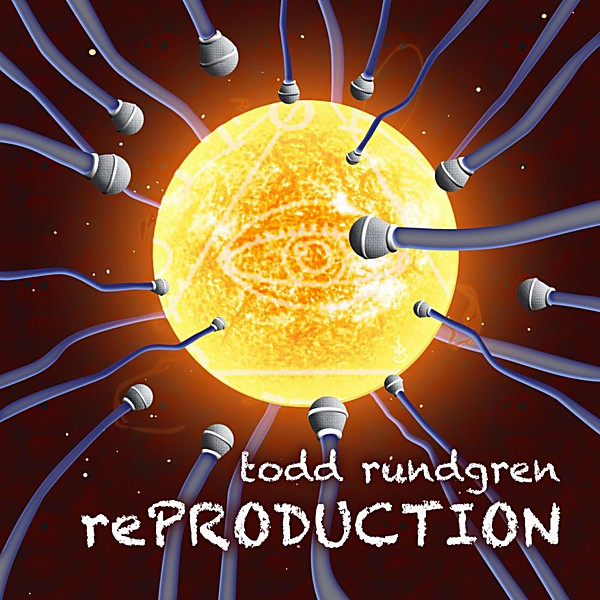

# [Re]Production

By **Todd Rundgren**

## Album Data

- **Catalog:** Beets
- **Format:** Digital, Album
- **Album:** [Re]Production
- **Artist:** Todd Rundgren
- **Albumartist:** Todd Rundgren
- **Genre:** Soft Rock
- **MusicBrainz Album Artist ID:** [1a9a8ca0-ea8e-4e9e-96aa-288155bb2c5d](https://musicbrainz.org/artist/1a9a8ca0-ea8e-4e9e-96aa-288155bb2c5d)
- **MusicBrainz Album ID:** [83fa0dff-2e91-4911-b4ce-4622957ce8ea](https://musicbrainz.org/release/83fa0dff-2e91-4911-b4ce-4622957ce8ea)
- **MusicBrainz Release Group ID:** [a1454c49-2a64-4c32-b57b-d109aaa0b2e0](https://musicbrainz.org/release-group/a1454c49-2a64-4c32-b57b-d109aaa0b2e0)
- **Year:** 2011
- **Catalog #:** R2 70864
- **Label:** Bearsville Records
- **Total Tracks:** 19

## Album Tracks

### Track 01 - International Feel

- **Artist:** Todd Rundgren
- **Format:** ALAC
- **Genre:** Space Rock
- **Length:** 2:50
- **MusicBrainz Track ID:** [de9ce01b-55c5-4024-868a-ae3700bb8be9](https://musicbrainz.org/recording/de9ce01b-55c5-4024-868a-ae3700bb8be9)
- **Title:** International Feel
- **Track:** 01
- **Year:** 1990

### Track 02 - Never Never Land

- **Artist:** Todd Rundgren
- **Format:** ALAC
- **Genre:** Psychedelic Pop
- **Length:** 1:34
- **MusicBrainz Track ID:** [2061a5b2-abfc-4925-bfef-256574cefda5](https://musicbrainz.org/recording/2061a5b2-abfc-4925-bfef-256574cefda5)
- **Title:** Never Never Land
- **Track:** 02
- **Year:** 1990

### Track 03 - Tic Tic Tic It Wears Off

- **Artist:** Todd Rundgren
- **Format:** ALAC
- **Genre:** Psychedelic Rock
- **Length:** 1:14
- **MusicBrainz Track ID:** [b460c8c7-51e9-4631-9ca7-117ac7c3ffcb](https://musicbrainz.org/recording/b460c8c7-51e9-4631-9ca7-117ac7c3ffcb)
- **Title:** Tic Tic Tic It Wears Off
- **Track:** 03
- **Year:** 1990

### Track 04 - You Need Your Head

- **Artist:** Todd Rundgren
- **Format:** ALAC
- **Genre:** Psychedelic Rock
- **Length:** 1:02
- **MusicBrainz Track ID:** [2cb73704-6cb0-4b89-84a0-fb1871bf23d9](https://musicbrainz.org/recording/2cb73704-6cb0-4b89-84a0-fb1871bf23d9)
- **Title:** You Need Your Head
- **Track:** 04
- **Year:** 1990

### Track 05 - Rock and Roll Pussy

- **Artist:** Todd Rundgren
- **Format:** ALAC
- **Genre:** Psychedelic Rock
- **Length:** 1:08
- **MusicBrainz Track ID:** [6439e9a5-3cd3-4625-92ba-8bfa6d6b7575](https://musicbrainz.org/recording/6439e9a5-3cd3-4625-92ba-8bfa6d6b7575)
- **Title:** Rock and Roll Pussy
- **Track:** 05
- **Year:** 1990

### Track 06 - Dogfight Giggle

- **Artist:** Todd Rundgren
- **Format:** ALAC
- **Genre:** Electronic
- **Length:** 1:05
- **MusicBrainz Track ID:** [44f72639-ffd3-471b-98f2-2ae13688b833](https://musicbrainz.org/recording/44f72639-ffd3-471b-98f2-2ae13688b833)
- **Title:** Dogfight Giggle
- **Track:** 06
- **Year:** 1990

### Track 07 - You Don't Have to Camp Around

- **Artist:** Todd Rundgren
- **Format:** ALAC
- **Genre:** Blue-Eyed Soul
- **Length:** 1:03
- **MusicBrainz Track ID:** [763c438d-021a-444b-9be2-5ebd8dddd4b8](https://musicbrainz.org/recording/763c438d-021a-444b-9be2-5ebd8dddd4b8)
- **Title:** You Don't Have to Camp Around
- **Track:** 07
- **Year:** 1990

### Track 08 - Flamingo

- **Artist:** Todd Rundgren
- **Format:** ALAC
- **Genre:** Space Age Pop
- **Length:** 2:34
- **MusicBrainz Track ID:** [6583b6d0-0efb-4771-92b0-b32778c59b65](https://musicbrainz.org/recording/6583b6d0-0efb-4771-92b0-b32778c59b65)
- **Title:** Flamingo
- **Track:** 08
- **Year:** 1990

### Track 09 - Zen Archer

- **Artist:** Todd Rundgren
- **Format:** ALAC
- **Genre:** Indie Rock
- **Length:** 5:35
- **MusicBrainz Track ID:** [52f22dc9-801f-4d22-a5b3-458d3a58fe1c](https://musicbrainz.org/recording/52f22dc9-801f-4d22-a5b3-458d3a58fe1c)
- **Title:** Zen Archer
- **Track:** 09
- **Year:** 1990

### Track 10 - Just Another Onionhead / Dada Dali

- **Artist:** Todd Rundgren
- **Format:** ALAC
- **Genre:** Post-Rock
- **Length:** 2:23
- **MusicBrainz Track ID:** [bcce401c-5449-4f17-bf26-136d48d3930f](https://musicbrainz.org/recording/bcce401c-5449-4f17-bf26-136d48d3930f)
- **Title:** Just Another Onionhead / Dada Dali
- **Track:** 10
- **Year:** 1990

### Track 11 - When the Shit Hits the Fan / Sunset Blvd.

- **Artist:** Todd Rundgren
- **Format:** ALAC
- **Genre:** Progressive Rock
- **Length:** 4:02
- **MusicBrainz Track ID:** [7aa92e46-fc90-4817-b921-d91e1b11ab91](https://musicbrainz.org/recording/7aa92e46-fc90-4817-b921-d91e1b11ab91)
- **Title:** When the Shit Hits the Fan / Sunset Blvd.
- **Track:** 11
- **Year:** 1990

### Track 12 - Le Feel Internacionale

- **Artist:** Todd Rundgren
- **Format:** ALAC
- **Genre:** Rock
- **Length:** 1:46
- **MusicBrainz Track ID:** [f0a062e7-9512-4210-943c-54aeaaa8dad3](https://musicbrainz.org/recording/f0a062e7-9512-4210-943c-54aeaaa8dad3)
- **Title:** Le Feel Internacionale
- **Track:** 12
- **Year:** 1990

### Track 13 - Sometimes I Don't Know What to Feel

- **Artist:** Todd Rundgren
- **Format:** ALAC
- **Genre:** Soul
- **Length:** 4:15
- **MusicBrainz Track ID:** [a4c96c16-34f3-4114-8bd6-62c21a0cec3c](https://musicbrainz.org/recording/a4c96c16-34f3-4114-8bd6-62c21a0cec3c)
- **Title:** Sometimes I Don't Know What to Feel
- **Track:** 13
- **Year:** 1990

### Track 14 - Does Anybody Love You?

- **Artist:** Todd Rundgren
- **Format:** ALAC
- **Genre:** Rock
- **Length:** 1:31
- **MusicBrainz Track ID:** [18a83c98-b2e1-4e2a-9b70-a396bcff7543](https://musicbrainz.org/recording/18a83c98-b2e1-4e2a-9b70-a396bcff7543)
- **Title:** Does Anybody Love You?
- **Track:** 14
- **Year:** 1990

### Track 15 - Medley

- **Artist:** Todd Rundgren
- **Format:** ALAC
- **Genre:** Post-Rock
- **Length:** 10:34
- **MusicBrainz Track ID:** [bf220e10-cbee-4e1c-8c4b-23af8c71a47f](https://musicbrainz.org/recording/bf220e10-cbee-4e1c-8c4b-23af8c71a47f)
- **Title:** Medley
- **Track:** 15
- **Year:** 1990

### Track 16 - Hungry for Love

- **Artist:** Todd Rundgren
- **Format:** ALAC
- **Genre:** Post-Rock
- **Length:** 2:18
- **MusicBrainz Track ID:** [f8143d80-7249-4d56-86f7-abb63011e92c](https://musicbrainz.org/recording/f8143d80-7249-4d56-86f7-abb63011e92c)
- **Title:** Hungry for Love
- **Track:** 16
- **Year:** 1990

### Track 17 - I Don't Want to Tie You Down

- **Artist:** Todd Rundgren
- **Format:** ALAC
- **Genre:** Post-Rock
- **Length:** 1:56
- **MusicBrainz Track ID:** [e6852f38-c851-4a86-bcb6-41a93fe6cd82](https://musicbrainz.org/recording/e6852f38-c851-4a86-bcb6-41a93fe6cd82)
- **Title:** I Don't Want to Tie You Down
- **Track:** 17
- **Year:** 1990

### Track 18 - Is It My Name?

- **Artist:** Todd Rundgren
- **Format:** ALAC
- **Genre:** Rock
- **Length:** 4:01
- **MusicBrainz Track ID:** [3aecaf7e-6464-4ca4-b191-8d832a3c7ac2](https://musicbrainz.org/recording/3aecaf7e-6464-4ca4-b191-8d832a3c7ac2)
- **Title:** Is It My Name?
- **Track:** 18
- **Year:** 1990

### Track 19 - Just One Victory

- **Artist:** Todd Rundgren
- **Format:** ALAC
- **Genre:** Soft Rock
- **Length:** 4:58
- **MusicBrainz Track ID:** [2aad6821-f24f-4cc7-afe2-bbe987a8be9b](https://musicbrainz.org/recording/2aad6821-f24f-4cc7-afe2-bbe987a8be9b)
- **Title:** Just One Victory
- **Track:** 19
- **Year:** 1990

## See also

- [2nd Wind](2nd_Wind.md)
- [Almost Famous](Almost_Famous.md)
- [Arena](Arena.md)
- [At the BBC 1972-1982](At_the_BBC_1972-1982.md)
- [A Wizard, a True Star](A_Wizard__a_True_Star.md)
- [A Wizard/A True Star](A_Wizard-A_True_Star.md)
- [Box O' Todd](Box_O_Todd.md)
- [Faithful](Faithful.md)
- [Grok This](Grok_This.md)
- [Initiation](Initiation.md)
- [No World Order](No_World_Order.md)
- [State [Disc 2]](State_[Disc_2].md)
- [State](State.md)
- [The Ever Popular Tortured Artist Effect](The_Ever_Popular_Tortured_Artist_Effect.md)
- [Todd](Todd.md)
- [Todd Rundgren](Todd_Rundgren.md)
- [Todd Rundgren's Johnson](Todd_Rundgrens_Johnson.md)
- [Todd Rundgren vs. Utopia](Todd_Rundgren_vs_Utopia.md)
- [White Knight](White_Knight.md)
- [With a Twist...](With_a_Twist.md)
- [CD: Todd](../../CD/Todd_Rundgren/Todd.md)
- [CD: ](../../CD/Todd_Rundgren/Todd_Rundgren.md)
- [Roon: A Cappella](../../Roon/Todd_Rundgren/A_Cappella.md)
- [Roon: An Elpee's Worth of Productions](../../Roon/Todd_Rundgren/An_Elpees_Worth_of_Productions.md)
- [Roon: Arena](../../Roon/Todd_Rundgren/Arena.md)
- [Roon: A Wizard / A True Star](../../Roon/Todd_Rundgren/A_Wizard_-_A_True_Star.md)
- [Roon: Deface The Music](../../Roon/Todd_Rundgren/Deface_The_Music.md)
- [Roon: Faithful](../../Roon/Todd_Rundgren/Faithful.md)
- [Roon: Initiation](../../Roon/Todd_Rundgren/Initiation.md)
- [Roon: RA](../../Roon/Todd_Rundgren/RA.md)
- [Roon: Second Wind (Live at the Palace of Fine Arts Theatre, San Francisco, CA, July 1990)](../../Roon/Todd_Rundgren/Second_Wind_Live_at_the_Palace_of_Fine_Arts_Theatre__San_Francisco__CA__July_1990.md)
- [Roon: Something / Anything?](../../Roon/Todd_Rundgren/Something_-_Anything.md)
- [Roon: State Theater New Jersey 2005 (Live)](../../Roon/Todd_Rundgren/State_Theater_New_Jersey_2005_Live.md)
- [Roon: Swing To The Right](../../Roon/Todd_Rundgren/Swing_To_The_Right.md)
- [Roon: The 70's Collection](../../Roon/Todd_Rundgren/The_70s_Collection.md)
- [Roon: Todd](../../Roon/Todd_Rundgren/Todd.md)
- [Roon: Todd Rundgren at the BBC](../../Roon/Todd_Rundgren/Todd_Rundgren_at_the_BBC-_1972-1982.md)
- [Roon: Todd Rundgren's Utopia](../../Roon/Todd_Rundgren/Todd_Rundgrens_Utopia.md)
- [Roon: White Knight](../../Roon/Todd_Rundgren/White_Knight.md)
- [Vinyl: "A Wizard, A True Star"](../../Vinyl/Todd_Rundgren/A_Wizard__A_True_Star.md)
- [Vinyl: Time Heals](../../Vinyl/Todd_Rundgren/Time_Heals.md)
- [Vinyl: Todd](../../Vinyl/Todd_Rundgren/Todd.md)
- [Vinyl: ](../../Vinyl/Todd_Rundgren/Todd_Rundgren.md)
