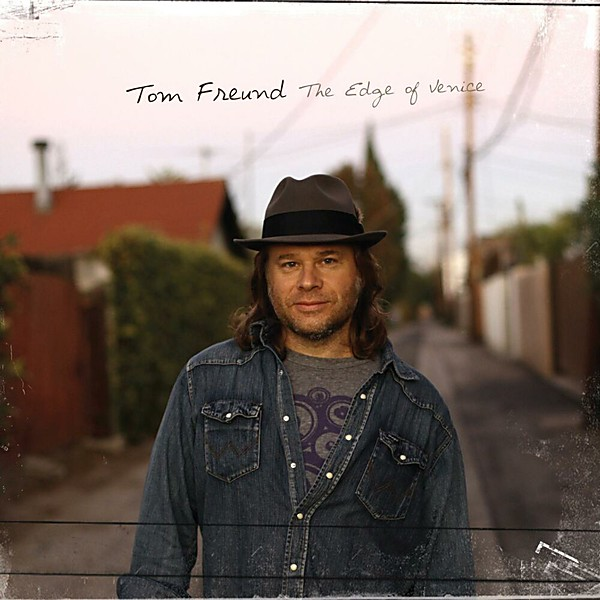

# The Edge of Venice

By **Tom Freund**

## Album Data

- **Catalog:** Beets
- **Format:** Digital, Album
- **Album:** The Edge of Venice
- **Artist:** Tom Freund
- **Albumartist:** Tom Freund
- **Genre:** Indie Rock
- **MusicBrainz Album Artist ID:** 
- **MusicBrainz Album ID:** 
- **MusicBrainz Release Group ID:** 
- **Year:** 2011
- **Catalog #:** 
- **Label:** 
- **Total Tracks:** 09

## Album Tracks

### Track 01 - Cruel Cruel World

- **Artist:** Tom Freund
- **Format:** ALAC
- **Genre:** Indie Rock
- **Length:** 3:46
- **MusicBrainz Track ID:** 
- **Title:** Cruel Cruel World
- **Track:** 01
- **Year:** 2011

### Track 02 - Wounded Surfer Boy

- **Artist:** Tom Freund
- **Format:** ALAC
- **Genre:** Indie Rock
- **Length:** 3:29
- **MusicBrainz Track ID:** 
- **Title:** Wounded Surfer Boy
- **Track:** 02
- **Year:** 2011

### Track 03 - Lakeshore Drive (LSD)

- **Artist:** Tom Freund
- **Format:** ALAC
- **Genre:** Indie Rock
- **Length:** 3:38
- **MusicBrainz Track ID:** 
- **Title:** Lakeshore Drive (LSD)
- **Track:** 03
- **Year:** 2011

### Track 04 - Show Me The Love

- **Artist:** Tom Freund
- **Format:** ALAC
- **Genre:** Indie Rock
- **Length:** 3:43
- **MusicBrainz Track ID:** 
- **Title:** Show Me The Love
- **Track:** 04
- **Year:** 2011

### Track 05 - Lonesome

- **Artist:** Tom Freund
- **Format:** ALAC
- **Genre:** Indie Rock
- **Length:** 4:03
- **MusicBrainz Track ID:** 
- **Title:** Lonesome
- **Track:** 05
- **Year:** 2011

### Track 06 - Fire Trucks

- **Artist:** Tom Freund
- **Format:** ALAC
- **Genre:** Indie Rock
- **Length:** 3:53
- **MusicBrainz Track ID:** 
- **Title:** Fire Trucks
- **Track:** 06
- **Year:** 2011

### Track 07 - Sweetly Calling My Name

- **Artist:** Tom Freund
- **Format:** ALAC
- **Genre:** Indie Rock
- **Length:** 3:26
- **MusicBrainz Track ID:** 
- **Title:** Sweetly Calling My Name
- **Track:** 07
- **Year:** 2011

### Track 08 - Daddy's Song . . .

- **Artist:** Tom Freund
- **Format:** ALAC
- **Genre:** Indie Rock
- **Length:** 3:45
- **MusicBrainz Track ID:** 
- **Title:** Daddy's Song . . .
- **Track:** 08
- **Year:** 2011

### Track 09 - Everything

- **Artist:** Tom Freund
- **Format:** ALAC
- **Genre:** Indie Rock
- **Length:** 3:48
- **MusicBrainz Track ID:** 
- **Title:** Everything
- **Track:** 09
- **Year:** 2011

## See also

- [East Of Lincoln](East_Of_Lincoln.md)
