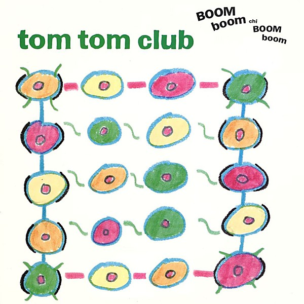

# Boom Boom Chi Boom Boom

By **Tom Tom Club**

## Album Data

- **Catalog:** Beets
- **Format:** Digital, Album
- **Album:** Boom Boom Chi Boom Boom
- **Artist:** Tom Tom Club
- **Albumartist:** Tom Tom Club
- **Genre:** Synthpop
- **MusicBrainz Album Artist ID:** [3dc66525-d359-406d-9cdf-cdd3a7de289c](https://musicbrainz.org/artist/3dc66525-d359-406d-9cdf-cdd3a7de289c)
- **MusicBrainz Album ID:** [469f24ff-717b-437f-848d-c682939884bf](https://musicbrainz.org/release/469f24ff-717b-437f-848d-c682939884bf)
- **MusicBrainz Release Group ID:** [88e9c6f3-85e6-3a6d-9442-fdcda7ae78ac](https://musicbrainz.org/release-group/88e9c6f3-85e6-3a6d-9442-fdcda7ae78ac)
- **Year:** 2008
- **Catalog #:** SRK 3628
- **Label:** Sire Records
- **Total Tracks:** 08

## Album Tracks

### Track 01 - Wordy Rappinghood

- **Artist:** Tom Tom Club
- **Format:** MP3
- **Genre:** Uk Garage
- **Length:** 6:29
- **MusicBrainz Track ID:** [2eba3cdb-ccc5-49ce-aaf3-f1611e157e57](https://musicbrainz.org/recording/2eba3cdb-ccc5-49ce-aaf3-f1611e157e57)
- **Title:** Wordy Rappinghood
- **Track:** 01
- **Year:** 1981

### Track 02 - Genius of Love

- **Artist:** Tom Tom Club
- **Format:** MP3
- **Genre:** New Wave
- **Length:** 5:34
- **MusicBrainz Track ID:** [8de23ed1-11d5-4713-8ddb-7768c8d98c26](https://musicbrainz.org/recording/8de23ed1-11d5-4713-8ddb-7768c8d98c26)
- **Title:** Genius of Love
- **Track:** 02
- **Year:** 1981

### Track 03 - Tom Tom Theme

- **Artist:** Tom Tom Club
- **Format:** MP3
- **Genre:** New Wave
- **Length:** 1:25
- **MusicBrainz Track ID:** [521a931e-b165-420a-b46b-ae1fd3421a01](https://musicbrainz.org/recording/521a931e-b165-420a-b46b-ae1fd3421a01)
- **Title:** Tom Tom Theme
- **Track:** 03
- **Year:** 1981

### Track 04 - L’Éléphant

- **Artist:** Tom Tom Club
- **Format:** MP3
- **Genre:** Synthpop
- **Length:** 4:47
- **MusicBrainz Track ID:** [1c83016d-ed80-4ebf-a865-1dc042b17983](https://musicbrainz.org/recording/1c83016d-ed80-4ebf-a865-1dc042b17983)
- **Title:** L’Éléphant
- **Track:** 04
- **Year:** 1981

### Track 05 - As Above, So Below

- **Artist:** Tom Tom Club
- **Format:** MP3
- **Genre:** New Wave
- **Length:** 5:24
- **MusicBrainz Track ID:** [e497f684-e985-430e-8e9b-e4dbf08bb79a](https://musicbrainz.org/recording/e497f684-e985-430e-8e9b-e4dbf08bb79a)
- **Title:** As Above, So Below
- **Track:** 05
- **Year:** 1981

### Track 06 - Lorelei

- **Artist:** Tom Tom Club
- **Format:** MP3
- **Genre:** New Wave
- **Length:** 5:04
- **MusicBrainz Track ID:** [7fb76180-ca24-4238-95b5-cb6e630be98f](https://musicbrainz.org/recording/7fb76180-ca24-4238-95b5-cb6e630be98f)
- **Title:** Lorelei
- **Track:** 06
- **Year:** 1981

### Track 07 - On, On, On, On…

- **Artist:** Tom Tom Club
- **Format:** MP3
- **Genre:** Synthpop
- **Length:** 3:33
- **MusicBrainz Track ID:** [845b49dc-1ed4-47ad-b870-4d8735c26923](https://musicbrainz.org/recording/845b49dc-1ed4-47ad-b870-4d8735c26923)
- **Title:** On, On, On, On…
- **Track:** 07
- **Year:** 1981

### Track 08 - Booming and Zooming

- **Artist:** Tom Tom Club
- **Format:** MP3
- **Genre:** New Wave
- **Length:** 4:34
- **MusicBrainz Track ID:** [6413c0e5-08e5-476b-94fb-136c353dee8d](https://musicbrainz.org/recording/6413c0e5-08e5-476b-94fb-136c353dee8d)
- **Title:** Booming and Zooming
- **Track:** 08
- **Year:** 1981

## See also

- [Tom Tom Club](Tom_Tom_Club.md)
- [Roon: Close To The Bone](../../Roon/Tom_Tom_Club/Close_To_The_Bone.md)
- [Roon: Genius of Live](../../Roon/Tom_Tom_Club/Genius_of_Live.md)
- [Roon: The Good The Bad and The Funky](../../Roon/Tom_Tom_Club/The_Good_The_Bad_and_The_Funky.md)
- [Roon: Tom Tom Club](../../Roon/Tom_Tom_Club/Tom_Tom_Club.md)
- [Vinyl: ](../../Vinyl/Tom_Tom_Club/Tom_Tom_Club_index.md)
- [Vinyl: Tom Tom Club](../../Vinyl/Tom_Tom_Club/Tom_Tom_Club.md)
