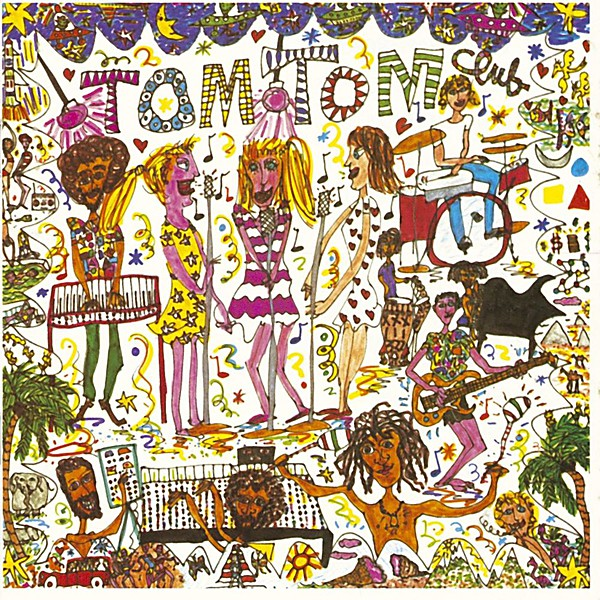

# Tom Tom Club

By Tom Tom Club

## Album Data

- Catalog: Beets
- Format: Digital, Album
- Album: Tom Tom Club
- Artist: Tom Tom Club
- Albumartist: Tom Tom Club
- Genre: Synthpop
- MusicBrainz Album Artist ID: 3dc66525-d359-406d-9cdf-cdd3a7de289c
- MusicBrainz Album ID: 20d91d1e-9f28-4587-8575-49eba3cd7f82
- MusicBrainz Release Group ID: 9a01f6b5-61f6-3b10-b1ab-735359fc407b
- Year: 1981

