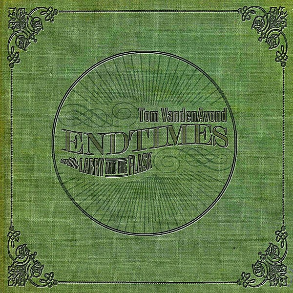

# Endtimes (with Larry and His Flask)

By **Tom VandenAvond**

## Album Data

- **Catalog:** Beets
- **Format:** Digital, Album
- **Album:** Endtimes (with Larry and His Flask)
- **Artist:** Tom Vandenavond
- **Albumartist:** Tom VandenAvond
- **Genre:** Americana
- **MusicBrainz Album Artist ID:** 
- **MusicBrainz Album ID:** 
- **MusicBrainz Release Group ID:** 
- **Year:** 2014
- **Catalog #:** 
- **Label:** 
- **Total Tracks:** 11

## Album Tracks

### Track 01 - Postmark West Baton Rouge

- **Artist:** Tom VandenAvond
- **Format:** ALAC
- **Genre:** Americana
- **Length:** 3:21
- **MusicBrainz Track ID:** 
- **Title:** Postmark West Baton Rouge
- **Track:** 01
- **Year:** 2012

### Track 02 - Wreck of a Fine Man

- **Artist:** Tom VandenAvond
- **Format:** ALAC
- **Genre:** Americana
- **Length:** 3:54
- **MusicBrainz Track ID:** 
- **Title:** Wreck of a Fine Man
- **Track:** 02
- **Year:** 2012

### Track 03 - Lost Claim

- **Artist:** Tom VandenAvond
- **Format:** ALAC
- **Genre:** Americana
- **Length:** 2:44
- **MusicBrainz Track ID:** 
- **Title:** Lost Claim
- **Track:** 03
- **Year:** 2012

### Track 04 - Where They Say You Been Livin'

- **Artist:** Tom VandenAvond
- **Format:** ALAC
- **Genre:** Americana
- **Length:** 3:32
- **MusicBrainz Track ID:** 
- **Title:** Where They Say You Been Livin'
- **Track:** 04
- **Year:** 2012

### Track 05 - Pawned All My Freedom

- **Artist:** Tom VandenAvond
- **Format:** ALAC
- **Genre:** Americana
- **Length:** 2:56
- **MusicBrainz Track ID:** 
- **Title:** Pawned All My Freedom
- **Track:** 05
- **Year:** 2012

### Track 06 - Them Travelers

- **Artist:** Tom VandenAvond
- **Format:** ALAC
- **Genre:** Americana
- **Length:** 2:13
- **MusicBrainz Track ID:** 
- **Title:** Them Travelers
- **Track:** 06
- **Year:** 2012

### Track 07 - Busted Knuckles

- **Artist:** Tom VandenAvond
- **Format:** ALAC
- **Genre:** Americana
- **Length:** 3:03
- **MusicBrainz Track ID:** 
- **Title:** Busted Knuckles
- **Track:** 07
- **Year:** 2012

### Track 08 - Meet Me at Weber's Deck

- **Artist:** Tom VandenAvond
- **Format:** ALAC
- **Genre:** Americana
- **Length:** 3:42
- **MusicBrainz Track ID:** 
- **Title:** Meet Me at Weber's Deck
- **Track:** 08
- **Year:** 2012

### Track 09 - Anyway, But Now I Gotta Go

- **Artist:** Tom VandenAvond
- **Format:** ALAC
- **Genre:** Americana
- **Length:** 4:12
- **MusicBrainz Track ID:** 
- **Title:** Anyway, But Now I Gotta Go
- **Track:** 09
- **Year:** 2012

### Track 10 - Times Ain't Like They Used To Be

- **Artist:** Tom VandenAvond
- **Format:** ALAC
- **Genre:** Americana
- **Length:** 3:43
- **MusicBrainz Track ID:** 
- **Title:** Times Ain't Like They Used To Be
- **Track:** 10
- **Year:** 2012

### Track 11 - To the Sunny Slopes of Long Ago

- **Artist:** Tom VandenAvond
- **Format:** ALAC
- **Genre:** Americana
- **Length:** 3:03
- **MusicBrainz Track ID:** 
- **Title:** To the Sunny Slopes of Long Ago
- **Track:** 11
- **Year:** 2012

## See also

- [Wreck of a Fine Man](Wreck_of_a_Fine_Man.md)
