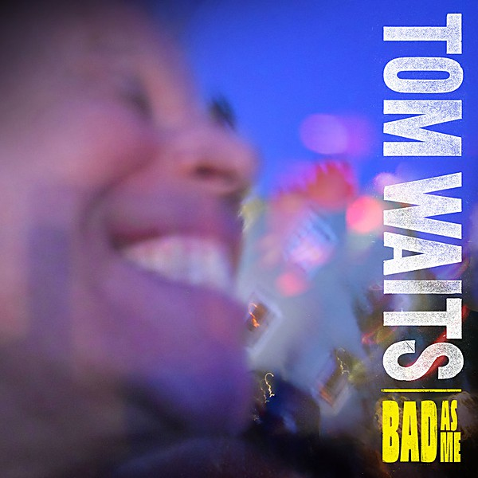

# Bad as Me

By **Tom Waits**

## Album Data

- **Catalog:** Beets
- **Format:** Digital, Album
- **Album:** Bad as Me
- **Artist:** Tom Waits
- **Albumartist:** Tom Waits
- **Genre:** Alternative Rock
- **MusicBrainz Album Artist ID:** [c3aeb863-7b26-4388-94e8-5a240f2be21b](https://musicbrainz.org/artist/c3aeb863-7b26-4388-94e8-5a240f2be21b)
- **MusicBrainz Album ID:** [42eba0b4-b7df-405c-a2c8-96dc15f13624](https://musicbrainz.org/release/42eba0b4-b7df-405c-a2c8-96dc15f13624)
- **MusicBrainz Release Group ID:** [956f10e8-0c74-4010-99d3-1b60fb7e88bc](https://musicbrainz.org/release-group/956f10e8-0c74-4010-99d3-1b60fb7e88bc)
- **Year:** 2011
- **Catalog #:** SD5061
- **Label:** Asylum Records
- **Total Tracks:** 12

## Album Tracks

### Track 01 - Ol’ ’55

- **Artist:** Tom Waits
- **Format:** MP3
- **Genre:** Rock
- **Length:** 4:00
- **MusicBrainz Track ID:** [476c44dd-16e6-4f32-b274-8d326cc6d109](https://musicbrainz.org/recording/476c44dd-16e6-4f32-b274-8d326cc6d109)
- **Title:** Ol’ ’55
- **Track:** 01
- **Year:** 1973

### Track 02 - I Hope That I Don’t Fall in Love With You

- **Artist:** Tom Waits
- **Format:** MP3
- **Genre:** Rock
- **Length:** 3:51
- **MusicBrainz Track ID:** [39bce42d-5cc8-4f4c-8120-73c35606ca38](https://musicbrainz.org/recording/39bce42d-5cc8-4f4c-8120-73c35606ca38)
- **Title:** I Hope That I Don’t Fall in Love With You
- **Track:** 02
- **Year:** 1973

### Track 03 - Virginia Avenue

- **Artist:** Tom Waits
- **Format:** MP3
- **Genre:** Rock
- **Length:** 3:09
- **MusicBrainz Track ID:** [c3e9a504-b5a8-411b-90bf-ca3adb23a140](https://musicbrainz.org/recording/c3e9a504-b5a8-411b-90bf-ca3adb23a140)
- **Title:** Virginia Avenue
- **Track:** 03
- **Year:** 1973

### Track 04 - Old Shoes (& Picture Postcards)

- **Artist:** Tom Waits
- **Format:** MP3
- **Genre:** Rock
- **Length:** 3:40
- **MusicBrainz Track ID:** [cb334c61-afdc-48cd-8aeb-d076c9d0ba7b](https://musicbrainz.org/recording/cb334c61-afdc-48cd-8aeb-d076c9d0ba7b)
- **Title:** Old Shoes (& Picture Postcards)
- **Track:** 04
- **Year:** 1973

### Track 05 - Midnight Lullaby

- **Artist:** Tom Waits
- **Format:** MP3
- **Genre:** Downtempo
- **Length:** 3:18
- **MusicBrainz Track ID:** [42df6399-3f0a-4e2e-9f24-2fe71f9ae0cf](https://musicbrainz.org/recording/42df6399-3f0a-4e2e-9f24-2fe71f9ae0cf)
- **Title:** Midnight Lullaby
- **Track:** 05
- **Year:** 1973

### Track 06 - Martha

- **Artist:** Tom Waits
- **Format:** MP3
- **Genre:** Rock
- **Length:** 4:25
- **MusicBrainz Track ID:** [246b5543-d55c-4651-b0d2-ee037dd75df8](https://musicbrainz.org/recording/246b5543-d55c-4651-b0d2-ee037dd75df8)
- **Title:** Martha
- **Track:** 06
- **Year:** 1973

### Track 07 - Rosie

- **Artist:** Tom Waits
- **Format:** MP3
- **Genre:** Rock
- **Length:** 4:00
- **MusicBrainz Track ID:** [47b8f0b8-dde8-4332-b3b6-c4712dd1b89f](https://musicbrainz.org/recording/47b8f0b8-dde8-4332-b3b6-c4712dd1b89f)
- **Title:** Rosie
- **Track:** 07
- **Year:** 1973

### Track 08 - Lonely

- **Artist:** Tom Waits
- **Format:** MP3
- **Genre:** Rock
- **Length:** 3:09
- **MusicBrainz Track ID:** [805ac5ab-eafe-4520-8fb6-297eaf08f2d6](https://musicbrainz.org/recording/805ac5ab-eafe-4520-8fb6-297eaf08f2d6)
- **Title:** Lonely
- **Track:** 08
- **Year:** 1973

### Track 09 - Ice Cream Man

- **Artist:** Tom Waits
- **Format:** MP3
- **Genre:** Rock
- **Length:** 3:03
- **MusicBrainz Track ID:** [14cfa452-343f-4b9b-806b-e43e87732cee](https://musicbrainz.org/recording/14cfa452-343f-4b9b-806b-e43e87732cee)
- **Title:** Ice Cream Man
- **Track:** 09
- **Year:** 1973

### Track 10 - Little Trip to Heaven (on the Wings of Your Love)

- **Artist:** Tom Waits
- **Format:** MP3
- **Genre:** Rock
- **Length:** 3:33
- **MusicBrainz Track ID:** [4cccbb72-9651-4eea-b45b-fccaf8cab9f2](https://musicbrainz.org/recording/4cccbb72-9651-4eea-b45b-fccaf8cab9f2)
- **Title:** Little Trip to Heaven (on the Wings of Your Love)
- **Track:** 10
- **Year:** 1973

### Track 11 - Grapefruit Moon

- **Artist:** Tom Waits
- **Format:** MP3
- **Genre:** Rock
- **Length:** 4:47
- **MusicBrainz Track ID:** [f41bf8bc-554f-4d02-8c42-12efa349cece](https://musicbrainz.org/recording/f41bf8bc-554f-4d02-8c42-12efa349cece)
- **Title:** Grapefruit Moon
- **Track:** 11
- **Year:** 1973

### Track 12 - Closing Time

- **Artist:** Tom Waits
- **Format:** MP3
- **Genre:** Americana
- **Length:** 4:11
- **MusicBrainz Track ID:** [0fac81d4-3486-468a-8ce8-c96434543f33](https://musicbrainz.org/recording/0fac81d4-3486-468a-8ce8-c96434543f33)
- **Title:** Closing Time
- **Track:** 12
- **Year:** 1973

## See also

- [Closing Time](Closing_Time.md)
- [Heartattack and Vine](Heartattack_and_Vine.md)
- [Nighthawks at the Diner](Nighthawks_at_the_Diner.md)
- [Small Change](Small_Change.md)
- [The Black Rider](The_Black_Rider.md)
- [The Heart of Saturday Night](The_Heart_of_Saturday_Night.md)
- [Roon: Closing Time (Remastered)](../../Roon/Tom_Waits/Closing_Time_Remastered.md)
- [Roon: Heartattack And Vine (Remastered)](../../Roon/Tom_Waits/Heartattack_And_Vine_Remastered.md)
- [Roon: Mule Variations (Remastered)](../../Roon/Tom_Waits/Mule_Variations_Remastered.md)
- [Roon: Nighthawks At The Diner (Remastered)](../../Roon/Tom_Waits/Nighthawks_At_The_Diner_Remastered.md)
- [Roon: Rain Dogs](../../Roon/Tom_Waits/Rain_Dogs.md)
- [Roon: Small Change (Remastered)](../../Roon/Tom_Waits/Small_Change_Remastered.md)
- [Roon: Swordfishtrombones](../../Roon/Tom_Waits/Swordfishtrombones.md)
- [Roon: The Heart Of Saturday Night (Remastered)](../../Roon/Tom_Waits/The_Heart_Of_Saturday_Night_Remastered.md)
