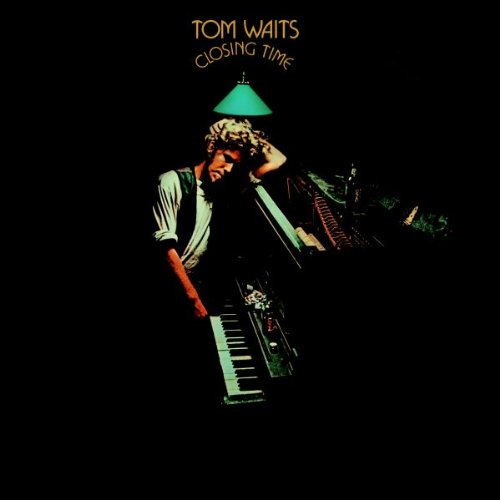

# Closing Time

By **Tom Waits**

## Album Data

- **Catalog:** Beets
- **Format:** Digital, Album
- **Album:** Closing Time
- **Artist:** Tom Waits
- **Albumartist:** Tom Waits
- **Genre:** Rock
- **MusicBrainz Album Artist ID:** [c3aeb863-7b26-4388-94e8-5a240f2be21b](https://musicbrainz.org/artist/c3aeb863-7b26-4388-94e8-5a240f2be21b)
- **MusicBrainz Album ID:** [d541b67e-e791-4c44-83ac-750ec65c0e6d](https://musicbrainz.org/release/d541b67e-e791-4c44-83ac-750ec65c0e6d)
- **MusicBrainz Release Group ID:** [35c9a4b0-d4dd-3e6f-87fd-2185519296e2](https://musicbrainz.org/release-group/35c9a4b0-d4dd-3e6f-87fd-2185519296e2)
- **Year:** 1973
- **Catalog #:** 295-2
- **Label:** Elektra Entertainment
- **Total Tracks:** 09

## Album Tracks

### Track 01 - Heartattack and Vine

- **Artist:** Tom Waits
- **Format:** MP3
- **Genre:** Rock
- **Length:** 4:43
- **MusicBrainz Track ID:** [2d916dc8-d240-45c6-bd3d-b2f88a27ffca](https://musicbrainz.org/recording/2d916dc8-d240-45c6-bd3d-b2f88a27ffca)
- **Title:** Heartattack and Vine
- **Track:** 01
- **Year:** 1990

### Track 02 - In Shades

- **Artist:** Tom Waits
- **Format:** MP3
- **Genre:** Rock
- **Length:** 4:21
- **MusicBrainz Track ID:** [b8208cfc-618e-444b-bf6d-4ef55f0c8e04](https://musicbrainz.org/recording/b8208cfc-618e-444b-bf6d-4ef55f0c8e04)
- **Title:** In Shades
- **Track:** 02
- **Year:** 1990

### Track 03 - Saving All My Love for You

- **Artist:** Tom Waits
- **Format:** MP3
- **Genre:** Folk Rock
- **Length:** 3:40
- **MusicBrainz Track ID:** [ee23c583-2561-4a47-b684-7c45df8a98e3](https://musicbrainz.org/recording/ee23c583-2561-4a47-b684-7c45df8a98e3)
- **Title:** Saving All My Love for You
- **Track:** 03
- **Year:** 1990

### Track 04 - Downtown

- **Artist:** Tom Waits
- **Format:** MP3
- **Genre:** Rock
- **Length:** 4:40
- **MusicBrainz Track ID:** [e2ad70b0-3830-4cfa-a91d-99fefb699843](https://musicbrainz.org/recording/e2ad70b0-3830-4cfa-a91d-99fefb699843)
- **Title:** Downtown
- **Track:** 04
- **Year:** 1990

### Track 05 - Jersey Girl

- **Artist:** Tom Waits
- **Format:** MP3
- **Genre:** Rock
- **Length:** 5:05
- **MusicBrainz Track ID:** [c881bef8-184d-4c24-8351-a2ceba9b64e7](https://musicbrainz.org/recording/c881bef8-184d-4c24-8351-a2ceba9b64e7)
- **Title:** Jersey Girl
- **Track:** 05
- **Year:** 1990

### Track 06 - ’Til the Money Runs Out

- **Artist:** Tom Waits
- **Format:** MP3
- **Genre:** Rock
- **Length:** 4:22
- **MusicBrainz Track ID:** [720146d5-a117-4edf-b127-9f0a012ad793](https://musicbrainz.org/recording/720146d5-a117-4edf-b127-9f0a012ad793)
- **Title:** ’Til the Money Runs Out
- **Track:** 06
- **Year:** 1990

### Track 07 - On the Nickel

- **Artist:** Tom Waits
- **Format:** MP3
- **Genre:** Pop Rock
- **Length:** 6:16
- **MusicBrainz Track ID:** [39ae4b48-0965-4e4f-baf7-56cd7d136388](https://musicbrainz.org/recording/39ae4b48-0965-4e4f-baf7-56cd7d136388)
- **Title:** On the Nickel
- **Track:** 07
- **Year:** 1990

### Track 08 - Mr. Siegal

- **Artist:** Tom Waits
- **Format:** MP3
- **Genre:** Rock
- **Length:** 5:12
- **MusicBrainz Track ID:** [d1030d5f-e924-4d3a-ba95-9e4bf8a30e42](https://musicbrainz.org/recording/d1030d5f-e924-4d3a-ba95-9e4bf8a30e42)
- **Title:** Mr. Siegal
- **Track:** 08
- **Year:** 1990

### Track 09 - Ruby’s Arms

- **Artist:** Tom Waits
- **Format:** MP3
- **Genre:** Rock
- **Length:** 5:35
- **MusicBrainz Track ID:** [d5c467a6-da79-49b6-9d14-6357de45bd10](https://musicbrainz.org/recording/d5c467a6-da79-49b6-9d14-6357de45bd10)
- **Title:** Ruby’s Arms
- **Track:** 09
- **Year:** 1990

## See also

- [Bad as Me](Bad_as_Me.md)
- [Heartattack and Vine](Heartattack_and_Vine.md)
- [Nighthawks at the Diner](Nighthawks_at_the_Diner.md)
- [Small Change](Small_Change.md)
- [The Black Rider](The_Black_Rider.md)
- [The Heart of Saturday Night](The_Heart_of_Saturday_Night.md)
- [Roon: Closing Time (Remastered)](../../Roon/Tom_Waits/Closing_Time_Remastered.md)
- [Roon: Heartattack And Vine (Remastered)](../../Roon/Tom_Waits/Heartattack_And_Vine_Remastered.md)
- [Roon: Mule Variations (Remastered)](../../Roon/Tom_Waits/Mule_Variations_Remastered.md)
- [Roon: Nighthawks At The Diner (Remastered)](../../Roon/Tom_Waits/Nighthawks_At_The_Diner_Remastered.md)
- [Roon: Rain Dogs](../../Roon/Tom_Waits/Rain_Dogs.md)
- [Roon: Small Change (Remastered)](../../Roon/Tom_Waits/Small_Change_Remastered.md)
- [Roon: Swordfishtrombones](../../Roon/Tom_Waits/Swordfishtrombones.md)
- [Roon: The Heart Of Saturday Night (Remastered)](../../Roon/Tom_Waits/The_Heart_Of_Saturday_Night_Remastered.md)
