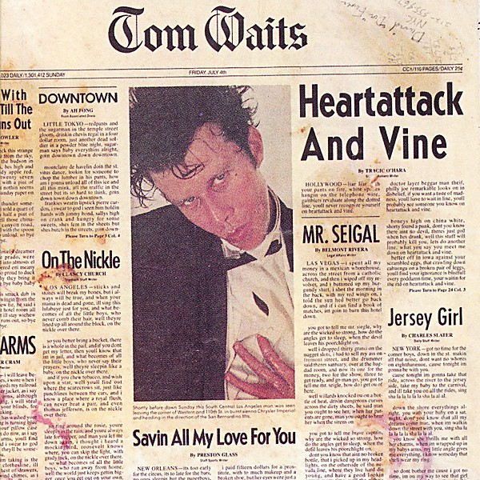

# Heartattack and Vine

By **Tom Waits**

## Album Data

- **Catalog:** Beets
- **Format:** Digital, Album
- **Album:** Heartattack and Vine
- **Artist:** Tom Waits
- **Albumartist:** Tom Waits
- **Genre:** Rock
- **MusicBrainz Album Artist ID:** [c3aeb863-7b26-4388-94e8-5a240f2be21b](https://musicbrainz.org/artist/c3aeb863-7b26-4388-94e8-5a240f2be21b)
- **MusicBrainz Album ID:** [f4c96489-6a4a-4e72-9522-a93ce3753f21](https://musicbrainz.org/release/f4c96489-6a4a-4e72-9522-a93ce3753f21)
- **MusicBrainz Release Group ID:** [6a9906e1-1ab2-37e1-980b-5e4889661089](https://musicbrainz.org/release-group/6a9906e1-1ab2-37e1-980b-5e4889661089)
- **Year:** 1990
- **Catalog #:** 7559-60620-2
- **Label:** Asylum Records
- **Total Tracks:** 18

## Album Tracks

### Track 01 - [opening intro]

- **Artist:** Tom Waits
- **Format:** MP3
- **Genre:** Rock
- **Length:** 2:57
- **MusicBrainz Track ID:** [80377c3a-5bfe-4a55-8d4d-5201d113c0b4](https://musicbrainz.org/recording/80377c3a-5bfe-4a55-8d4d-5201d113c0b4)
- **Title:** [opening intro]
- **Track:** 01
- **Year:** 1998

### Track 02 - Emotional Weather Report

- **Artist:** Tom Waits
- **Format:** MP3
- **Genre:** Rock
- **Length:** 3:45
- **MusicBrainz Track ID:** [df01808f-d5d0-429c-b07a-16be5a935d2c](https://musicbrainz.org/recording/df01808f-d5d0-429c-b07a-16be5a935d2c)
- **Title:** Emotional Weather Report
- **Track:** 02
- **Year:** 1998

### Track 03 - [intro]

- **Artist:** Tom Waits
- **Format:** MP3
- **Genre:** Americana
- **Length:** 2:18
- **MusicBrainz Track ID:** [127edaf1-7a03-40e9-ba25-1097937b2347](https://musicbrainz.org/recording/127edaf1-7a03-40e9-ba25-1097937b2347)
- **Title:** [intro]
- **Track:** 03
- **Year:** 1998

### Track 04 - On a Foggy Night

- **Artist:** Tom Waits
- **Format:** MP3
- **Genre:** Rock
- **Length:** 3:48
- **MusicBrainz Track ID:** [035876e0-ce19-4580-8e30-70c670fe12ca](https://musicbrainz.org/recording/035876e0-ce19-4580-8e30-70c670fe12ca)
- **Title:** On a Foggy Night
- **Track:** 04
- **Year:** 1998

### Track 05 - [intro]

- **Artist:** Tom Waits
- **Format:** MP3
- **Genre:** Americana
- **Length:** 1:53
- **MusicBrainz Track ID:** [b779fc6c-20c4-4c33-aebc-2e764c019e7f](https://musicbrainz.org/recording/b779fc6c-20c4-4c33-aebc-2e764c019e7f)
- **Title:** [intro]
- **Track:** 05
- **Year:** 1998

### Track 06 - Eggs and Sausage (In a Cadillac With Susan Michelson)

- **Artist:** Tom Waits
- **Format:** MP3
- **Genre:** Rock
- **Length:** 4:19
- **MusicBrainz Track ID:** [a6d73190-d248-42d3-8226-456d052f12c3](https://musicbrainz.org/recording/a6d73190-d248-42d3-8226-456d052f12c3)
- **Title:** Eggs and Sausage (In a Cadillac With Susan Michelson)
- **Track:** 06
- **Year:** 1998

### Track 07 - [intro]

- **Artist:** Tom Waits
- **Format:** MP3
- **Genre:** Americana
- **Length:** 3:02
- **MusicBrainz Track ID:** [617cf59a-abbb-4da3-ac49-dddc743c0f81](https://musicbrainz.org/recording/617cf59a-abbb-4da3-ac49-dddc743c0f81)
- **Title:** [intro]
- **Track:** 07
- **Year:** 1998

### Track 08 - Better Off Without a Wife

- **Artist:** Tom Waits
- **Format:** MP3
- **Genre:** Rock
- **Length:** 4:00
- **MusicBrainz Track ID:** [6e2e59af-c41a-4624-a4c5-52f60ea0f78b](https://musicbrainz.org/recording/6e2e59af-c41a-4624-a4c5-52f60ea0f78b)
- **Title:** Better Off Without a Wife
- **Track:** 08
- **Year:** 1998

### Track 10 - [intro]

- **Artist:** Tom Waits
- **Format:** MP3
- **Genre:** Americana
- **Length:** 0:55
- **MusicBrainz Track ID:** [9edc575b-2268-4c47-999b-b2e1ad0816c2](https://musicbrainz.org/recording/9edc575b-2268-4c47-999b-b2e1ad0816c2)
- **Title:** [intro]
- **Track:** 10
- **Year:** 1998

### Track 11 - Warm Beer and Cold Women

- **Artist:** Tom Waits
- **Format:** MP3
- **Genre:** Rock
- **Length:** 5:21
- **MusicBrainz Track ID:** [0700c665-a57b-49e8-9c70-c5281b380edd](https://musicbrainz.org/recording/0700c665-a57b-49e8-9c70-c5281b380edd)
- **Title:** Warm Beer and Cold Women
- **Track:** 11
- **Year:** 1998

### Track 12 - [intro]

- **Artist:** Tom Waits
- **Format:** MP3
- **Genre:** Americana
- **Length:** 0:47
- **MusicBrainz Track ID:** [1c6227df-28f8-4012-993d-821b9236853d](https://musicbrainz.org/recording/1c6227df-28f8-4012-993d-821b9236853d)
- **Title:** [intro]
- **Track:** 12
- **Year:** 1998

### Track 13 - Putnam County

- **Artist:** Tom Waits
- **Format:** MP3
- **Genre:** Rock
- **Length:** 7:35
- **MusicBrainz Track ID:** [bd97d91e-1804-4d42-bcc1-da19dc727787](https://musicbrainz.org/recording/bd97d91e-1804-4d42-bcc1-da19dc727787)
- **Title:** Putnam County
- **Track:** 13
- **Year:** 1998

### Track 14 - Spare Parts I (A Nocturnal Emission)

- **Artist:** Tom Waits
- **Format:** MP3
- **Genre:** Rock
- **Length:** 6:43
- **MusicBrainz Track ID:** [0a3b0838-ef78-431a-8ece-848c6b75d66a](https://musicbrainz.org/recording/0a3b0838-ef78-431a-8ece-848c6b75d66a)
- **Title:** Spare Parts I (A Nocturnal Emission)
- **Track:** 14
- **Year:** 1998

### Track 15 - Nobody

- **Artist:** Tom Waits
- **Format:** MP3
- **Genre:** Vocal Jazz
- **Length:** 2:52
- **MusicBrainz Track ID:** [680af936-6cae-4e03-ac97-30cd10822249](https://musicbrainz.org/recording/680af936-6cae-4e03-ac97-30cd10822249)
- **Title:** Nobody
- **Track:** 15
- **Year:** 1998

### Track 16 - [intro]

- **Artist:** Tom Waits
- **Format:** MP3
- **Genre:** Americana
- **Length:** 0:41
- **MusicBrainz Track ID:** [74389613-2d89-48e1-904c-2b8a16c18477](https://musicbrainz.org/recording/74389613-2d89-48e1-904c-2b8a16c18477)
- **Title:** [intro]
- **Track:** 16
- **Year:** 1998

### Track 17 - Big Joe and Phantom 309

- **Artist:** Tom Waits
- **Format:** MP3
- **Genre:** Rock
- **Length:** 6:28
- **MusicBrainz Track ID:** [5ffc5afc-59f9-4025-b741-d987de82bf9e](https://musicbrainz.org/recording/5ffc5afc-59f9-4025-b741-d987de82bf9e)
- **Title:** Big Joe and Phantom 309
- **Track:** 17
- **Year:** 1998

### Track 18 - Spare Parts II and Closing

- **Artist:** Tom Waits
- **Format:** MP3
- **Genre:** Rock
- **Length:** 5:13
- **MusicBrainz Track ID:** [f1b638c8-43c0-4355-8c46-55efc166a861](https://musicbrainz.org/recording/f1b638c8-43c0-4355-8c46-55efc166a861)
- **Title:** Spare Parts II and Closing
- **Track:** 18
- **Year:** 1998

## See also

- [Bad as Me](Bad_as_Me.md)
- [Closing Time](Closing_Time.md)
- [Nighthawks at the Diner](Nighthawks_at_the_Diner.md)
- [Small Change](Small_Change.md)
- [The Black Rider](The_Black_Rider.md)
- [The Heart of Saturday Night](The_Heart_of_Saturday_Night.md)
- [Roon: Closing Time (Remastered)](../../Roon/Tom_Waits/Closing_Time_Remastered.md)
- [Roon: Heartattack And Vine (Remastered)](../../Roon/Tom_Waits/Heartattack_And_Vine_Remastered.md)
- [Roon: Mule Variations (Remastered)](../../Roon/Tom_Waits/Mule_Variations_Remastered.md)
- [Roon: Nighthawks At The Diner (Remastered)](../../Roon/Tom_Waits/Nighthawks_At_The_Diner_Remastered.md)
- [Roon: Rain Dogs](../../Roon/Tom_Waits/Rain_Dogs.md)
- [Roon: Small Change (Remastered)](../../Roon/Tom_Waits/Small_Change_Remastered.md)
- [Roon: Swordfishtrombones](../../Roon/Tom_Waits/Swordfishtrombones.md)
- [Roon: The Heart Of Saturday Night (Remastered)](../../Roon/Tom_Waits/The_Heart_Of_Saturday_Night_Remastered.md)
