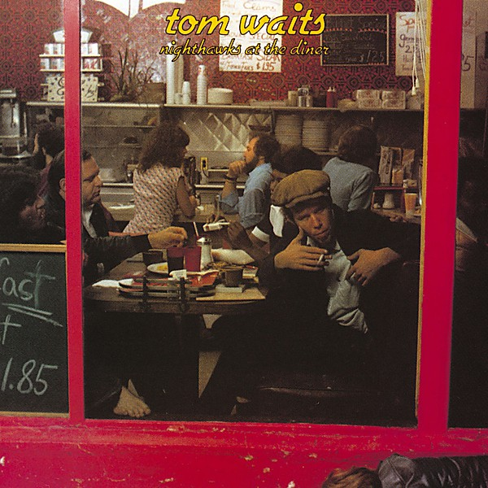

# Nighthawks at the Diner

By **Tom Waits**

## Album Data

- **Catalog:** Beets
- **Format:** Digital, Album
- **Album:** Nighthawks at the Diner
- **Artist:** Tom Waits
- **Albumartist:** Tom Waits
- **Genre:** Rock
- **MusicBrainz Album Artist ID:** [c3aeb863-7b26-4388-94e8-5a240f2be21b](https://musicbrainz.org/artist/c3aeb863-7b26-4388-94e8-5a240f2be21b)
- **MusicBrainz Album ID:** [63294f64-1477-32da-a734-99565ffc1e1d](https://musicbrainz.org/release/63294f64-1477-32da-a734-99565ffc1e1d)
- **MusicBrainz Release Group ID:** [ae446997-5355-3b5d-9dce-8a48ee1044ac](https://musicbrainz.org/release-group/ae446997-5355-3b5d-9dce-8a48ee1044ac)
- **Year:** 1998
- **Catalog #:** 1078-2
- **Label:** Asylum Records
- **Total Tracks:** 11

## Album Tracks

### Track 01 - Tom Traubert’s Blues (Four Sheets to the Wind in Copenhagen)

- **Artist:** Tom Waits
- **Format:** MP3
- **Genre:** Rock
- **Length:** 6:26
- **MusicBrainz Track ID:** [a2d2cf9f-45fe-484f-aa0d-3f267c40c6a7](https://musicbrainz.org/recording/a2d2cf9f-45fe-484f-aa0d-3f267c40c6a7)
- **Title:** Tom Traubert’s Blues (Four Sheets to the Wind in Copenhagen)
- **Track:** 01
- **Year:** 1989

### Track 02 - Step Right Up

- **Artist:** Tom Waits
- **Format:** MP3
- **Genre:** Americana
- **Length:** 5:39
- **MusicBrainz Track ID:** [c996dd3b-f319-4b83-b58c-2d3ff7225459](https://musicbrainz.org/recording/c996dd3b-f319-4b83-b58c-2d3ff7225459)
- **Title:** Step Right Up
- **Track:** 02
- **Year:** 1989

### Track 03 - Jitterbug Boy (Sharing a Curbstone With Chuck E. Weiss, Robert Marchese, Paul Body and the Mug and Artie)

- **Artist:** Tom Waits
- **Format:** MP3
- **Genre:** Rock
- **Length:** 3:16
- **MusicBrainz Track ID:** [1f4f4862-1ddf-466b-ade1-145494a52ad6](https://musicbrainz.org/recording/1f4f4862-1ddf-466b-ade1-145494a52ad6)
- **Title:** Jitterbug Boy (Sharing a Curbstone With Chuck E. Weiss, Robert Marchese, Paul Body and the Mug and Artie)
- **Track:** 03
- **Year:** 1989

### Track 04 - I Wish I Was in New Orleans (in the Ninth Ward)

- **Artist:** Tom Waits
- **Format:** MP3
- **Genre:** Rock
- **Length:** 4:36
- **MusicBrainz Track ID:** [ff65caee-76fa-40de-aec9-26a98db5e44e](https://musicbrainz.org/recording/ff65caee-76fa-40de-aec9-26a98db5e44e)
- **Title:** I Wish I Was in New Orleans (in the Ninth Ward)
- **Track:** 04
- **Year:** 1989

### Track 05 - The Piano Has Been Drinking (Not Me) (An Evening With Pete King)

- **Artist:** Tom Waits
- **Format:** MP3
- **Genre:** Rock
- **Length:** 3:34
- **MusicBrainz Track ID:** [c6c1f8b8-e7bd-4317-ba9a-89bbd53fca38](https://musicbrainz.org/recording/c6c1f8b8-e7bd-4317-ba9a-89bbd53fca38)
- **Title:** The Piano Has Been Drinking (Not Me) (An Evening With Pete King)
- **Track:** 05
- **Year:** 1989

### Track 06 - Invitation to the Blues

- **Artist:** Tom Waits
- **Format:** MP3
- **Genre:** Dark Cabaret
- **Length:** 5:18
- **MusicBrainz Track ID:** [74c1738f-0a45-415c-beaf-12244a63339e](https://musicbrainz.org/recording/74c1738f-0a45-415c-beaf-12244a63339e)
- **Title:** Invitation to the Blues
- **Track:** 06
- **Year:** 1989

### Track 07 - Pasties and a G‐String (at the Two O’Clock Club)

- **Artist:** Tom Waits
- **Format:** MP3
- **Genre:** Rock
- **Length:** 2:28
- **MusicBrainz Track ID:** [f12df183-db82-476f-9f78-6046cac0d514](https://musicbrainz.org/recording/f12df183-db82-476f-9f78-6046cac0d514)
- **Title:** Pasties and a G‐String (at the Two O’Clock Club)
- **Track:** 07
- **Year:** 1989

### Track 08 - Bad Liver and a Broken Heart (in Lowell)

- **Artist:** Tom Waits
- **Format:** MP3
- **Genre:** Rock
- **Length:** 4:30
- **MusicBrainz Track ID:** [375ddd96-a82e-4967-a342-f9ce5e9df995](https://musicbrainz.org/recording/375ddd96-a82e-4967-a342-f9ce5e9df995)
- **Title:** Bad Liver and a Broken Heart (in Lowell)
- **Track:** 08
- **Year:** 1989

### Track 09 - The One That Got Away

- **Artist:** Tom Waits
- **Format:** MP3
- **Genre:** Rock
- **Length:** 3:59
- **MusicBrainz Track ID:** [7d8ff95f-410e-4c69-815a-9993076f93f6](https://musicbrainz.org/recording/7d8ff95f-410e-4c69-815a-9993076f93f6)
- **Title:** The One That Got Away
- **Track:** 09
- **Year:** 1989

### Track 10 - Small Change (Got Rained On With His Own .38)

- **Artist:** Tom Waits
- **Format:** MP3
- **Genre:** Rock
- **Length:** 5:06
- **MusicBrainz Track ID:** [67c5a6b7-0c5e-47d3-a2f3-e00fa5f2c092](https://musicbrainz.org/recording/67c5a6b7-0c5e-47d3-a2f3-e00fa5f2c092)
- **Title:** Small Change (Got Rained On With His Own .38)
- **Track:** 10
- **Year:** 1989

### Track 11 - I Can’t Wait to Get Off Work (and See My Baby on Montgomery Avenue)

- **Artist:** Tom Waits
- **Format:** MP3
- **Genre:** Rock
- **Length:** 3:12
- **MusicBrainz Track ID:** [a210734c-8df3-424a-a9a0-ec86023aec4b](https://musicbrainz.org/recording/a210734c-8df3-424a-a9a0-ec86023aec4b)
- **Title:** I Can’t Wait to Get Off Work (and See My Baby on Montgomery Avenue)
- **Track:** 11
- **Year:** 1989

## See also

- [Bad as Me](Bad_as_Me.md)
- [Closing Time](Closing_Time.md)
- [Heartattack and Vine](Heartattack_and_Vine.md)
- [Small Change](Small_Change.md)
- [The Black Rider](The_Black_Rider.md)
- [The Heart of Saturday Night](The_Heart_of_Saturday_Night.md)
- [Roon: Closing Time (Remastered)](../../Roon/Tom_Waits/Closing_Time_Remastered.md)
- [Roon: Heartattack And Vine (Remastered)](../../Roon/Tom_Waits/Heartattack_And_Vine_Remastered.md)
- [Roon: Mule Variations (Remastered)](../../Roon/Tom_Waits/Mule_Variations_Remastered.md)
- [Roon: Nighthawks At The Diner (Remastered)](../../Roon/Tom_Waits/Nighthawks_At_The_Diner_Remastered.md)
- [Roon: Rain Dogs](../../Roon/Tom_Waits/Rain_Dogs.md)
- [Roon: Small Change (Remastered)](../../Roon/Tom_Waits/Small_Change_Remastered.md)
- [Roon: Swordfishtrombones](../../Roon/Tom_Waits/Swordfishtrombones.md)
- [Roon: The Heart Of Saturday Night (Remastered)](../../Roon/Tom_Waits/The_Heart_Of_Saturday_Night_Remastered.md)
