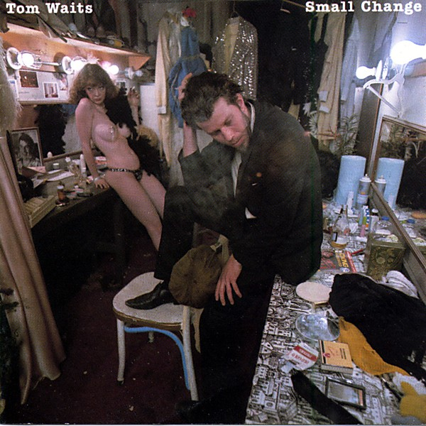

# Small Change

By **Tom Waits**

## Album Data

- **Catalog:** Beets
- **Format:** Digital, Album
- **Album:** Small Change
- **Artist:** Tom Waits
- **Albumartist:** Tom Waits
- **Genre:** Rock
- **MusicBrainz Album Artist ID:** [c3aeb863-7b26-4388-94e8-5a240f2be21b](https://musicbrainz.org/artist/c3aeb863-7b26-4388-94e8-5a240f2be21b)
- **MusicBrainz Album ID:** [4d61e053-ac62-336b-9f9d-3727ce566fe5](https://musicbrainz.org/release/4d61e053-ac62-336b-9f9d-3727ce566fe5)
- **MusicBrainz Release Group ID:** [74d9eef1-bbc6-3029-8289-a53ef41698f6](https://musicbrainz.org/release-group/74d9eef1-bbc6-3029-8289-a53ef41698f6)
- **Year:** 1989
- **Catalog #:** 0073145185592
- **Label:** Island
- **Total Tracks:** 20

## Album Tracks

### Track 01 - Lucky Day (overture)

- **Artist:** Tom Waits
- **Format:** MP3
- **Genre:** Blues
- **Length:** 2:27
- **MusicBrainz Track ID:** [bb552b94-06ac-4dc7-bd30-6ecea3ec6d8a](https://musicbrainz.org/recording/bb552b94-06ac-4dc7-bd30-6ecea3ec6d8a)
- **Title:** Lucky Day (overture)
- **Track:** 01
- **Year:** 1993

### Track 02 - The Black Rider

- **Artist:** Tom Waits
- **Format:** MP3
- **Genre:** Jazz Blues
- **Length:** 3:20
- **MusicBrainz Track ID:** [5f54f324-9bef-4355-9910-23cccda2655c](https://musicbrainz.org/recording/5f54f324-9bef-4355-9910-23cccda2655c)
- **Title:** The Black Rider
- **Track:** 02
- **Year:** 1993

### Track 03 - November

- **Artist:** Tom Waits
- **Format:** MP3
- **Genre:** Rock
- **Length:** 2:53
- **MusicBrainz Track ID:** [f2a0025a-613c-4233-a3d1-9775b9499caf](https://musicbrainz.org/recording/f2a0025a-613c-4233-a3d1-9775b9499caf)
- **Title:** November
- **Track:** 03
- **Year:** 1993

### Track 04 - Just the Right Bullets

- **Artist:** Tom Waits
- **Format:** MP3
- **Genre:** Folk Rock
- **Length:** 3:35
- **MusicBrainz Track ID:** [c31c6bbb-3bdb-4211-8771-c793f61ef2c7](https://musicbrainz.org/recording/c31c6bbb-3bdb-4211-8771-c793f61ef2c7)
- **Title:** Just the Right Bullets
- **Track:** 04
- **Year:** 1993

### Track 05 - Black Box Theme

- **Artist:** Tom Waits
- **Format:** MP3
- **Genre:** Jazz
- **Length:** 2:42
- **MusicBrainz Track ID:** [80c1e227-c97e-4f44-b415-05494faa23ff](https://musicbrainz.org/recording/80c1e227-c97e-4f44-b415-05494faa23ff)
- **Title:** Black Box Theme
- **Track:** 05
- **Year:** 1993

### Track 06 - 'T 'Ain't No Sin

- **Artist:** Tom Waits
- **Format:** MP3
- **Genre:** Opera
- **Length:** 2:25
- **MusicBrainz Track ID:** [5ba3b5da-b985-4499-b9d8-640734d25997](https://musicbrainz.org/recording/5ba3b5da-b985-4499-b9d8-640734d25997)
- **Title:** 'T 'Ain't No Sin
- **Track:** 06
- **Year:** 1993

### Track 07 - Flash Pan Hunter (intro)

- **Artist:** Tom Waits
- **Format:** MP3
- **Genre:** Blues
- **Length:** 1:09
- **MusicBrainz Track ID:** [0845c3fd-22c7-46c6-ac73-e2052e979407](https://musicbrainz.org/recording/0845c3fd-22c7-46c6-ac73-e2052e979407)
- **Title:** Flash Pan Hunter (intro)
- **Track:** 07
- **Year:** 1993

### Track 08 - That's the Way

- **Artist:** Tom Waits
- **Format:** MP3
- **Genre:** Soft Rock
- **Length:** 1:07
- **MusicBrainz Track ID:** [dc1bec98-9865-47f8-b709-5050e471f347](https://musicbrainz.org/recording/dc1bec98-9865-47f8-b709-5050e471f347)
- **Title:** That's the Way
- **Track:** 08
- **Year:** 1993

### Track 09 - The Briar and the Rose

- **Artist:** Tom Waits
- **Format:** MP3
- **Genre:** Rock
- **Length:** 3:50
- **MusicBrainz Track ID:** [4516da6c-8957-4d00-bab1-f5cf57f4ddb0](https://musicbrainz.org/recording/4516da6c-8957-4d00-bab1-f5cf57f4ddb0)
- **Title:** The Briar and the Rose
- **Track:** 09
- **Year:** 1993

### Track 10 - Russian Dance

- **Artist:** Tom Waits
- **Format:** MP3
- **Genre:** Gypsy Jazz
- **Length:** 3:11
- **MusicBrainz Track ID:** [e184f0f1-9b06-41bc-8a28-6692e676c475](https://musicbrainz.org/recording/e184f0f1-9b06-41bc-8a28-6692e676c475)
- **Title:** Russian Dance
- **Track:** 10
- **Year:** 1993

### Track 11 - Gospel Train (orchestra)

- **Artist:** Tom Waits
- **Format:** MP3
- **Genre:** Jazz
- **Length:** 2:33
- **MusicBrainz Track ID:** [23901b02-e765-4863-b7ea-61e7f597fdd3](https://musicbrainz.org/recording/23901b02-e765-4863-b7ea-61e7f597fdd3)
- **Title:** Gospel Train (orchestra)
- **Track:** 11
- **Year:** 1993

### Track 12 - I'll Shoot the Moon

- **Artist:** Tom Waits
- **Format:** MP3
- **Genre:** Jazz
- **Length:** 3:50
- **MusicBrainz Track ID:** [94706dde-7701-424f-8146-886e49eb80d8](https://musicbrainz.org/recording/94706dde-7701-424f-8146-886e49eb80d8)
- **Title:** I'll Shoot the Moon
- **Track:** 12
- **Year:** 1993

### Track 13 - Flash Pan Hunter

- **Artist:** Tom Waits
- **Format:** MP3
- **Genre:** Art Rock
- **Length:** 3:10
- **MusicBrainz Track ID:** [a71504d9-f8c1-408c-9ba4-f417004f9737](https://musicbrainz.org/recording/a71504d9-f8c1-408c-9ba4-f417004f9737)
- **Title:** Flash Pan Hunter
- **Track:** 13
- **Year:** 1993

### Track 14 - Crossroads

- **Artist:** Tom Waits
- **Format:** MP3
- **Genre:** Art Rock
- **Length:** 2:43
- **MusicBrainz Track ID:** [4e2a2448-c9de-480a-9983-f10bacd72a81](https://musicbrainz.org/recording/4e2a2448-c9de-480a-9983-f10bacd72a81)
- **Title:** Crossroads
- **Track:** 14
- **Year:** 1993

### Track 15 - Gospel Train

- **Artist:** Tom Waits
- **Format:** MP3
- **Genre:** Jazz
- **Length:** 4:42
- **MusicBrainz Track ID:** [300505a7-8dcb-4a31-89aa-cb3fc1db5ca2](https://musicbrainz.org/recording/300505a7-8dcb-4a31-89aa-cb3fc1db5ca2)
- **Title:** Gospel Train
- **Track:** 15
- **Year:** 1993

### Track 16 - Interlude

- **Artist:** Tom Waits
- **Format:** MP3
- **Genre:** Opera
- **Length:** 0:18
- **MusicBrainz Track ID:** [9cbcaa24-cecc-4821-a2c6-fe0fdff188c0](https://musicbrainz.org/recording/9cbcaa24-cecc-4821-a2c6-fe0fdff188c0)
- **Title:** Interlude
- **Track:** 16
- **Year:** 1993

### Track 17 - Oily Night

- **Artist:** Tom Waits
- **Format:** MP3
- **Genre:** Jazz
- **Length:** 4:23
- **MusicBrainz Track ID:** [8921ff4c-9a4d-463f-86a3-65564f00fb2a](https://musicbrainz.org/recording/8921ff4c-9a4d-463f-86a3-65564f00fb2a)
- **Title:** Oily Night
- **Track:** 17
- **Year:** 1993

### Track 18 - Lucky Day

- **Artist:** Tom Waits
- **Format:** MP3
- **Genre:** Americana
- **Length:** 3:42
- **MusicBrainz Track ID:** [f66b1673-cae4-4d18-b49e-07892172f5d7](https://musicbrainz.org/recording/f66b1673-cae4-4d18-b49e-07892172f5d7)
- **Title:** Lucky Day
- **Track:** 18
- **Year:** 1993

### Track 19 - The Last Rose of Summer

- **Artist:** Tom Waits
- **Format:** MP3
- **Genre:** Rock
- **Length:** 2:07
- **MusicBrainz Track ID:** [5170caf2-ee65-4c30-8bb1-ef3604b9e3d5](https://musicbrainz.org/recording/5170caf2-ee65-4c30-8bb1-ef3604b9e3d5)
- **Title:** The Last Rose of Summer
- **Track:** 19
- **Year:** 1993

### Track 20 - Carnival

- **Artist:** Tom Waits
- **Format:** MP3
- **Genre:** Dark Cabaret
- **Length:** 1:15
- **MusicBrainz Track ID:** [4c277d65-f2dd-4a71-86f6-a047fce06979](https://musicbrainz.org/recording/4c277d65-f2dd-4a71-86f6-a047fce06979)
- **Title:** Carnival
- **Track:** 20
- **Year:** 1993

## See also

- [Bad as Me](Bad_as_Me.md)
- [Closing Time](Closing_Time.md)
- [Heartattack and Vine](Heartattack_and_Vine.md)
- [Nighthawks at the Diner](Nighthawks_at_the_Diner.md)
- [The Black Rider](The_Black_Rider.md)
- [The Heart of Saturday Night](The_Heart_of_Saturday_Night.md)
- [Roon: Closing Time (Remastered)](../../Roon/Tom_Waits/Closing_Time_Remastered.md)
- [Roon: Heartattack And Vine (Remastered)](../../Roon/Tom_Waits/Heartattack_And_Vine_Remastered.md)
- [Roon: Mule Variations (Remastered)](../../Roon/Tom_Waits/Mule_Variations_Remastered.md)
- [Roon: Nighthawks At The Diner (Remastered)](../../Roon/Tom_Waits/Nighthawks_At_The_Diner_Remastered.md)
- [Roon: Rain Dogs](../../Roon/Tom_Waits/Rain_Dogs.md)
- [Roon: Small Change (Remastered)](../../Roon/Tom_Waits/Small_Change_Remastered.md)
- [Roon: Swordfishtrombones](../../Roon/Tom_Waits/Swordfishtrombones.md)
- [Roon: The Heart Of Saturday Night (Remastered)](../../Roon/Tom_Waits/The_Heart_Of_Saturday_Night_Remastered.md)
