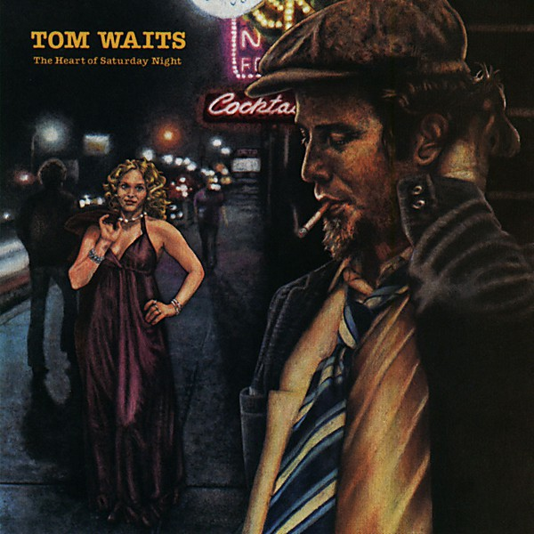

# The Heart of Saturday Night

By **Tom Waits**

## Album Data

- **Catalog:** Beets
- **Format:** Digital, Album
- **Album:** The Heart of Saturday Night
- **Artist:** Tom Waits
- **Albumartist:** Tom Waits
- **Genre:** Rock
- **MusicBrainz Album Artist ID:** [c3aeb863-7b26-4388-94e8-5a240f2be21b](https://musicbrainz.org/artist/c3aeb863-7b26-4388-94e8-5a240f2be21b)
- **MusicBrainz Album ID:** [7c660e69-4d7b-3aca-9bc0-4895fd9ef1d1](https://musicbrainz.org/release/7c660e69-4d7b-3aca-9bc0-4895fd9ef1d1)
- **MusicBrainz Release Group ID:** [02e8018b-9dfe-35f4-99a1-6759c8b5f41c](https://musicbrainz.org/release-group/02e8018b-9dfe-35f4-99a1-6759c8b5f41c)
- **Year:** 1990
- **Catalog #:** 7559-60597-2
- **Label:** Asylum Records
- **Total Tracks:** 11

## Album Tracks

### Track 01 - New Coat of Paint

- **Artist:** Tom Waits
- **Format:** MP3
- **Genre:** Rock
- **Length:** 3:20
- **MusicBrainz Track ID:** [87fd3a23-3792-460d-8ec5-b30c457c7188](https://musicbrainz.org/recording/87fd3a23-3792-460d-8ec5-b30c457c7188)
- **Title:** New Coat of Paint
- **Track:** 01
- **Year:** 1990

### Track 02 - San Diego Serenade

- **Artist:** Tom Waits
- **Format:** MP3
- **Genre:** Folk Rock
- **Length:** 3:23
- **MusicBrainz Track ID:** [6fab5153-08f1-495d-a77d-677709e5c94b](https://musicbrainz.org/recording/6fab5153-08f1-495d-a77d-677709e5c94b)
- **Title:** San Diego Serenade
- **Track:** 02
- **Year:** 1990

### Track 03 - Semi Suite

- **Artist:** Tom Waits
- **Format:** MP3
- **Genre:** Rock
- **Length:** 3:23
- **MusicBrainz Track ID:** [343b2714-fde9-4c96-a252-873f99d276b6](https://musicbrainz.org/recording/343b2714-fde9-4c96-a252-873f99d276b6)
- **Title:** Semi Suite
- **Track:** 03
- **Year:** 1990

### Track 04 - Shiver Me Timbers

- **Artist:** Tom Waits
- **Format:** MP3
- **Genre:** Rock
- **Length:** 4:22
- **MusicBrainz Track ID:** [7112e17f-aa4f-455c-b462-cb2173569a86](https://musicbrainz.org/recording/7112e17f-aa4f-455c-b462-cb2173569a86)
- **Title:** Shiver Me Timbers
- **Track:** 04
- **Year:** 1990

### Track 05 - Diamonds on My Windshield

- **Artist:** Tom Waits
- **Format:** MP3
- **Genre:** Rock
- **Length:** 3:07
- **MusicBrainz Track ID:** [8ee44e2a-cae8-4a78-93f2-1d2784b6a50f](https://musicbrainz.org/recording/8ee44e2a-cae8-4a78-93f2-1d2784b6a50f)
- **Title:** Diamonds on My Windshield
- **Track:** 05
- **Year:** 1990

### Track 06 - (Looking for) The Heart of Saturday Night

- **Artist:** Tom Waits
- **Format:** MP3
- **Genre:** Rock
- **Length:** 3:54
- **MusicBrainz Track ID:** [9ba54ad0-8f4e-47e9-a8cd-9a50e056db47](https://musicbrainz.org/recording/9ba54ad0-8f4e-47e9-a8cd-9a50e056db47)
- **Title:** (Looking for) The Heart of Saturday Night
- **Track:** 06
- **Year:** 1990

### Track 07 - Fumblin’ With the Blues

- **Artist:** Tom Waits
- **Format:** MP3
- **Genre:** Rock
- **Length:** 2:59
- **MusicBrainz Track ID:** [6729544b-3b74-43d4-b6d8-84b6973a4201](https://musicbrainz.org/recording/6729544b-3b74-43d4-b6d8-84b6973a4201)
- **Title:** Fumblin’ With the Blues
- **Track:** 07
- **Year:** 1990

### Track 08 - Please Call Me, Baby

- **Artist:** Tom Waits
- **Format:** MP3
- **Genre:** Rock
- **Length:** 4:22
- **MusicBrainz Track ID:** [46d1737a-6d75-4618-a5c5-f761cf2859c9](https://musicbrainz.org/recording/46d1737a-6d75-4618-a5c5-f761cf2859c9)
- **Title:** Please Call Me, Baby
- **Track:** 08
- **Year:** 1990

### Track 09 - Depot, Depot

- **Artist:** Tom Waits
- **Format:** MP3
- **Genre:** Folk Rock
- **Length:** 3:42
- **MusicBrainz Track ID:** [f18e37e9-37f3-4d62-81b2-34b201b9485b](https://musicbrainz.org/recording/f18e37e9-37f3-4d62-81b2-34b201b9485b)
- **Title:** Depot, Depot
- **Track:** 09
- **Year:** 1990

### Track 10 - Drunk on the Moon

- **Artist:** Tom Waits
- **Format:** MP3
- **Genre:** Americana
- **Length:** 5:03
- **MusicBrainz Track ID:** [f3f04b37-1c19-47bb-8135-9020342365a2](https://musicbrainz.org/recording/f3f04b37-1c19-47bb-8135-9020342365a2)
- **Title:** Drunk on the Moon
- **Track:** 10
- **Year:** 1990

### Track 11 - The Ghosts of Saturday Night (After Hours at Napoleone’s Pizza House)

- **Artist:** Tom Waits
- **Format:** MP3
- **Genre:** Rock
- **Length:** 3:11
- **MusicBrainz Track ID:** [b9b4b756-f5ee-4ee4-95ec-d0b45fa59ae3](https://musicbrainz.org/recording/b9b4b756-f5ee-4ee4-95ec-d0b45fa59ae3)
- **Title:** The Ghosts of Saturday Night (After Hours at Napoleone’s Pizza House)
- **Track:** 11
- **Year:** 1990

## See also

- [Bad as Me](Bad_as_Me.md)
- [Closing Time](Closing_Time.md)
- [Heartattack and Vine](Heartattack_and_Vine.md)
- [Nighthawks at the Diner](Nighthawks_at_the_Diner.md)
- [Small Change](Small_Change.md)
- [The Black Rider](The_Black_Rider.md)
- [Roon: Closing Time (Remastered)](../../Roon/Tom_Waits/Closing_Time_Remastered.md)
- [Roon: Heartattack And Vine (Remastered)](../../Roon/Tom_Waits/Heartattack_And_Vine_Remastered.md)
- [Roon: Mule Variations (Remastered)](../../Roon/Tom_Waits/Mule_Variations_Remastered.md)
- [Roon: Nighthawks At The Diner (Remastered)](../../Roon/Tom_Waits/Nighthawks_At_The_Diner_Remastered.md)
- [Roon: Rain Dogs](../../Roon/Tom_Waits/Rain_Dogs.md)
- [Roon: Small Change (Remastered)](../../Roon/Tom_Waits/Small_Change_Remastered.md)
- [Roon: Swordfishtrombones](../../Roon/Tom_Waits/Swordfishtrombones.md)
- [Roon: The Heart Of Saturday Night (Remastered)](../../Roon/Tom_Waits/The_Heart_Of_Saturday_Night_Remastered.md)
