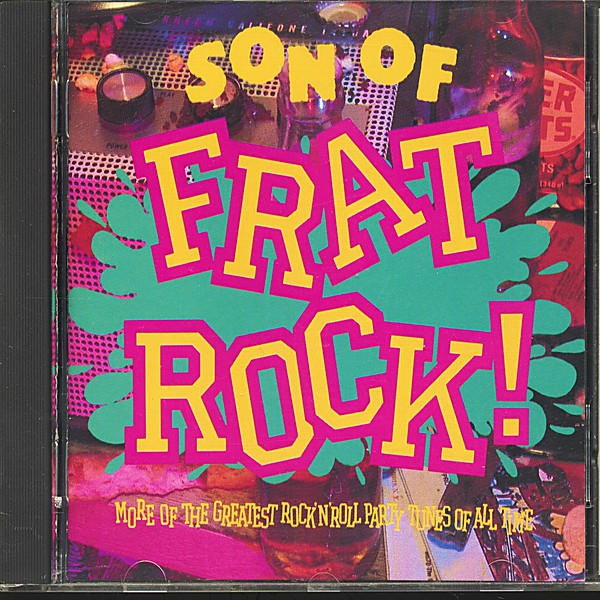

# Unknown Album

By **Tommy James & The Shondells**

## Album Data

- **Catalog:** Beets
- **Format:** Digital, Album
- **Album:** Unknown Album
- **Artist:** Tommy James & The Shondells
- **Albumartist:** Tommy James & The Shondells
- **Genre:** Psychedelic Rock
- **MusicBrainz Album Artist ID:** 
- **MusicBrainz Album ID:** 
- **MusicBrainz Release Group ID:** 
- **Year:** 1969
- **Catalog #:** 
- **Label:** 
- **Total Tracks:** 00

## Album Tracks

### Track 00 - Crimson and Clover

- **Artist:** Tommy James & The Shondells
- **Format:** AAC
- **Genre:** Rock
- **Length:** 5:30
- **MusicBrainz Track ID:** 
- **Title:** Crimson and Clover
- **Track:** 00
- **Year:** 1969

### Track 00 - Crystal Blue Persuasion

- **Artist:** Tommy James & The Shondells
- **Format:** AAC
- **Genre:** Psychedelic Rock
- **Length:** 4:04
- **MusicBrainz Track ID:** 
- **Title:** Crystal Blue Persuasion
- **Track:** 00
- **Year:** 1969

## See also

- [Vinyl: Sweet Cherry Wine / Breakaway](../../Vinyl/Tommy_James_and_The_Shondells/Sweet_Cherry_Wine_-_Breakaway.md)
- [Vinyl: ](../../Vinyl/Tommy_James_and_The_Shondells/Tommy_James_and_The_Shondells.md)
