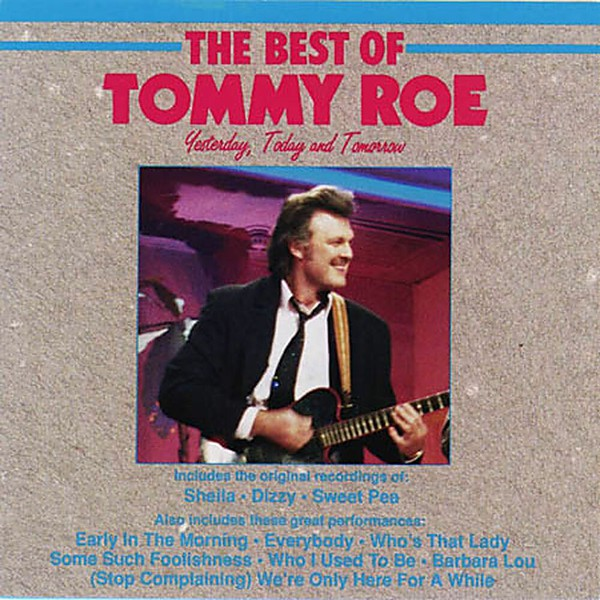

# The Best Of Tommy Roe

By **Tommy Roe**

## Album Data

- **Catalog:** Beets
- **Format:** Digital, Album
- **Album:** The Best Of Tommy Roe
- **Artist:** Tommy Roe
- **Albumartist:** Tommy Roe
- **Genre:** Rock And Roll
- **MusicBrainz Album Artist ID:** 
- **MusicBrainz Album ID:** 
- **MusicBrainz Release Group ID:** 
- **Year:** 1976
- **Catalog #:** 
- **Label:** 
- **Total Tracks:** 10

## Album Tracks

### Track 01 - Early In The Morning

- **Artist:** Tommy Roe
- **Format:** ALAC
- **Genre:** Rock And Roll
- **Length:** 2:59
- **MusicBrainz Track ID:** 
- **Title:** Early In The Morning
- **Track:** 01
- **Year:** 1976

### Track 02 - Sheila

- **Artist:** Tommy Roe
- **Format:** ALAC
- **Genre:** Pop
- **Length:** 2:07
- **MusicBrainz Track ID:** 
- **Title:** Sheila
- **Track:** 02
- **Year:** 1962

### Track 03 - (Stop Complaining) We're Only Here For A While

- **Artist:** Tommy Roe
- **Format:** ALAC
- **Genre:** Rock And Roll
- **Length:** 3:09
- **MusicBrainz Track ID:** 
- **Title:** (Stop Complaining) We're Only Here For A While
- **Track:** 03
- **Year:** 1990

### Track 04 - Dizzy

- **Artist:** Tommy Roe
- **Format:** ALAC
- **Genre:** Pop
- **Length:** 2:58
- **MusicBrainz Track ID:** 
- **Title:** Dizzy
- **Track:** 04
- **Year:** 1969

### Track 05 - Barbara Lou

- **Artist:** Tommy Roe
- **Format:** ALAC
- **Genre:** Rock And Roll
- **Length:** 2:54
- **MusicBrainz Track ID:** 
- **Title:** Barbara Lou
- **Track:** 05
- **Year:** 1985

### Track 06 - Sweet Pea

- **Artist:** Tommy Roe
- **Format:** ALAC
- **Genre:** Bubblegum Pop
- **Length:** 2:11
- **MusicBrainz Track ID:** 
- **Title:** Sweet Pea
- **Track:** 06
- **Year:** 1966

### Track 07 - Who I Used To Be

- **Artist:** Tommy Roe
- **Format:** ALAC
- **Genre:** Rock And Roll
- **Length:** 4:33
- **MusicBrainz Track ID:** 
- **Title:** Who I Used To Be
- **Track:** 07
- **Year:** 1990

### Track 08 - Some Such Foolishness

- **Artist:** Tommy Roe
- **Format:** ALAC
- **Genre:** Pop
- **Length:** 3:54
- **MusicBrainz Track ID:** 
- **Title:** Some Such Foolishness
- **Track:** 08
- **Year:** 1985

### Track 09 - Who's That Lady

- **Artist:** Tommy Roe
- **Format:** ALAC
- **Genre:** Rock And Roll
- **Length:** 3:51
- **MusicBrainz Track ID:** 
- **Title:** Who's That Lady
- **Track:** 09
- **Year:** 1990

### Track 10 - Everybody (Re-Recorded In Stereo)

- **Artist:** Tommy Roe
- **Format:** ALAC
- **Genre:** Rock And Roll
- **Length:** 3:11
- **MusicBrainz Track ID:** 
- **Title:** Everybody (Re-Recorded In Stereo)
- **Track:** 10
- **Year:** 1963

## See also

- [Roon: Greatest Hits](../../Roon/Tommy_Roe/Greatest_Hits.md)
- [Roon: It's Now Winters Day](../../Roon/Tommy_Roe/Its_Now_Winters_Day.md)
- [Roon: Sheila & Other Hits](../../Roon/Tommy_Roe/Sheila_and_Other_Hits.md)
