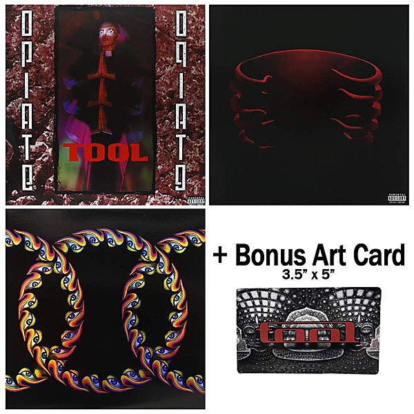

# Undertow

By **Tool**

## Album Data

- **Catalog:** Beets
- **Format:** Digital, Album
- **Album:** Undertow
- **Artist:** Tool
- **Albumartist:** Tool
- **Genre:** Progressive Metal
- **MusicBrainz Album Artist ID:** [66fc5bf8-daa4-4241-b378-9bc9077939d2](https://musicbrainz.org/artist/66fc5bf8-daa4-4241-b378-9bc9077939d2)
- **MusicBrainz Album ID:** [660c1995-c6a0-4c90-b158-2f2d9caff78f](https://musicbrainz.org/release/660c1995-c6a0-4c90-b158-2f2d9caff78f)
- **MusicBrainz Release Group ID:** [b067cde8-f3a7-394a-b8e7-640ca744f2e4](https://musicbrainz.org/release-group/b067cde8-f3a7-394a-b8e7-640ca744f2e4)
- **Year:** 1993
- **Catalog #:** 61422-31087-2
- **Label:** Volcano Records
- **Total Tracks:** 15

## Album Tracks

### Track 01 - Stinkfist

- **Artist:** Tool
- **Format:** ALAC
- **Genre:** Progressive Metal
- **Length:** 5:11
- **MusicBrainz Track ID:** [827cf397-a290-4a0b-b1d3-3cd5100fccfa](https://musicbrainz.org/recording/827cf397-a290-4a0b-b1d3-3cd5100fccfa)
- **Title:** Stinkfist
- **Track:** 01
- **Year:** 1996

### Track 02 - Eulogy

- **Artist:** Tool
- **Format:** ALAC
- **Genre:** Progressive Metal
- **Length:** 8:28
- **MusicBrainz Track ID:** [af73de40-302f-4e6b-874f-a64d1b4fad27](https://musicbrainz.org/recording/af73de40-302f-4e6b-874f-a64d1b4fad27)
- **Title:** Eulogy
- **Track:** 02
- **Year:** 1996

### Track 03 - H.

- **Artist:** Tool
- **Format:** ALAC
- **Genre:** Progressive Metal
- **Length:** 6:07
- **MusicBrainz Track ID:** [5dc9742c-c68b-4534-b0f4-91b341ad09d3](https://musicbrainz.org/recording/5dc9742c-c68b-4534-b0f4-91b341ad09d3)
- **Title:** H.
- **Track:** 03
- **Year:** 1996

### Track 04 - Useful Idiot

- **Artist:** Tool
- **Format:** ALAC
- **Genre:** Progressive Metal
- **Length:** 0:38
- **MusicBrainz Track ID:** [34de25f9-a1ce-436f-9068-e8c8d723b51b](https://musicbrainz.org/recording/34de25f9-a1ce-436f-9068-e8c8d723b51b)
- **Title:** Useful Idiot
- **Track:** 04
- **Year:** 1996

### Track 05 - Forty Six & 2

- **Artist:** Tool
- **Format:** ALAC
- **Genre:** Progressive Metal
- **Length:** 6:04
- **MusicBrainz Track ID:** [f355d857-0920-40a7-927d-051c78188768](https://musicbrainz.org/recording/f355d857-0920-40a7-927d-051c78188768)
- **Title:** Forty Six & 2
- **Track:** 05
- **Year:** 1996

### Track 06 - Message to Harry Manback

- **Artist:** Tool
- **Format:** ALAC
- **Genre:** Progressive Metal
- **Length:** 1:53
- **MusicBrainz Track ID:** [5151ffce-8617-443f-959a-82692c717cbf](https://musicbrainz.org/recording/5151ffce-8617-443f-959a-82692c717cbf)
- **Title:** Message to Harry Manback
- **Track:** 06
- **Year:** 1996

### Track 07 - Hooker With a Penis

- **Artist:** Tool
- **Format:** ALAC
- **Genre:** Progressive Metal
- **Length:** 4:33
- **MusicBrainz Track ID:** [72b4a21f-1d10-4cf3-a448-ae26a3f3fa1f](https://musicbrainz.org/recording/72b4a21f-1d10-4cf3-a448-ae26a3f3fa1f)
- **Title:** Hooker With a Penis
- **Track:** 07
- **Year:** 1996

### Track 08 - Intermission

- **Artist:** Tool
- **Format:** ALAC
- **Genre:** Progressive Metal
- **Length:** 0:56
- **MusicBrainz Track ID:** [bf9e43cc-4d38-4179-9d14-0cfff7ee755b](https://musicbrainz.org/recording/bf9e43cc-4d38-4179-9d14-0cfff7ee755b)
- **Title:** Intermission
- **Track:** 08
- **Year:** 1996

### Track 09 - jimmy

- **Artist:** Tool
- **Format:** ALAC
- **Genre:** Progressive Metal
- **Length:** 5:24
- **MusicBrainz Track ID:** [5f8d296f-295f-4d9b-8d91-22eb00668aea](https://musicbrainz.org/recording/5f8d296f-295f-4d9b-8d91-22eb00668aea)
- **Title:** jimmy
- **Track:** 09
- **Year:** 1996

### Track 10 - Die Eier von Satan

- **Artist:** Tool
- **Format:** ALAC
- **Genre:** Progressive Metal
- **Length:** 2:17
- **MusicBrainz Track ID:** [092b7d76-b9f3-42b4-88f7-4adec3eed283](https://musicbrainz.org/recording/092b7d76-b9f3-42b4-88f7-4adec3eed283)
- **Title:** Die Eier von Satan
- **Track:** 10
- **Year:** 1996

### Track 11 - Pushit

- **Artist:** Tool
- **Format:** ALAC
- **Genre:** Progressive Metal
- **Length:** 9:55
- **MusicBrainz Track ID:** [b8362114-74ab-47ac-856c-3ae48b28eb1a](https://musicbrainz.org/recording/b8362114-74ab-47ac-856c-3ae48b28eb1a)
- **Title:** Pushit
- **Track:** 11
- **Year:** 1996

### Track 12 - Cesaro Summability

- **Artist:** Tool
- **Format:** ALAC
- **Genre:** Progressive Metal
- **Length:** 1:26
- **MusicBrainz Track ID:** [e8dd63fb-eed9-41bb-9cc6-0825ff6fa874](https://musicbrainz.org/recording/e8dd63fb-eed9-41bb-9cc6-0825ff6fa874)
- **Title:** Cesaro Summability
- **Track:** 12
- **Year:** 1996

### Track 13 - Ænema

- **Artist:** Tool
- **Format:** ALAC
- **Genre:** Progressive Metal
- **Length:** 6:39
- **MusicBrainz Track ID:** [261ecb02-10e1-4e24-8279-3fcae702a9b9](https://musicbrainz.org/recording/261ecb02-10e1-4e24-8279-3fcae702a9b9)
- **Title:** Ænema
- **Track:** 13
- **Year:** 1996

### Track 14 - (‐) Ions

- **Artist:** Tool
- **Format:** ALAC
- **Genre:** Progressive Metal
- **Length:** 4:00
- **MusicBrainz Track ID:** [be587eb1-910b-4ca4-99ee-1e37a9fabaeb](https://musicbrainz.org/recording/be587eb1-910b-4ca4-99ee-1e37a9fabaeb)
- **Title:** (‐) Ions
- **Track:** 14
- **Year:** 1996

### Track 15 - Third Eye

- **Artist:** Tool
- **Format:** ALAC
- **Genre:** Progressive Metal
- **Length:** 13:47
- **MusicBrainz Track ID:** [03a2f5e0-7bf4-4473-b475-37fe93a0f67a](https://musicbrainz.org/recording/03a2f5e0-7bf4-4473-b475-37fe93a0f67a)
- **Title:** Third Eye
- **Track:** 15
- **Year:** 1996

## See also

- [Ænima](Ænima.md)
- [CD: Ænima](../../CD/Tool/Ænima.md)
- [CD: ](../../CD/Tool/Tool.md)
- [Roon: Fear Inoculum](../../Roon/Tool/Fear_Inoculum.md)
