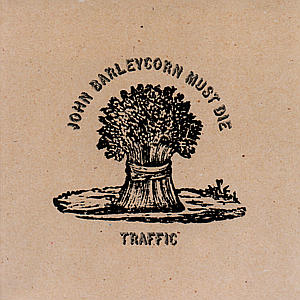

# John Barleycorn Must Die

By **Traffic**

## Album Data

- **Catalog:** Beets
- **Format:** Digital, Album
- **Album:** John Barleycorn Must Die
- **Artist:** Traffic
- **Albumartist:** Traffic
- **Genre:** Psychedelic Rock
- **MusicBrainz Album Artist ID:** [9fadfba9-ecae-4383-a4d8-47b043cea19a](https://musicbrainz.org/artist/9fadfba9-ecae-4383-a4d8-47b043cea19a)
- **MusicBrainz Album ID:** [0d22b56d-0a3b-4ea4-8443-77ae16945a09](https://musicbrainz.org/release/0d22b56d-0a3b-4ea4-8443-77ae16945a09)
- **MusicBrainz Release Group ID:** [3770d5ce-e0e1-3389-9acf-cd38f0722baf](https://musicbrainz.org/release-group/3770d5ce-e0e1-3389-9acf-cd38f0722baf)
- **Year:** 1970
- **Catalog #:** 314 548 827-2
- **Label:** Island
- **Total Tracks:** 07

## Album Tracks

### Track 01 - Hidden Treasure

- **Artist:** Traffic
- **Format:** ALAC
- **Genre:** Psychedelic Rock
- **Length:** 4:11
- **MusicBrainz Track ID:** [091ddaa2-e45d-4272-a02e-91ea12bd77a4](https://musicbrainz.org/recording/091ddaa2-e45d-4272-a02e-91ea12bd77a4)
- **Title:** Hidden Treasure
- **Track:** 01
- **Year:** 2002

### Track 02 - The Low Spark of High‐Heeled Boys

- **Artist:** Traffic
- **Format:** ALAC
- **Genre:** Progressive Rock
- **Length:** 11:44
- **MusicBrainz Track ID:** [a6499cab-50f5-4f01-9047-ae1fbbd098ce](https://musicbrainz.org/recording/a6499cab-50f5-4f01-9047-ae1fbbd098ce)
- **Title:** The Low Spark of High‐Heeled Boys
- **Track:** 02
- **Year:** 2002

### Track 03 - Light Up or Leave Me Alone

- **Artist:** Traffic
- **Format:** ALAC
- **Genre:** Progressive Rock
- **Length:** 4:50
- **MusicBrainz Track ID:** [2b9db9ad-8fe1-4fec-bec1-560b2a164dcf](https://musicbrainz.org/recording/2b9db9ad-8fe1-4fec-bec1-560b2a164dcf)
- **Title:** Light Up or Leave Me Alone
- **Track:** 03
- **Year:** 2002

### Track 04 - Rock & Roll Stew

- **Artist:** Traffic
- **Format:** ALAC
- **Genre:** Psychedelic Rock
- **Length:** 4:27
- **MusicBrainz Track ID:** [8b36ccd7-c821-4ed6-9eff-9b24a95cba8b](https://musicbrainz.org/recording/8b36ccd7-c821-4ed6-9eff-9b24a95cba8b)
- **Title:** Rock & Roll Stew
- **Track:** 04
- **Year:** 2002

### Track 05 - Many a Mile to Freedom

- **Artist:** Traffic
- **Format:** ALAC
- **Genre:** Soft Rock
- **Length:** 7:18
- **MusicBrainz Track ID:** [33f84870-718f-4e5a-aa31-b16c6237e909](https://musicbrainz.org/recording/33f84870-718f-4e5a-aa31-b16c6237e909)
- **Title:** Many a Mile to Freedom
- **Track:** 05
- **Year:** 2002

### Track 06 - Rainmaker

- **Artist:** Traffic
- **Format:** ALAC
- **Genre:** Progressive Rock
- **Length:** 7:53
- **MusicBrainz Track ID:** [c531b909-07cd-4fcb-a060-f2f6b6d23ef2](https://musicbrainz.org/recording/c531b909-07cd-4fcb-a060-f2f6b6d23ef2)
- **Title:** Rainmaker
- **Track:** 06
- **Year:** 2002

### Track 07 - Rock & Roll Stew, Parts 1 & 2 (single version)

- **Artist:** Traffic
- **Format:** ALAC
- **Genre:** Progressive Rock
- **Length:** 6:09
- **MusicBrainz Track ID:** [59fade85-bb66-43d4-b5fd-5da92344385c](https://musicbrainz.org/recording/59fade85-bb66-43d4-b5fd-5da92344385c)
- **Title:** Rock & Roll Stew, Parts 1 & 2 (single version)
- **Track:** 07
- **Year:** 2002

## See also

- [The Low Spark of High Heeled Boys](The_Low_Spark_of_High_Heeled_Boys.md)
- [Traffic](Traffic.md)
- [CD: The Low Spark Of High-Heeled Boys](../../CD/Traffic/The_Low_Spark_Of_High-Heeled_Boys.md)
- [CD: ](../../CD/Traffic/Traffic.md)
- [Roon: John Barleycorn Must Die](../../Roon/Traffic/John_Barleycorn_Must_Die.md)
- [Roon: Last Exit](../../Roon/Traffic/Last_Exit.md)
- [Roon: Mr. Fantasy](../../Roon/Traffic/Mr_Fantasy.md)
- [Roon: The Low Spark Of High Heeled Boys](../../Roon/Traffic/The_Low_Spark_Of_High_Heeled_Boys.md)
- [Roon: Traffic](../../Roon/Traffic/Traffic.md)
- [Roon: Welcome To The Canteen](../../Roon/Traffic/Welcome_To_The_Canteen.md)
- [Roon: When The Eagle Flies](../../Roon/Traffic/When_The_Eagle_Flies.md)
- [Vinyl: John Barleycorn Must Die](../../Vinyl/Traffic/John_Barleycorn_Must_Die.md)
- [Vinyl: ](../../Vinyl/Traffic/Traffic.md)
