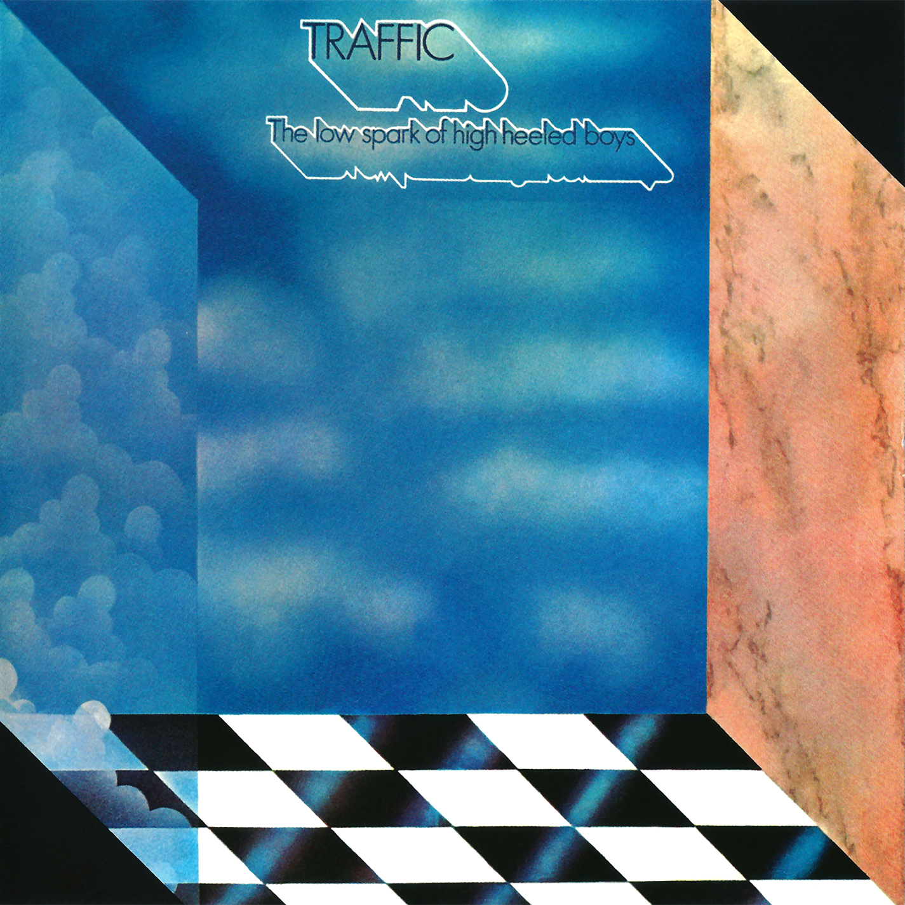

# The Low Spark of High Heeled Boys

By **Traffic**

## Album Data

- **Catalog:** Beets
- **Format:** Digital, Album
- **Album:** The Low Spark of High Heeled Boys
- **Artist:** Traffic
- **Albumartist:** Traffic
- **Genre:** Progressive Rock
- **MusicBrainz Album Artist ID:** [9fadfba9-ecae-4383-a4d8-47b043cea19a](https://musicbrainz.org/artist/9fadfba9-ecae-4383-a4d8-47b043cea19a)
- **MusicBrainz Album ID:** [4d7f9963-a4f9-4dab-be01-e7a4e6eb8204](https://musicbrainz.org/release/4d7f9963-a4f9-4dab-be01-e7a4e6eb8204)
- **MusicBrainz Release Group ID:** [12980c27-0af8-36eb-91a8-808b26b30a79](https://musicbrainz.org/release-group/12980c27-0af8-36eb-91a8-808b26b30a79)
- **Year:** 2002
- **Catalog #:** 314 542 852-2
- **Label:** Island
- **Total Tracks:** 13

## Album Tracks

### Track 01 - You Can All Join In

- **Artist:** Traffic
- **Format:** ALAC
- **Genre:** Psychedelic Rock
- **Length:** 3:36
- **MusicBrainz Track ID:** [c80311b3-d8b3-4d6b-bc3c-7d9ef375a180](https://musicbrainz.org/recording/c80311b3-d8b3-4d6b-bc3c-7d9ef375a180)
- **Title:** You Can All Join In
- **Track:** 01
- **Year:** 2001

### Track 02 - Pearly Queen

- **Artist:** Traffic
- **Format:** ALAC
- **Genre:** Psychedelic Rock
- **Length:** 4:19
- **MusicBrainz Track ID:** [46df3280-109e-4099-8fa5-649714844b5d](https://musicbrainz.org/recording/46df3280-109e-4099-8fa5-649714844b5d)
- **Title:** Pearly Queen
- **Track:** 02
- **Year:** 2001

### Track 03 - Don’t Be Sad

- **Artist:** Traffic
- **Format:** ALAC
- **Genre:** Psychedelic Rock
- **Length:** 3:21
- **MusicBrainz Track ID:** [cee0fd6b-457c-47d1-bd57-540a76650131](https://musicbrainz.org/recording/cee0fd6b-457c-47d1-bd57-540a76650131)
- **Title:** Don’t Be Sad
- **Track:** 03
- **Year:** 2001

### Track 04 - Who Knows What Tomorrow May Bring

- **Artist:** Traffic
- **Format:** ALAC
- **Genre:** Soul
- **Length:** 3:13
- **MusicBrainz Track ID:** [3f4c2a46-4423-4227-85da-3b48bf2772ee](https://musicbrainz.org/recording/3f4c2a46-4423-4227-85da-3b48bf2772ee)
- **Title:** Who Knows What Tomorrow May Bring
- **Track:** 04
- **Year:** 2001

### Track 05 - Feelin’ Alright?

- **Artist:** Traffic
- **Format:** ALAC
- **Genre:** Psychedelic Rock
- **Length:** 4:18
- **MusicBrainz Track ID:** [9850fa21-ceb4-4696-afc9-3d9a3151ab9d](https://musicbrainz.org/recording/9850fa21-ceb4-4696-afc9-3d9a3151ab9d)
- **Title:** Feelin’ Alright?
- **Track:** 05
- **Year:** 2001

### Track 06 - Vagabond Virgin

- **Artist:** Traffic
- **Format:** ALAC
- **Genre:** Psychedelic Rock
- **Length:** 5:21
- **MusicBrainz Track ID:** [23fe412e-72ab-49c3-a7b5-ad634b2db7cf](https://musicbrainz.org/recording/23fe412e-72ab-49c3-a7b5-ad634b2db7cf)
- **Title:** Vagabond Virgin
- **Track:** 06
- **Year:** 2001

### Track 07 - Forty Thousand Headmen

- **Artist:** Traffic
- **Format:** ALAC
- **Genre:** Progressive Rock
- **Length:** 3:13
- **MusicBrainz Track ID:** [ef6e0fd2-025c-4fd5-ad0b-023996f171cf](https://musicbrainz.org/recording/ef6e0fd2-025c-4fd5-ad0b-023996f171cf)
- **Title:** Forty Thousand Headmen
- **Track:** 07
- **Year:** 2001

### Track 08 - Cryin’ to Be Heard

- **Artist:** Traffic
- **Format:** ALAC
- **Genre:** Psychedelic Rock
- **Length:** 5:14
- **MusicBrainz Track ID:** [e162d129-560a-4e68-bbbb-ef35b482c1c0](https://musicbrainz.org/recording/e162d129-560a-4e68-bbbb-ef35b482c1c0)
- **Title:** Cryin’ to Be Heard
- **Track:** 08
- **Year:** 2001

### Track 09 - No Time to Live

- **Artist:** Traffic
- **Format:** ALAC
- **Genre:** Psychedelic Rock
- **Length:** 5:19
- **MusicBrainz Track ID:** [2ed1df1b-46e9-4546-8471-150997e2e300](https://musicbrainz.org/recording/2ed1df1b-46e9-4546-8471-150997e2e300)
- **Title:** No Time to Live
- **Track:** 09
- **Year:** 2001

### Track 10 - Means to an End

- **Artist:** Traffic
- **Format:** ALAC
- **Genre:** Psychedelic Rock
- **Length:** 2:38
- **MusicBrainz Track ID:** [6118bf5e-6dc6-4f78-87f1-03f809fbc914](https://musicbrainz.org/recording/6118bf5e-6dc6-4f78-87f1-03f809fbc914)
- **Title:** Means to an End
- **Track:** 10
- **Year:** 2001

### Track 11 - You Can All Join In (mono single mix)

- **Artist:** Traffic
- **Format:** ALAC
- **Genre:** Psychedelic Rock
- **Length:** 3:45
- **MusicBrainz Track ID:** [af23d0a4-d4ed-49bf-8096-435b79f3e467](https://musicbrainz.org/recording/af23d0a4-d4ed-49bf-8096-435b79f3e467)
- **Title:** You Can All Join In (mono single mix)
- **Track:** 11
- **Year:** 2001

### Track 12 - Feelin’ Alright? (mono single mix)

- **Artist:** Traffic
- **Format:** ALAC
- **Genre:** Psychedelic Rock
- **Length:** 4:03
- **MusicBrainz Track ID:** [dc411dfd-8755-40ad-93a9-d9e207f368c3](https://musicbrainz.org/recording/dc411dfd-8755-40ad-93a9-d9e207f368c3)
- **Title:** Feelin’ Alright? (mono single mix)
- **Track:** 12
- **Year:** 2001

### Track 13 - Withering Tree (stereo single mix)

- **Artist:** Traffic
- **Format:** ALAC
- **Genre:** Psychedelic Rock
- **Length:** 2:53
- **MusicBrainz Track ID:** [ab003c67-15be-4610-9c6d-2b88fdc638cf](https://musicbrainz.org/recording/ab003c67-15be-4610-9c6d-2b88fdc638cf)
- **Title:** Withering Tree (stereo single mix)
- **Track:** 13
- **Year:** 2001

## See also

- [John Barleycorn Must Die](John_Barleycorn_Must_Die.md)
- [Traffic](Traffic.md)
- [CD: The Low Spark Of High-Heeled Boys](../../CD/Traffic/The_Low_Spark_Of_High-Heeled_Boys.md)
- [CD: ](../../CD/Traffic/Traffic.md)
- [Roon: John Barleycorn Must Die](../../Roon/Traffic/John_Barleycorn_Must_Die.md)
- [Roon: Last Exit](../../Roon/Traffic/Last_Exit.md)
- [Roon: Mr. Fantasy](../../Roon/Traffic/Mr_Fantasy.md)
- [Roon: The Low Spark Of High Heeled Boys](../../Roon/Traffic/The_Low_Spark_Of_High_Heeled_Boys.md)
- [Roon: Traffic](../../Roon/Traffic/Traffic.md)
- [Roon: Welcome To The Canteen](../../Roon/Traffic/Welcome_To_The_Canteen.md)
- [Roon: When The Eagle Flies](../../Roon/Traffic/When_The_Eagle_Flies.md)
- [Vinyl: John Barleycorn Must Die](../../Vinyl/Traffic/John_Barleycorn_Must_Die.md)
- [Vinyl: ](../../Vinyl/Traffic/Traffic.md)
