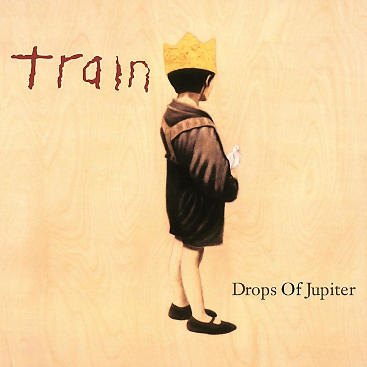

# Drops Of Jupiter

By **Train**

## Album Data

- **Catalog:** Beets
- **Format:** Digital, Album
- **Album:** Drops Of Jupiter
- **Artist:** Train
- **Albumartist:** Train
- **Genre:** Soft Rock
- **MusicBrainz Album Artist ID:** 
- **MusicBrainz Album ID:** 
- **MusicBrainz Release Group ID:** 
- **Year:** 0000
- **Catalog #:** 
- **Label:** 
- **Total Tracks:** 13

## Album Tracks

### Track 01 - All I Ever Wanted

- **Artist:** Train
- **Format:** ALAC
- **Genre:** Pop Rock
- **Length:** 4:07
- **MusicBrainz Track ID:** 
- **Title:** All I Ever Wanted
- **Track:** 01
- **Year:** 2006

### Track 08 - Shelter Me

- **Artist:** Train
- **Format:** ALAC
- **Genre:** Pop Rock
- **Length:** 3:35
- **MusicBrainz Track ID:** 
- **Title:** Shelter Me
- **Track:** 08
- **Year:** 2006

### Track 09 - Explanation

- **Artist:** Train
- **Format:** ALAC
- **Genre:** Alternative Rock
- **Length:** 4:32
- **MusicBrainz Track ID:** 
- **Title:** Explanation
- **Track:** 09
- **Year:** 2006

## See also

- [For Me, It's You](For_Me__Its_You.md)
- [My Private Nation](My_Private_Nation.md)
- [Train](Train.md)
- [Roon: My Private Nation](../../Roon/Train/My_Private_Nation.md)
- [Roon: Train](../../Roon/Train/Train.md)
