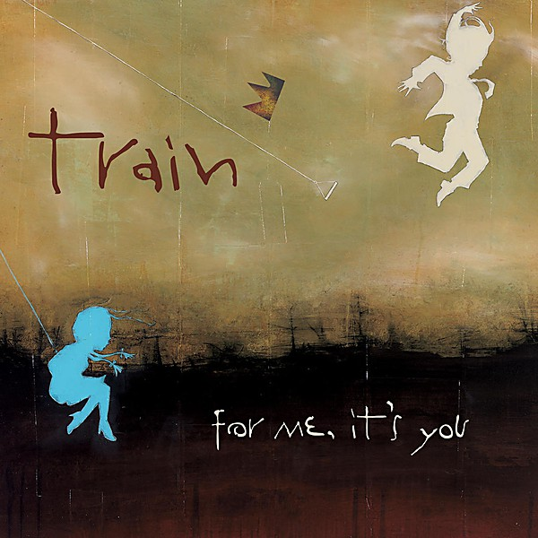

# For Me, It's You

By **Train**

## Album Data

- **Catalog:** Beets
- **Format:** Digital, Album
- **Album:** For Me, It's You
- **Artist:** Train
- **Albumartist:** Train
- **Genre:** Soft Rock
- **MusicBrainz Album Artist ID:** 
- **MusicBrainz Album ID:** 
- **MusicBrainz Release Group ID:** 
- **Year:** 2006
- **Catalog #:** CK 86593
- **Label:** Columbia
- **Total Tracks:** 12

## Album Tracks

### Track 01 - Calling All Angels

- **Artist:** Train
- **Format:** AAC
- **Genre:** Soft Rock
- **Length:** 4:02
- **MusicBrainz Track ID:** [34fdbc74-5a4e-4cc9-aaac-250e7c832fcf](https://musicbrainz.org/recording/34fdbc74-5a4e-4cc9-aaac-250e7c832fcf)
- **Title:** Calling All Angels
- **Track:** 01
- **Year:** 2003

### Track 02 - All American Girl

- **Artist:** Train
- **Format:** AAC
- **Genre:** Alternative Rock
- **Length:** 3:17
- **MusicBrainz Track ID:** [0e7fb20c-a00e-44b8-a51d-21de063f4123](https://musicbrainz.org/recording/0e7fb20c-a00e-44b8-a51d-21de063f4123)
- **Title:** All American Girl
- **Track:** 02
- **Year:** 2003

### Track 03 - When I Look to the Sky

- **Artist:** Train
- **Format:** AAC
- **Genre:** Alternative Rock
- **Length:** 4:04
- **MusicBrainz Track ID:** [06301459-dc3c-4e35-a727-4e00a7a55fa8](https://musicbrainz.org/recording/06301459-dc3c-4e35-a727-4e00a7a55fa8)
- **Title:** When I Look to the Sky
- **Track:** 03
- **Year:** 2003

### Track 04 - Save the Day

- **Artist:** Train
- **Format:** AAC
- **Genre:** Hard Rock
- **Length:** 4:05
- **MusicBrainz Track ID:** [006b3fc6-ea30-4798-8b74-d6192c823761](https://musicbrainz.org/recording/006b3fc6-ea30-4798-8b74-d6192c823761)
- **Title:** Save the Day
- **Track:** 04
- **Year:** 2003

### Track 05 - My Private Nation

- **Artist:** Train
- **Format:** AAC
- **Genre:** Pop Rock
- **Length:** 3:22
- **MusicBrainz Track ID:** [72f15876-cf39-4c06-8834-b3a70b1e7dda](https://musicbrainz.org/recording/72f15876-cf39-4c06-8834-b3a70b1e7dda)
- **Title:** My Private Nation
- **Track:** 05
- **Year:** 2003

### Track 06 - Get to Me

- **Artist:** Train
- **Format:** AAC
- **Genre:** Hard Rock
- **Length:** 4:05
- **MusicBrainz Track ID:** [6fc0b499-5b56-4d7e-ae69-5038ed5692f0](https://musicbrainz.org/recording/6fc0b499-5b56-4d7e-ae69-5038ed5692f0)
- **Title:** Get to Me
- **Track:** 06
- **Year:** 2003

### Track 07 - Counting Airplanes

- **Artist:** Train
- **Format:** AAC
- **Genre:** Hard Rock
- **Length:** 4:21
- **MusicBrainz Track ID:** [9a3a489a-1639-42f3-85f6-1235badc0f04](https://musicbrainz.org/recording/9a3a489a-1639-42f3-85f6-1235badc0f04)
- **Title:** Counting Airplanes
- **Track:** 07
- **Year:** 2003

### Track 08 - Following Rita

- **Artist:** Train
- **Format:** AAC
- **Genre:** Hard Rock
- **Length:** 3:44
- **MusicBrainz Track ID:** [ccf86d8d-cd51-4d3a-9329-1917dca9f3ac](https://musicbrainz.org/recording/ccf86d8d-cd51-4d3a-9329-1917dca9f3ac)
- **Title:** Following Rita
- **Track:** 08
- **Year:** 2003

### Track 09 - Your Every Color

- **Artist:** Train
- **Format:** AAC
- **Genre:** Power Pop
- **Length:** 4:26
- **MusicBrainz Track ID:** [0e8c9abe-9217-44d2-ad15-b01b296ef00b](https://musicbrainz.org/recording/0e8c9abe-9217-44d2-ad15-b01b296ef00b)
- **Title:** Your Every Color
- **Track:** 09
- **Year:** 2003

### Track 10 - Lincoln Avenue

- **Artist:** Train
- **Format:** AAC
- **Genre:** Soft Rock
- **Length:** 3:36
- **MusicBrainz Track ID:** [632d29cf-0b60-46bc-8470-ad8af21b7a2f](https://musicbrainz.org/recording/632d29cf-0b60-46bc-8470-ad8af21b7a2f)
- **Title:** Lincoln Avenue
- **Track:** 10
- **Year:** 2003

### Track 11 - I’m About to Come Alive

- **Artist:** Train
- **Format:** AAC
- **Genre:** Power Pop
- **Length:** 4:05
- **MusicBrainz Track ID:** [95cf0c68-122a-400a-98be-4234071d5ccd](https://musicbrainz.org/recording/95cf0c68-122a-400a-98be-4234071d5ccd)
- **Title:** I’m About to Come Alive
- **Track:** 11
- **Year:** 2003

### Track 12 - When I Look to the Sky (alternate version)

- **Artist:** Train
- **Format:** AAC
- **Genre:** Power Pop
- **Length:** 3:59
- **MusicBrainz Track ID:** [494d2d81-7b1c-4c44-b149-0c7db777792c](https://musicbrainz.org/recording/494d2d81-7b1c-4c44-b149-0c7db777792c)
- **Title:** When I Look to the Sky (alternate version)
- **Track:** 12
- **Year:** 2003

## See also

- [Drops Of Jupiter](Drops_Of_Jupiter.md)
- [My Private Nation](My_Private_Nation.md)
- [Train](Train.md)
- [Roon: My Private Nation](../../Roon/Train/My_Private_Nation.md)
- [Roon: Train](../../Roon/Train/Train.md)
