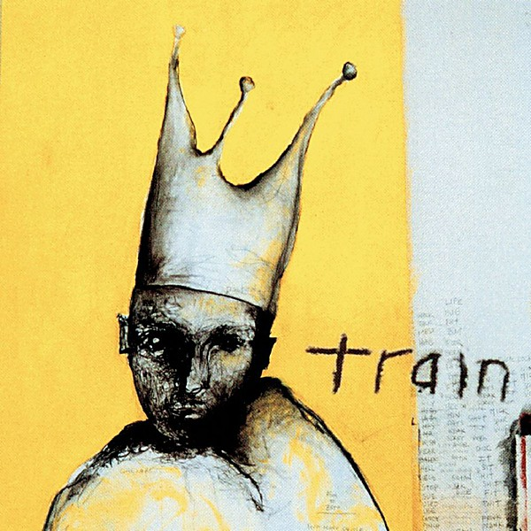

# Train

By **Train**

## Album Data

- **Catalog:** Beets
- **Format:** Digital, Album
- **Album:** Train
- **Artist:** Train
- **Albumartist:** Train
- **Genre:** Pop Rock
- **MusicBrainz Album Artist ID:** [bfd5aec5-62a2-4560-a316-7c46c17babda](https://musicbrainz.org/artist/bfd5aec5-62a2-4560-a316-7c46c17babda)
- **MusicBrainz Album ID:** [8118dd96-d32e-4b63-ae31-22bf0adcc9e9](https://musicbrainz.org/release/8118dd96-d32e-4b63-ae31-22bf0adcc9e9)
- **MusicBrainz Release Group ID:** [cc9eea3f-db80-3579-9499-146e38b0d514](https://musicbrainz.org/release-group/cc9eea3f-db80-3579-9499-146e38b0d514)
- **Year:** 1996
- **Catalog #:** 
- **Label:** 
- **Total Tracks:** 13

## Album Tracks

### Track 01 - Meet Virginia

- **Artist:** Train
- **Format:** AAC
- **Genre:** Pop Rock
- **Length:** 4:00
- **MusicBrainz Track ID:** [8aaaafcb-383f-4267-925b-8f2d0fea24ee](https://musicbrainz.org/recording/8aaaafcb-383f-4267-925b-8f2d0fea24ee)
- **Title:** Meet Virginia
- **Track:** 01
- **Year:** 1996

### Track 02 - I Am

- **Artist:** Train
- **Format:** AAC
- **Genre:** Emo
- **Length:** 4:28
- **MusicBrainz Track ID:** [c2db3aa5-8286-4e30-802b-c48380a494ec](https://musicbrainz.org/recording/c2db3aa5-8286-4e30-802b-c48380a494ec)
- **Title:** I Am
- **Track:** 02
- **Year:** 1996

### Track 03 - If You Leave

- **Artist:** Train
- **Format:** AAC
- **Genre:** Rock
- **Length:** 3:28
- **MusicBrainz Track ID:** [8a411efb-8bc5-4f42-90b8-483154365fd7](https://musicbrainz.org/recording/8a411efb-8bc5-4f42-90b8-483154365fd7)
- **Title:** If You Leave
- **Track:** 03
- **Year:** 1996

### Track 04 - Homesick

- **Artist:** Train
- **Format:** AAC
- **Genre:** Indie Rock
- **Length:** 4:38
- **MusicBrainz Track ID:** [0ad630f5-af66-478f-930c-9b4863977851](https://musicbrainz.org/recording/0ad630f5-af66-478f-930c-9b4863977851)
- **Title:** Homesick
- **Track:** 04
- **Year:** 1996

### Track 05 - Free

- **Artist:** Train
- **Format:** AAC
- **Genre:** Alternative Rock
- **Length:** 3:57
- **MusicBrainz Track ID:** [f77bb665-985a-4443-83bc-307be5166c64](https://musicbrainz.org/recording/f77bb665-985a-4443-83bc-307be5166c64)
- **Title:** Free
- **Track:** 05
- **Year:** 1996

### Track 06 - Blind

- **Artist:** Train
- **Format:** AAC
- **Genre:** Emo
- **Length:** 5:01
- **MusicBrainz Track ID:** [e8a7f089-21bb-48bf-952e-0dc88fdaca1a](https://musicbrainz.org/recording/e8a7f089-21bb-48bf-952e-0dc88fdaca1a)
- **Title:** Blind
- **Track:** 06
- **Year:** 1996

### Track 07 - Eggplant

- **Artist:** Train
- **Format:** AAC
- **Genre:** Soft Rock
- **Length:** 3:11
- **MusicBrainz Track ID:** [1ff7e48b-6a7d-4dd8-aae2-925bbf649a8b](https://musicbrainz.org/recording/1ff7e48b-6a7d-4dd8-aae2-925bbf649a8b)
- **Title:** Eggplant
- **Track:** 07
- **Year:** 1996

### Track 08 - Idaho

- **Artist:** Train
- **Format:** AAC
- **Genre:** Rock
- **Length:** 4:56
- **MusicBrainz Track ID:** [d5ee8f40-2419-4370-8e27-484df80b398c](https://musicbrainz.org/recording/d5ee8f40-2419-4370-8e27-484df80b398c)
- **Title:** Idaho
- **Track:** 08
- **Year:** 1996

### Track 09 - Days

- **Artist:** Train
- **Format:** AAC
- **Genre:** Indie Rock
- **Length:** 4:37
- **MusicBrainz Track ID:** [688727ae-2120-4f36-b630-b4eb652695df](https://musicbrainz.org/recording/688727ae-2120-4f36-b630-b4eb652695df)
- **Title:** Days
- **Track:** 09
- **Year:** 1996

### Track 10 - Rat

- **Artist:** Train
- **Format:** AAC
- **Genre:** Rock
- **Length:** 4:31
- **MusicBrainz Track ID:** [2a85370b-6eb5-497e-bf5b-2c14a03e6dc8](https://musicbrainz.org/recording/2a85370b-6eb5-497e-bf5b-2c14a03e6dc8)
- **Title:** Rat
- **Track:** 10
- **Year:** 1996

### Track 11 - Swaying

- **Artist:** Train
- **Format:** AAC
- **Genre:** Hard Rock
- **Length:** 3:11
- **MusicBrainz Track ID:** [15a0a4b5-472e-4c37-95ba-05f5d6e88d5b](https://musicbrainz.org/recording/15a0a4b5-472e-4c37-95ba-05f5d6e88d5b)
- **Title:** Swaying
- **Track:** 11
- **Year:** 1996

### Track 12 - Train

- **Artist:** Train
- **Format:** MP3
- **Genre:** Alternative Rock
- **Length:** 6:36
- **MusicBrainz Track ID:** [66e49102-5ed2-4a5a-aa3c-ec668457f0a5](https://musicbrainz.org/recording/66e49102-5ed2-4a5a-aa3c-ec668457f0a5)
- **Title:** Train
- **Track:** 12
- **Year:** 1996

### Track 13 - Heavy

- **Artist:** Train
- **Format:** AAC
- **Genre:** Rock
- **Length:** 3:49
- **MusicBrainz Track ID:** [fce9bbeb-e6df-4780-a3ad-1f4bc0c80e1d](https://musicbrainz.org/recording/fce9bbeb-e6df-4780-a3ad-1f4bc0c80e1d)
- **Title:** Heavy
- **Track:** 13
- **Year:** 1996

## See also

- [Drops Of Jupiter](Drops_Of_Jupiter.md)
- [For Me, It's You](For_Me__Its_You.md)
- [My Private Nation](My_Private_Nation.md)
- [Roon: My Private Nation](../../Roon/Train/My_Private_Nation.md)
- [Roon: Train](../../Roon/Train/Train.md)
