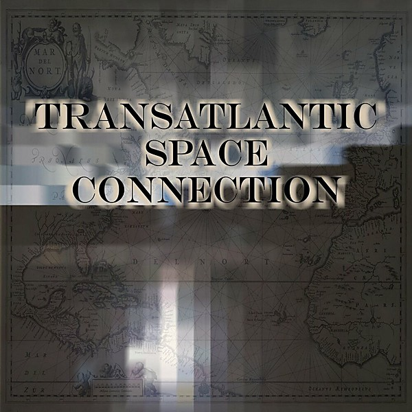

# Transatlantic Space Connection

By **Transatlantic Space Connection**

## Album Data

- **Catalog:** Beets
- **Format:** Digital, Album
- **Album:** Transatlantic Space Connection
- **Artist:** Transatlantic Space Connection
- **Albumartist:** Transatlantic Space Connection
- **Genre:** Unknown
- **MusicBrainz Album Artist ID:** [https](https://musicbrainz.org/artist/https)
- **MusicBrainz Album ID:** [https](https://musicbrainz.org/release/https)
- **MusicBrainz Release Group ID:** 
- **Year:** 2020
- **Catalog #:** 
- **Label:** Jonathan Segel
- **Total Tracks:** 04

## Album Tracks

### Track 01 - Don't Threaten Me with a Good Time

- **Artist:** Transatlantic Space Connection
- **Format:** FLAC
- **Genre:** Unknown
- **Length:** 8:30
- **MusicBrainz Track ID:** [https](https://musicbrainz.org/recording/https)
- **Title:** Don't Threaten Me with a Good Time
- **Track:** 01
- **Year:** 2020

### Track 01 - Don't Threaten Me with a Good Time

- **Artist:** Transatlantic Space Connection
- **Format:** MP3
- **Genre:** Unknown
- **Length:** 8:30
- **MusicBrainz Track ID:** [https](https://musicbrainz.org/recording/https)
- **Title:** Don't Threaten Me with a Good Time
- **Track:** 01
- **Year:** 2020

### Track 02 - Party at the A-Frame

- **Artist:** Transatlantic Space Connection
- **Format:** FLAC
- **Genre:** Unknown
- **Length:** 10:17
- **MusicBrainz Track ID:** [https](https://musicbrainz.org/recording/https)
- **Title:** Party at the A-Frame
- **Track:** 02
- **Year:** 2020

### Track 02 - Party at the A-Frame

- **Artist:** Transatlantic Space Connection
- **Format:** MP3
- **Genre:** Unknown
- **Length:** 10:17
- **MusicBrainz Track ID:** [https](https://musicbrainz.org/recording/https)
- **Title:** Party at the A-Frame
- **Track:** 02
- **Year:** 2020

### Track 03 - That's Y'all's Call.

- **Artist:** Transatlantic Space Connection
- **Format:** FLAC
- **Genre:** Unknown
- **Length:** 10:24
- **MusicBrainz Track ID:** [https](https://musicbrainz.org/recording/https)
- **Title:** That's Y'all's Call.
- **Track:** 03
- **Year:** 2020

### Track 03 - That's Y'all's Call.

- **Artist:** Transatlantic Space Connection
- **Format:** MP3
- **Genre:** Unknown
- **Length:** 10:24
- **MusicBrainz Track ID:** [https](https://musicbrainz.org/recording/https)
- **Title:** That's Y'all's Call.
- **Track:** 03
- **Year:** 2020

### Track 04 - Perfect Moment Forever

- **Artist:** Transatlantic Space Connection
- **Format:** FLAC
- **Genre:** Unknown
- **Length:** 10:34
- **MusicBrainz Track ID:** [https](https://musicbrainz.org/recording/https)
- **Title:** Perfect Moment Forever
- **Track:** 04
- **Year:** 2020

### Track 04 - Perfect Moment Forever

- **Artist:** Transatlantic Space Connection
- **Format:** MP3
- **Genre:** Unknown
- **Length:** 10:34
- **MusicBrainz Track ID:** [https](https://musicbrainz.org/recording/https)
- **Title:** Perfect Moment Forever
- **Track:** 04
- **Year:** 2020

## See also

- [Roon: Transatlantic Space Connection](../../Roon/Transatlantic_Space_Connection/Transatlantic_Space_Connection.md)
