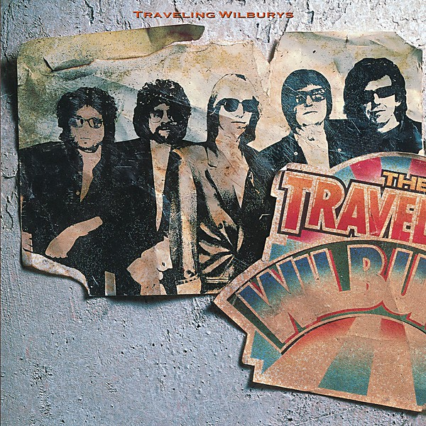

# The Traveling Wilburys

By **Traveling Wilburys**

## Album Data

- **Catalog:** Beets
- **Format:** Digital, Album
- **Album:** The Traveling Wilburys
- **Artist:** Traveling Wilburys
- **Albumartist:** Traveling Wilburys
- **Genre:** Rock
- **MusicBrainz Album Artist ID:** 
- **MusicBrainz Album ID:** 
- **MusicBrainz Release Group ID:** 
- **Year:** 0000
- **Catalog #:** 
- **Label:** 
- **Total Tracks:** 13

## Album Tracks

### Track 01 - She's My Baby

- **Artist:** Traveling Wilburys
- **Format:** ALAC
- **Genre:** Garage Rock
- **Length:** 3:15
- **MusicBrainz Track ID:** 
- **Title:** She's My Baby
- **Track:** 01
- **Year:** 1990

### Track 02 - Inside Out

- **Artist:** Traveling Wilburys
- **Format:** ALAC
- **Genre:** Glam Rock
- **Length:** 3:35
- **MusicBrainz Track ID:** 
- **Title:** Inside Out
- **Track:** 02
- **Year:** 1990

### Track 03 - If You Belonged To Me

- **Artist:** Traveling Wilburys
- **Format:** ALAC
- **Genre:** Folk Rock
- **Length:** 3:13
- **MusicBrainz Track ID:** 
- **Title:** If You Belonged To Me
- **Track:** 03
- **Year:** 1990

### Track 04 - The Devil's Been Busy

- **Artist:** Traveling Wilburys
- **Format:** ALAC
- **Genre:** Glam Rock
- **Length:** 3:18
- **MusicBrainz Track ID:** 
- **Title:** The Devil's Been Busy
- **Track:** 04
- **Year:** 1990

### Track 05 - 7 Deadly Sins

- **Artist:** Traveling Wilburys
- **Format:** ALAC
- **Genre:** Glam Rock
- **Length:** 3:17
- **MusicBrainz Track ID:** 
- **Title:** 7 Deadly Sins
- **Track:** 05
- **Year:** 1990

### Track 06 - Poor House

- **Artist:** Traveling Wilburys
- **Format:** ALAC
- **Genre:** Folk Rock
- **Length:** 3:16
- **MusicBrainz Track ID:** 
- **Title:** Poor House
- **Track:** 06
- **Year:** 1990

### Track 07 - Where Were You Last Night

- **Artist:** Traveling Wilburys
- **Format:** ALAC
- **Genre:** Rock
- **Length:** 3:03
- **MusicBrainz Track ID:** 
- **Title:** Where Were You Last Night
- **Track:** 07
- **Year:** 1990

### Track 08 - Cool Dry Place

- **Artist:** Traveling Wilburys
- **Format:** ALAC
- **Genre:** Rock And Roll
- **Length:** 3:37
- **MusicBrainz Track ID:** 
- **Title:** Cool Dry Place
- **Track:** 08
- **Year:** 1990

### Track 09 - New Blue Moon

- **Artist:** Traveling Wilburys
- **Format:** ALAC
- **Genre:** Soft Rock
- **Length:** 3:20
- **MusicBrainz Track ID:** 
- **Title:** New Blue Moon
- **Track:** 09
- **Year:** 1990

### Track 10 - You Took My Breath Away

- **Artist:** Traveling Wilburys
- **Format:** ALAC
- **Genre:** Country Rock
- **Length:** 3:18
- **MusicBrainz Track ID:** 
- **Title:** You Took My Breath Away
- **Track:** 10
- **Year:** 1990

### Track 11 - Wilbury Twist

- **Artist:** Traveling Wilburys
- **Format:** ALAC
- **Genre:** Rock
- **Length:** 2:58
- **MusicBrainz Track ID:** 
- **Title:** Wilbury Twist
- **Track:** 11
- **Year:** 1990

### Track 12 - Nobody's Child

- **Artist:** Traveling Wilburys
- **Format:** ALAC
- **Genre:** Folk Rock
- **Length:** 3:28
- **MusicBrainz Track ID:** 
- **Title:** Nobody's Child
- **Track:** 12
- **Year:** 1990

### Track 13 - Runaway

- **Artist:** Traveling Wilburys
- **Format:** ALAC
- **Genre:** Soul
- **Length:** 2:30
- **MusicBrainz Track ID:** 
- **Title:** Runaway
- **Track:** 13
- **Year:** 1990

## See also

- [Traveling Wilburys [Disc 2]](Traveling_Wilburys_[Disc_2].md)
- [Traveling Wilburys, Vol. 1](Traveling_Wilburys__Vol_1.md)
- [Vinyl: The Traveling Wilburys Collection](../../Vinyl/Traveling_Wilburys/The_Traveling_Wilburys_Collection.md)
- [Vinyl: ](../../Vinyl/Traveling_Wilburys/Traveling_Wilburys.md)
- [Vinyl: Volume One](../../Vinyl/Traveling_Wilburys/Volume_One.md)
