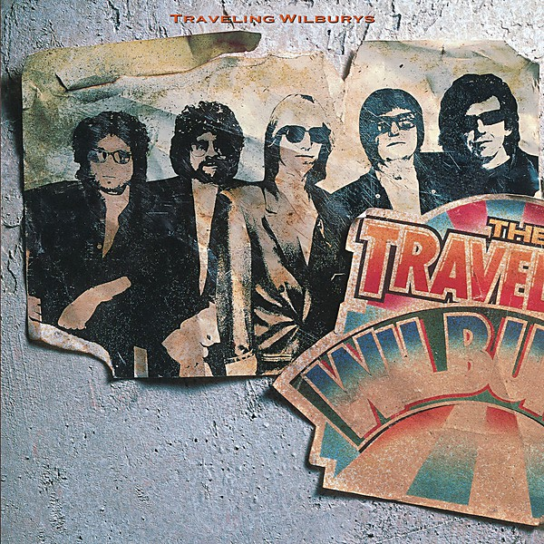

# Traveling Wilburys, Vol. 1

By **Traveling Wilburys**

## Album Data

- **Catalog:** Beets
- **Format:** Digital, Album
- **Album:** Traveling Wilburys, Vol. 1
- **Artist:** Traveling Wilburys
- **Albumartist:** Traveling Wilburys
- **Genre:** Rock
- **MusicBrainz Album Artist ID:** [4387b544-e4d0-4f18-b74e-d4a5ba1582ab](https://musicbrainz.org/artist/4387b544-e4d0-4f18-b74e-d4a5ba1582ab)
- **MusicBrainz Album ID:** [c5283b06-29ea-427e-b951-1f2cd7fffc71](https://musicbrainz.org/release/c5283b06-29ea-427e-b951-1f2cd7fffc71)
- **MusicBrainz Release Group ID:** [7bfb7661-aef3-3f43-b625-542726cb078d](https://musicbrainz.org/release-group/7bfb7661-aef3-3f43-b625-542726cb078d)
- **Year:** 2008
- **Catalog #:** 
- **Label:** Rhino
- **Total Tracks:** 12

## Album Tracks

### Track 01 - Handle With Care

- **Artist:** Traveling Wilburys
- **Format:** ALAC
- **Genre:** Rock And Roll
- **Length:** 3:19
- **MusicBrainz Track ID:** [ea5d3599-55ef-49d4-9244-731f1f9a3ec2](https://musicbrainz.org/recording/ea5d3599-55ef-49d4-9244-731f1f9a3ec2)
- **Title:** Handle With Care
- **Track:** 01
- **Year:** 2008

### Track 02 - Dirty World

- **Artist:** Traveling Wilburys
- **Format:** ALAC
- **Genre:** Folk Rock
- **Length:** 3:29
- **MusicBrainz Track ID:** [be427811-0d77-4558-9ce7-58c95944515b](https://musicbrainz.org/recording/be427811-0d77-4558-9ce7-58c95944515b)
- **Title:** Dirty World
- **Track:** 02
- **Year:** 2008

### Track 03 - Rattled

- **Artist:** Traveling Wilburys
- **Format:** ALAC
- **Genre:** Rockabilly
- **Length:** 2:59
- **MusicBrainz Track ID:** [ad5619a5-b7bd-4a08-b4a9-5d4ca940d69e](https://musicbrainz.org/recording/ad5619a5-b7bd-4a08-b4a9-5d4ca940d69e)
- **Title:** Rattled
- **Track:** 03
- **Year:** 2008

### Track 04 - Last Night

- **Artist:** Traveling Wilburys
- **Format:** ALAC
- **Genre:** Folk Rock
- **Length:** 3:51
- **MusicBrainz Track ID:** [e69cdec4-8920-4131-91fc-0b85f5bb6218](https://musicbrainz.org/recording/e69cdec4-8920-4131-91fc-0b85f5bb6218)
- **Title:** Last Night
- **Track:** 04
- **Year:** 2008

### Track 05 - Not Alone Any More

- **Artist:** Traveling Wilburys
- **Format:** ALAC
- **Genre:** Rock
- **Length:** 3:24
- **MusicBrainz Track ID:** [0849bb67-bc39-465b-b76e-a5ec9fdeccb6](https://musicbrainz.org/recording/0849bb67-bc39-465b-b76e-a5ec9fdeccb6)
- **Title:** Not Alone Any More
- **Track:** 05
- **Year:** 2008

### Track 06 - Congratulations

- **Artist:** Traveling Wilburys
- **Format:** ALAC
- **Genre:** Rock
- **Length:** 3:29
- **MusicBrainz Track ID:** [55f298b5-ef1d-4624-9e81-9f0c1ad2484b](https://musicbrainz.org/recording/55f298b5-ef1d-4624-9e81-9f0c1ad2484b)
- **Title:** Congratulations
- **Track:** 06
- **Year:** 2008

### Track 07 - Heading for the Light

- **Artist:** Traveling Wilburys
- **Format:** ALAC
- **Genre:** Rock
- **Length:** 3:36
- **MusicBrainz Track ID:** [6c25563c-a4d4-4a06-82d5-e620bc6e9ac1](https://musicbrainz.org/recording/6c25563c-a4d4-4a06-82d5-e620bc6e9ac1)
- **Title:** Heading for the Light
- **Track:** 07
- **Year:** 2008

### Track 08 - Margarita

- **Artist:** Traveling Wilburys
- **Format:** ALAC
- **Genre:** Country Rock
- **Length:** 3:16
- **MusicBrainz Track ID:** [f73f38a7-fa20-4ec7-80da-22ee96edf8cd](https://musicbrainz.org/recording/f73f38a7-fa20-4ec7-80da-22ee96edf8cd)
- **Title:** Margarita
- **Track:** 08
- **Year:** 2008

### Track 09 - Tweeter and the Monkey Man

- **Artist:** Traveling Wilburys
- **Format:** ALAC
- **Genre:** Rock
- **Length:** 5:27
- **MusicBrainz Track ID:** [1f786ce6-bdab-470c-8f2e-df67e12cb4f6](https://musicbrainz.org/recording/1f786ce6-bdab-470c-8f2e-df67e12cb4f6)
- **Title:** Tweeter and the Monkey Man
- **Track:** 09
- **Year:** 2008

### Track 10 - End of the Line

- **Artist:** Traveling Wilburys
- **Format:** ALAC
- **Genre:** Country Rock
- **Length:** 3:29
- **MusicBrainz Track ID:** [c6bb675e-f161-4b07-ae5c-a85d02796215](https://musicbrainz.org/recording/c6bb675e-f161-4b07-ae5c-a85d02796215)
- **Title:** End of the Line
- **Track:** 10
- **Year:** 2008

### Track 11 - Maxine

- **Artist:** Traveling Wilburys
- **Format:** ALAC
- **Genre:** Rock
- **Length:** 2:49
- **MusicBrainz Track ID:** [1e8ca457-add8-4722-a2ef-6a0e313e62bb](https://musicbrainz.org/recording/1e8ca457-add8-4722-a2ef-6a0e313e62bb)
- **Title:** Maxine
- **Track:** 11
- **Year:** 2008

### Track 12 - Like a Ship

- **Artist:** Traveling Wilburys
- **Format:** ALAC
- **Genre:** Folk Rock
- **Length:** 3:30
- **MusicBrainz Track ID:** [c71023b7-0baa-47f6-8f15-67318797ed32](https://musicbrainz.org/recording/c71023b7-0baa-47f6-8f15-67318797ed32)
- **Title:** Like a Ship
- **Track:** 12
- **Year:** 2008

## See also

- [The Traveling Wilburys](The_Traveling_Wilburys.md)
- [Traveling Wilburys [Disc 2]](Traveling_Wilburys_[Disc_2].md)
- [Vinyl: The Traveling Wilburys Collection](../../Vinyl/Traveling_Wilburys/The_Traveling_Wilburys_Collection.md)
- [Vinyl: ](../../Vinyl/Traveling_Wilburys/Traveling_Wilburys.md)
- [Vinyl: Volume One](../../Vinyl/Traveling_Wilburys/Volume_One.md)
