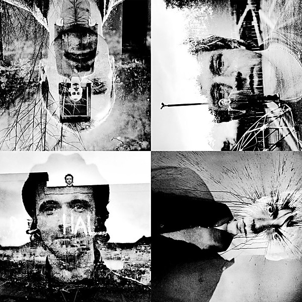

# 12 Memories

By **Travis**

## Album Data

- **Catalog:** Beets
- **Format:** Digital, Album
- **Album:** 12 Memories
- **Artist:** Travis
- **Albumartist:** Travis
- **Genre:** Britpop
- **MusicBrainz Album Artist ID:** [22a40b75-affc-4e69-8884-266d087e4751](https://musicbrainz.org/artist/22a40b75-affc-4e69-8884-266d087e4751)
- **MusicBrainz Album ID:** [daacbfc5-fd2c-3b22-896c-321ff18f1959](https://musicbrainz.org/release/daacbfc5-fd2c-3b22-896c-321ff18f1959)
- **MusicBrainz Release Group ID:** [a50ac4bb-9926-381e-8f13-c9a1c651545c](https://musicbrainz.org/release-group/a50ac4bb-9926-381e-8f13-c9a1c651545c)
- **Year:** 2003
- **Catalog #:** ISOM 25CD
- **Label:** Independiente
- **Total Tracks:** 12

## Album Tracks

### Track 01 - Sing

- **Artist:** Travis
- **Format:** ALAC
- **Genre:** Indie Rock
- **Length:** 3:48
- **MusicBrainz Track ID:** [0d6d7b66-69b2-47aa-a78c-aaf35e5a629d](https://musicbrainz.org/recording/0d6d7b66-69b2-47aa-a78c-aaf35e5a629d)
- **Title:** Sing
- **Track:** 01
- **Year:** 2001

### Track 02 - Dear Diary

- **Artist:** Travis
- **Format:** ALAC
- **Genre:** Emo
- **Length:** 2:57
- **MusicBrainz Track ID:** [6f034087-5b90-4a8c-94ae-edf75bbe9f70](https://musicbrainz.org/recording/6f034087-5b90-4a8c-94ae-edf75bbe9f70)
- **Title:** Dear Diary
- **Track:** 02
- **Year:** 2001

### Track 03 - Side

- **Artist:** Travis
- **Format:** ALAC
- **Genre:** Indie Rock
- **Length:** 3:59
- **MusicBrainz Track ID:** [dfedac3d-49ee-4595-8416-7011c032e0ee](https://musicbrainz.org/recording/dfedac3d-49ee-4595-8416-7011c032e0ee)
- **Title:** Side
- **Track:** 03
- **Year:** 2001

### Track 04 - Pipe Dreams

- **Artist:** Travis
- **Format:** ALAC
- **Genre:** Indie Rock
- **Length:** 4:05
- **MusicBrainz Track ID:** [183c1734-5370-4907-8eb2-76bb754fe15c](https://musicbrainz.org/recording/183c1734-5370-4907-8eb2-76bb754fe15c)
- **Title:** Pipe Dreams
- **Track:** 04
- **Year:** 2001

### Track 05 - Flowers in the Window

- **Artist:** Travis
- **Format:** ALAC
- **Genre:** Indie Rock
- **Length:** 3:41
- **MusicBrainz Track ID:** [69f88e11-d9a0-48ae-8ce8-7bc9fda0d558](https://musicbrainz.org/recording/69f88e11-d9a0-48ae-8ce8-7bc9fda0d558)
- **Title:** Flowers in the Window
- **Track:** 05
- **Year:** 2001

### Track 06 - The Cage

- **Artist:** Travis
- **Format:** ALAC
- **Genre:** Indie Rock
- **Length:** 3:05
- **MusicBrainz Track ID:** [8b340a95-fb6e-4523-bbd1-b1ef02e78d8f](https://musicbrainz.org/recording/8b340a95-fb6e-4523-bbd1-b1ef02e78d8f)
- **Title:** The Cage
- **Track:** 06
- **Year:** 2001

### Track 07 - Safe

- **Artist:** Travis
- **Format:** ALAC
- **Genre:** Indie Rock
- **Length:** 4:23
- **MusicBrainz Track ID:** [39a9eed3-3a51-4a53-898a-73fe113e5c90](https://musicbrainz.org/recording/39a9eed3-3a51-4a53-898a-73fe113e5c90)
- **Title:** Safe
- **Track:** 07
- **Year:** 2001

### Track 08 - Follow the Light

- **Artist:** Travis
- **Format:** ALAC
- **Genre:** Indie Rock
- **Length:** 3:08
- **MusicBrainz Track ID:** [34df51d8-4503-4825-913d-8252ee1c641a](https://musicbrainz.org/recording/34df51d8-4503-4825-913d-8252ee1c641a)
- **Title:** Follow the Light
- **Track:** 08
- **Year:** 2001

### Track 09 - Last Train

- **Artist:** Travis
- **Format:** ALAC
- **Genre:** Indie Rock
- **Length:** 3:16
- **MusicBrainz Track ID:** [8863ff31-fafe-45ae-8093-3dedf6da2e6d](https://musicbrainz.org/recording/8863ff31-fafe-45ae-8093-3dedf6da2e6d)
- **Title:** Last Train
- **Track:** 09
- **Year:** 2001

### Track 10 - Afterglow

- **Artist:** Travis
- **Format:** ALAC
- **Genre:** Indie Rock
- **Length:** 4:05
- **MusicBrainz Track ID:** [1a2d0f52-c748-4d6f-a064-bd6cabb63547](https://musicbrainz.org/recording/1a2d0f52-c748-4d6f-a064-bd6cabb63547)
- **Title:** Afterglow
- **Track:** 10
- **Year:** 2001

### Track 11 - Indefinitely

- **Artist:** Travis
- **Format:** ALAC
- **Genre:** Britpop
- **Length:** 3:52
- **MusicBrainz Track ID:** [2deffc85-a589-47c7-8b81-1933e9673596](https://musicbrainz.org/recording/2deffc85-a589-47c7-8b81-1933e9673596)
- **Title:** Indefinitely
- **Track:** 11
- **Year:** 2001

### Track 12 - The Humpty Dumpty Love Song

- **Artist:** Travis
- **Format:** ALAC
- **Genre:** Indie Rock
- **Length:** 5:02
- **MusicBrainz Track ID:** [5d8578df-4f70-4bb3-9899-a346f1f82e5d](https://musicbrainz.org/recording/5d8578df-4f70-4bb3-9899-a346f1f82e5d)
- **Title:** The Humpty Dumpty Love Song
- **Track:** 12
- **Year:** 2001

## See also

- [The Invisible Band](The_Invisible_Band.md)
- [The Man Who](The_Man_Who.md)
