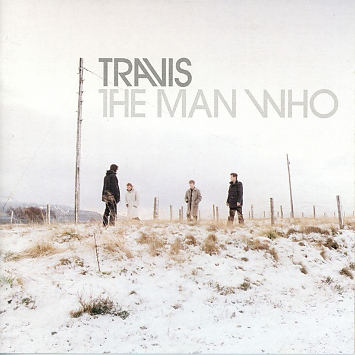

# The Man Who

By **Travis**

## Album Data

- **Catalog:** Beets
- **Format:** Digital, Album
- **Album:** The Man Who
- **Artist:** Travis
- **Albumartist:** Travis
- **Genre:** Britpop
- **MusicBrainz Album Artist ID:** [22a40b75-affc-4e69-8884-266d087e4751](https://musicbrainz.org/artist/22a40b75-affc-4e69-8884-266d087e4751)
- **MusicBrainz Album ID:** [f7ae782d-95ab-4c7c-a9e6-f5062c9c5315](https://musicbrainz.org/release/f7ae782d-95ab-4c7c-a9e6-f5062c9c5315)
- **MusicBrainz Release Group ID:** [d96bd9ec-329a-3740-9eb5-e65257445afa](https://musicbrainz.org/release-group/d96bd9ec-329a-3740-9eb5-e65257445afa)
- **Year:** 1999
- **Catalog #:** 4946242000
- **Label:** Independiente
- **Total Tracks:** 10

## Album Tracks

### Track 01 - Writing to Reach You

- **Artist:** Travis
- **Format:** ALAC
- **Genre:** Indie Rock
- **Length:** 3:41
- **MusicBrainz Track ID:** [3057e0e7-4d07-4070-b7fd-fe10608763a5](https://musicbrainz.org/recording/3057e0e7-4d07-4070-b7fd-fe10608763a5)
- **Title:** Writing to Reach You
- **Track:** 01
- **Year:** 1999

### Track 02 - The Fear

- **Artist:** Travis
- **Format:** ALAC
- **Genre:** Post-Britpop
- **Length:** 4:12
- **MusicBrainz Track ID:** [9fac0ba8-f45d-4164-9138-2ed14375511f](https://musicbrainz.org/recording/9fac0ba8-f45d-4164-9138-2ed14375511f)
- **Title:** The Fear
- **Track:** 02
- **Year:** 1999

### Track 03 - As You Are

- **Artist:** Travis
- **Format:** ALAC
- **Genre:** Indie Rock
- **Length:** 4:14
- **MusicBrainz Track ID:** [038ceaa8-972d-4c5c-8498-04fef387d0f7](https://musicbrainz.org/recording/038ceaa8-972d-4c5c-8498-04fef387d0f7)
- **Title:** As You Are
- **Track:** 03
- **Year:** 1999

### Track 04 - Driftwood

- **Artist:** Travis
- **Format:** ALAC
- **Genre:** Indie Rock
- **Length:** 3:33
- **MusicBrainz Track ID:** [ece72018-066b-4afb-8b17-1443770b6893](https://musicbrainz.org/recording/ece72018-066b-4afb-8b17-1443770b6893)
- **Title:** Driftwood
- **Track:** 04
- **Year:** 1999

### Track 05 - The Last Laugh of the Laughter

- **Artist:** Travis
- **Format:** ALAC
- **Genre:** Indie Rock
- **Length:** 4:20
- **MusicBrainz Track ID:** [9bc74559-023b-4e16-96ca-61241594d4bb](https://musicbrainz.org/recording/9bc74559-023b-4e16-96ca-61241594d4bb)
- **Title:** The Last Laugh of the Laughter
- **Track:** 05
- **Year:** 1999

### Track 06 - Turn

- **Artist:** Travis
- **Format:** ALAC
- **Genre:** Indie Rock
- **Length:** 4:23
- **MusicBrainz Track ID:** [949c8b61-bfd9-42e2-b8b8-cdab155baa84](https://musicbrainz.org/recording/949c8b61-bfd9-42e2-b8b8-cdab155baa84)
- **Title:** Turn
- **Track:** 06
- **Year:** 1999

### Track 07 - Why Does It Always Rain on Me?

- **Artist:** Travis
- **Format:** ALAC
- **Genre:** Indie Rock
- **Length:** 4:25
- **MusicBrainz Track ID:** [8d0a0cec-ca61-4401-99e1-e86fc6579925](https://musicbrainz.org/recording/8d0a0cec-ca61-4401-99e1-e86fc6579925)
- **Title:** Why Does It Always Rain on Me?
- **Track:** 07
- **Year:** 1999

### Track 08 - Luv

- **Artist:** Travis
- **Format:** ALAC
- **Genre:** Indie Rock
- **Length:** 4:54
- **MusicBrainz Track ID:** [36947807-12a2-477e-a147-f6cff5d7e8ca](https://musicbrainz.org/recording/36947807-12a2-477e-a147-f6cff5d7e8ca)
- **Title:** Luv
- **Track:** 08
- **Year:** 1999

### Track 09 - She’s So Strange

- **Artist:** Travis
- **Format:** ALAC
- **Genre:** Britpop
- **Length:** 3:15
- **MusicBrainz Track ID:** [9ed325ac-8ec8-4e65-968a-81c52e0f995d](https://musicbrainz.org/recording/9ed325ac-8ec8-4e65-968a-81c52e0f995d)
- **Title:** She’s So Strange
- **Track:** 09
- **Year:** 1999

### Track 10 - Slide Show / Blue Flashing Light

- **Artist:** Travis
- **Format:** ALAC
- **Genre:** Rock
- **Length:** 10:31
- **MusicBrainz Track ID:** [1daebec5-0afe-45a8-b712-b4b9abd9aabe](https://musicbrainz.org/recording/1daebec5-0afe-45a8-b712-b4b9abd9aabe)
- **Title:** Slide Show / Blue Flashing Light
- **Track:** 10
- **Year:** 1999

## See also

- [12 Memories](12_Memories.md)
- [The Invisible Band](The_Invisible_Band.md)
