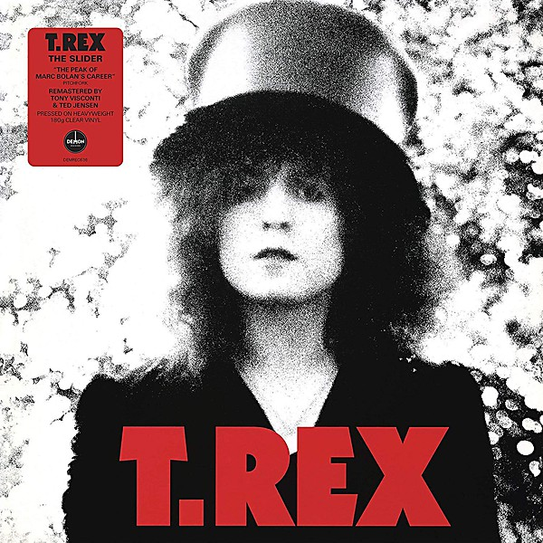

# The Slider

By **T.Rex**

## Album Data

- **Catalog:** Beets
- **Format:** Digital, Album
- **Album:** The Slider
- **Artist:** T.rex
- **Albumartist:** T.Rex
- **Genre:** Glam Rock
- **MusicBrainz Album Artist ID:** 
- **MusicBrainz Album ID:** 
- **MusicBrainz Release Group ID:** 
- **Year:** 0000
- **Catalog #:** 
- **Label:** 
- **Total Tracks:** 00

## Album Tracks

### Track 09 - Rabbit Fighter

- **Artist:** T.Rex
- **Format:** AAC
- **Genre:** Hard Rock
- **Length:** 4:01
- **MusicBrainz Track ID:** 
- **Title:** Rabbit Fighter
- **Track:** 09
- **Year:** 0000

### Track 12 - Chariot Choogle

- **Artist:** T.Rex
- **Format:** AAC
- **Genre:** Hard Rock
- **Length:** 2:50
- **MusicBrainz Track ID:** 
- **Title:** Chariot Choogle
- **Track:** 12
- **Year:** 0000

### Track 13 - Main Man

- **Artist:** T.Rex
- **Format:** AAC
- **Genre:** Hard Rock
- **Length:** 4:21
- **MusicBrainz Track ID:** 
- **Title:** Main Man
- **Track:** 13
- **Year:** 0000

