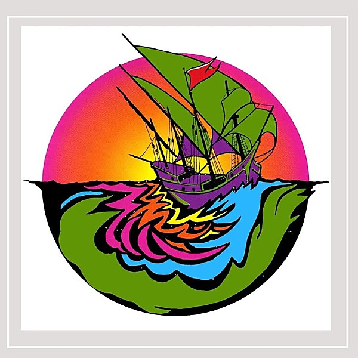

# I Was Accident

By **True Love**

## Album Data

- **Catalog:** Beets
- **Format:** Digital, Album
- **Album:** I Was Accident
- **Artist:** True Love
- **Albumartist:** True Love
- **Genre:** Hardcore Punk
- **MusicBrainz Album Artist ID:** [23e6c969-dbdf-4762-8006-cfce3a31a097](https://musicbrainz.org/artist/23e6c969-dbdf-4762-8006-cfce3a31a097)
- **MusicBrainz Album ID:** [84ec7497-bf82-413d-99bf-0515d3734c93](https://musicbrainz.org/release/84ec7497-bf82-413d-99bf-0515d3734c93)
- **MusicBrainz Release Group ID:** [57726ab9-91f3-4c0b-b761-680867d5d292](https://musicbrainz.org/release-group/57726ab9-91f3-4c0b-b761-680867d5d292)
- **Year:** 2003
- **Catalog #:** 
- **Label:** Not Lame Recordings
- **Total Tracks:** 12

## Album Tracks

### Track 01 - Worse Ways Than This

- **Artist:** True Love
- **Format:** MP3
- **Genre:** Hardcore Punk
- **Length:** 2:49
- **MusicBrainz Track ID:** 
- **Title:** Worse Ways Than This
- **Track:** 01
- **Year:** 2006

### Track 02 - The Crime

- **Artist:** True Love
- **Format:** MP3
- **Genre:** Hardcore Punk
- **Length:** 2:28
- **MusicBrainz Track ID:** 
- **Title:** The Crime
- **Track:** 02
- **Year:** 2006

### Track 03 - How Does It Feel?

- **Artist:** True Love
- **Format:** MP3
- **Genre:** Hardcore Punk
- **Length:** 4:12
- **MusicBrainz Track ID:** 
- **Title:** How Does It Feel?
- **Track:** 03
- **Year:** 2006

### Track 04 - Old Building

- **Artist:** True Love
- **Format:** MP3
- **Genre:** Hardcore Punk
- **Length:** 2:56
- **MusicBrainz Track ID:** 
- **Title:** Old Building
- **Track:** 04
- **Year:** 2006

### Track 05 - Center of the Cyclone

- **Artist:** True Love
- **Format:** MP3
- **Genre:** Hardcore Punk
- **Length:** 2:42
- **MusicBrainz Track ID:** 
- **Title:** Center of the Cyclone
- **Track:** 05
- **Year:** 2006

### Track 06 - Sweet Racket

- **Artist:** True Love
- **Format:** MP3
- **Genre:** Hardcore Punk
- **Length:** 3:31
- **MusicBrainz Track ID:** 
- **Title:** Sweet Racket
- **Track:** 06
- **Year:** 2006

### Track 07 - Hot Toddy

- **Artist:** True Love
- **Format:** MP3
- **Genre:** Hardcore Punk
- **Length:** 3:59
- **MusicBrainz Track ID:** 
- **Title:** Hot Toddy
- **Track:** 07
- **Year:** 2006

### Track 08 - Forever and Ever

- **Artist:** True Love
- **Format:** MP3
- **Genre:** Hardcore Punk
- **Length:** 2:27
- **MusicBrainz Track ID:** 
- **Title:** Forever and Ever
- **Track:** 08
- **Year:** 2006

### Track 09 - Decay

- **Artist:** True Love
- **Format:** MP3
- **Genre:** Hardcore Punk
- **Length:** 2:38
- **MusicBrainz Track ID:** 
- **Title:** Decay
- **Track:** 09
- **Year:** 2006

### Track 10 - Asleep at the Wheel

- **Artist:** True Love
- **Format:** MP3
- **Genre:** Hardcore Punk
- **Length:** 2:51
- **MusicBrainz Track ID:** 
- **Title:** Asleep at the Wheel
- **Track:** 10
- **Year:** 2006

### Track 11 - All Was Lost

- **Artist:** True Love
- **Format:** MP3
- **Genre:** Hardcore Punk
- **Length:** 2:59
- **MusicBrainz Track ID:** 
- **Title:** All Was Lost
- **Track:** 11
- **Year:** 2006

### Track 12 - Pacific Coast West Is Blue

- **Artist:** True Love
- **Format:** MP3
- **Genre:** Hardcore Punk
- **Length:** 4:17
- **MusicBrainz Track ID:** 
- **Title:** Pacific Coast West Is Blue
- **Track:** 12
- **Year:** 2006

## See also

- [Wings](Wings.md)
