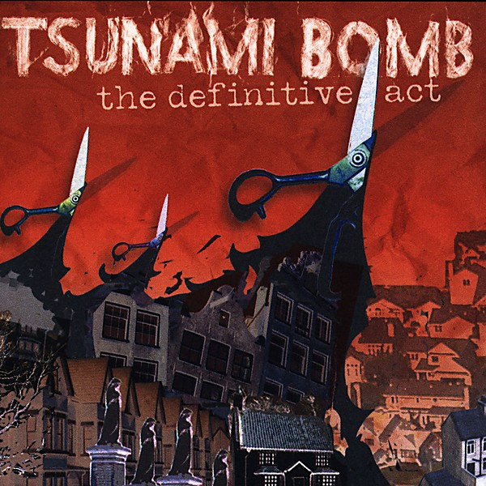

# The Definitive Act

By **Tsunami Bomb**

## Album Data

- **Catalog:** Beets
- **Format:** Digital, Album
- **Album:** The Definitive Act
- **Artist:** Tsunami Bomb
- **Albumartist:** Tsunami Bomb
- **Genre:** Pop Punk
- **MusicBrainz Album Artist ID:** [https](https://musicbrainz.org/artist/https)
- **MusicBrainz Album ID:** [https](https://musicbrainz.org/release/https)
- **MusicBrainz Release Group ID:** 
- **Year:** 2004
- **Catalog #:** 
- **Label:** Kung Fu Records
- **Total Tracks:** 12

## Album Tracks

### Track 01 - Dawn On A Funeral Day

- **Artist:** Tsunami Bomb
- **Format:** MP3
- **Genre:** Pop Punk
- **Length:** 3:08
- **MusicBrainz Track ID:** [https](https://musicbrainz.org/recording/https)
- **Title:** Dawn On A Funeral Day
- **Track:** 01
- **Year:** 2004

### Track 02 - Being Alright

- **Artist:** Tsunami Bomb
- **Format:** MP3
- **Genre:** Riot Grrrl
- **Length:** 3:03
- **MusicBrainz Track ID:** [https](https://musicbrainz.org/recording/https)
- **Title:** Being Alright
- **Track:** 02
- **Year:** 2004

### Track 03 - 5150

- **Artist:** Tsunami Bomb
- **Format:** MP3
- **Genre:** Punk Rock
- **Length:** 2:44
- **MusicBrainz Track ID:** [https](https://musicbrainz.org/recording/https)
- **Title:** 5150
- **Track:** 03
- **Year:** 2004

### Track 04 - Safety Song

- **Artist:** Tsunami Bomb
- **Format:** MP3
- **Genre:** Pop Punk
- **Length:** 2:12
- **MusicBrainz Track ID:** [https](https://musicbrainz.org/recording/https)
- **Title:** Safety Song
- **Track:** 04
- **Year:** 2004

### Track 05 - I Bought You

- **Artist:** Tsunami Bomb
- **Format:** MP3
- **Genre:** Punk Rock
- **Length:** 3:13
- **MusicBrainz Track ID:** [https](https://musicbrainz.org/recording/https)
- **Title:** I Bought You
- **Track:** 05
- **Year:** 2004

### Track 06 - 4 Robots & An Evil Scientist

- **Artist:** Tsunami Bomb
- **Format:** MP3
- **Genre:** Pop Punk
- **Length:** 1:24
- **MusicBrainz Track ID:** [https](https://musicbrainz.org/recording/https)
- **Title:** 4 Robots & An Evil Scientist
- **Track:** 06
- **Year:** 2004

### Track 07 - A Lonely Chord

- **Artist:** Tsunami Bomb
- **Format:** MP3
- **Genre:** Punk Rock
- **Length:** 3:58
- **MusicBrainz Track ID:** [https](https://musicbrainz.org/recording/https)
- **Title:** A Lonely Chord
- **Track:** 07
- **Year:** 2004

### Track 08 - Epic

- **Artist:** Tsunami Bomb
- **Format:** MP3
- **Genre:** Punk Rock
- **Length:** 3:33
- **MusicBrainz Track ID:** [https](https://musicbrainz.org/recording/https)
- **Title:** Epic
- **Track:** 08
- **Year:** 2004

### Track 09 - Negative One To Ten

- **Artist:** Tsunami Bomb
- **Format:** MP3
- **Genre:** Punk Rock
- **Length:** 3:04
- **MusicBrainz Track ID:** [https](https://musicbrainz.org/recording/https)
- **Title:** Negative One To Ten
- **Track:** 09
- **Year:** 2004

### Track 10 - My Machete

- **Artist:** Tsunami Bomb
- **Format:** MP3
- **Genre:** Punk Rock
- **Length:** 2:54
- **MusicBrainz Track ID:** [https](https://musicbrainz.org/recording/https)
- **Title:** My Machete
- **Track:** 10
- **Year:** 2004

### Track 11 - Tetanus Shot

- **Artist:** Tsunami Bomb
- **Format:** MP3
- **Genre:** Punk Rock
- **Length:** 2:45
- **MusicBrainz Track ID:** [https](https://musicbrainz.org/recording/https)
- **Title:** Tetanus Shot
- **Track:** 11
- **Year:** 2004

### Track 12 - Jigsaw

- **Artist:** Tsunami Bomb
- **Format:** MP3
- **Genre:** Punk Rock
- **Length:** 4:20
- **MusicBrainz Track ID:** [https](https://musicbrainz.org/recording/https)
- **Title:** Jigsaw
- **Track:** 12
- **Year:** 2004

