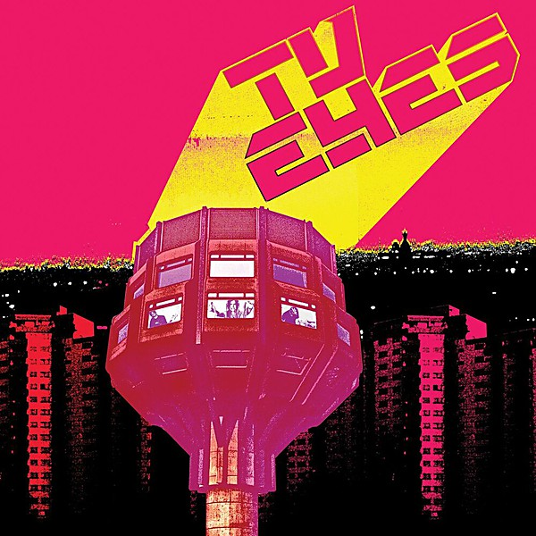

# TV Eyes

By **TV Eyes**

## Album Data

- **Catalog:** Beets
- **Format:** Digital, Album
- **Album:** TV Eyes
- **Artist:** Tv Eyes
- **Albumartist:** TV Eyes
- **Genre:** Indie Rock
- **MusicBrainz Album Artist ID:** [ddd814d4-ed9c-4ee9-b438-e183d9c5dc34](https://musicbrainz.org/artist/ddd814d4-ed9c-4ee9-b438-e183d9c5dc34)
- **MusicBrainz Album ID:** [795668cd-b69c-451b-86ce-eaa2d3e98afa](https://musicbrainz.org/release/795668cd-b69c-451b-86ce-eaa2d3e98afa)
- **MusicBrainz Release Group ID:** [9cac3852-dcb1-3a52-9fb2-b57f191c0acb](https://musicbrainz.org/release-group/9cac3852-dcb1-3a52-9fb2-b57f191c0acb)
- **Year:** 2014
- **Catalog #:** 
- **Label:** Omnivore Recordings
- **Total Tracks:** 13

## Album Tracks

### Track 01 - Over the City

- **Artist:** TV Eyes
- **Format:** ALAC
- **Genre:** Rock
- **Length:** 4:58
- **MusicBrainz Track ID:** [e9c2b52e-d104-44d2-86a7-1bffb16636fe](https://musicbrainz.org/recording/e9c2b52e-d104-44d2-86a7-1bffb16636fe)
- **Title:** Over the City
- **Track:** 01
- **Year:** 2014

### Track 02 - Fascinating

- **Artist:** TV Eyes
- **Format:** ALAC
- **Genre:** Rock
- **Length:** 5:19
- **MusicBrainz Track ID:** [0d02729b-9560-4b4b-a320-24a5c677015b](https://musicbrainz.org/recording/0d02729b-9560-4b4b-a320-24a5c677015b)
- **Title:** Fascinating
- **Track:** 02
- **Year:** 2014

### Track 03 - She's a Study

- **Artist:** TV Eyes
- **Format:** ALAC
- **Genre:** Power Pop
- **Length:** 4:51
- **MusicBrainz Track ID:** [47dfdc66-9051-4e40-aaa1-b5b45b126578](https://musicbrainz.org/recording/47dfdc66-9051-4e40-aaa1-b5b45b126578)
- **Title:** She's a Study
- **Track:** 03
- **Year:** 2014

### Track 04 - The Party's Over

- **Artist:** TV Eyes
- **Format:** ALAC
- **Genre:** Indie Rock
- **Length:** 4:42
- **MusicBrainz Track ID:** [7ffdf6b2-498e-4463-b455-4a5aa42fb0bb](https://musicbrainz.org/recording/7ffdf6b2-498e-4463-b455-4a5aa42fb0bb)
- **Title:** The Party's Over
- **Track:** 04
- **Year:** 2014

### Track 05 - Mission

- **Artist:** TV Eyes
- **Format:** ALAC
- **Genre:** Indie Rock
- **Length:** 4:29
- **MusicBrainz Track ID:** [b47f46b5-efc9-4305-a486-7ad3b9038758](https://musicbrainz.org/recording/b47f46b5-efc9-4305-a486-7ad3b9038758)
- **Title:** Mission
- **Track:** 05
- **Year:** 2014

### Track 06 - Love to Need

- **Artist:** TV Eyes
- **Format:** ALAC
- **Genre:** Rock
- **Length:** 4:04
- **MusicBrainz Track ID:** [77194aec-b0f4-4a27-9c80-c81d8ef7c3c5](https://musicbrainz.org/recording/77194aec-b0f4-4a27-9c80-c81d8ef7c3c5)
- **Title:** Love to Need
- **Track:** 06
- **Year:** 2014

### Track 07 - What She Said

- **Artist:** TV Eyes
- **Format:** ALAC
- **Genre:** Rock
- **Length:** 4:12
- **MusicBrainz Track ID:** [3fce40ce-57e8-4921-98c1-69ce5ec42a6e](https://musicbrainz.org/recording/3fce40ce-57e8-4921-98c1-69ce5ec42a6e)
- **Title:** What She Said
- **Track:** 07
- **Year:** 2014

### Track 08 - Fade Away

- **Artist:** TV Eyes
- **Format:** ALAC
- **Genre:** Rock
- **Length:** 4:27
- **MusicBrainz Track ID:** [e89cfe35-ba1c-4193-9f16-4e0c8f88b54e](https://musicbrainz.org/recording/e89cfe35-ba1c-4193-9f16-4e0c8f88b54e)
- **Title:** Fade Away
- **Track:** 08
- **Year:** 2014

### Track 09 - Time's Up

- **Artist:** TV Eyes
- **Format:** ALAC
- **Genre:** Rock
- **Length:** 4:45
- **MusicBrainz Track ID:** [b73c5f75-6d9d-47e2-8f61-7cfe1cb9b15f](https://musicbrainz.org/recording/b73c5f75-6d9d-47e2-8f61-7cfe1cb9b15f)
- **Title:** Time's Up
- **Track:** 09
- **Year:** 2014

### Track 10 - Fascinating (Jason Falkner remix)

- **Artist:** TV Eyes
- **Format:** ALAC
- **Genre:** Indie Rock
- **Length:** 4:59
- **MusicBrainz Track ID:** [62200f8d-f337-430b-baeb-18627e03810f](https://musicbrainz.org/recording/62200f8d-f337-430b-baeb-18627e03810f)
- **Title:** Fascinating (Jason Falkner remix)
- **Track:** 10
- **Year:** 2014

### Track 11 - She's a Study (Roger Joseph Manning Jr. "Malibu" remix)

- **Artist:** TV Eyes
- **Format:** ALAC
- **Genre:** Indie Rock
- **Length:** 6:39
- **MusicBrainz Track ID:** [a3012ef8-3d32-440b-a2b5-5704dac21d6f](https://musicbrainz.org/recording/a3012ef8-3d32-440b-a2b5-5704dac21d6f)
- **Title:** She's a Study (Roger Joseph Manning Jr. "Malibu" remix)
- **Track:** 11
- **Year:** 2014

### Track 12 - Time's Up (Brian Reitzell remix)

- **Artist:** TV Eyes
- **Format:** ALAC
- **Genre:** Indie Rock
- **Length:** 10:22
- **MusicBrainz Track ID:** [2db005e7-46ca-4332-b501-f946b954adbb](https://musicbrainz.org/recording/2db005e7-46ca-4332-b501-f946b954adbb)
- **Title:** Time's Up (Brian Reitzell remix)
- **Track:** 12
- **Year:** 2014

### Track 13 - She Gets Around

- **Artist:** TV Eyes
- **Format:** ALAC
- **Genre:** Indie Rock
- **Length:** 6:22
- **MusicBrainz Track ID:** [92118604-265f-4fc0-a868-a4ba17872b2c](https://musicbrainz.org/recording/92118604-265f-4fc0-a868-a4ba17872b2c)
- **Title:** She Gets Around
- **Track:** 13
- **Year:** 2014

