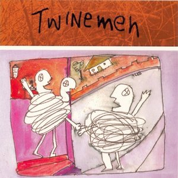

# Twinemen

By **Twinemen**

## Album Data

- **Catalog:** Beets
- **Format:** Digital, Album
- **Album:** Twinemen
- **Artist:** Twinemen
- **Albumartist:** Twinemen
- **Genre:** Acid Jazz
- **MusicBrainz Album Artist ID:** [a7b71f97-d889-4f00-8de0-0d7abd8a36b1](https://musicbrainz.org/artist/a7b71f97-d889-4f00-8de0-0d7abd8a36b1)
- **MusicBrainz Album ID:** [499af011-cb85-48c4-9499-29ca4cbd92a0](https://musicbrainz.org/release/499af011-cb85-48c4-9499-29ca4cbd92a0)
- **MusicBrainz Release Group ID:** [95cc5609-63d5-3c46-8686-261602bed3f3](https://musicbrainz.org/release-group/95cc5609-63d5-3c46-8686-261602bed3f3)
- **Year:** 2002
- **Catalog #:** 
- **Label:** 
- **Total Tracks:** 06

## Album Tracks

### Track 01 - Signs Of Life

- **Artist:** Twinemen
- **Format:** ALAC
- **Genre:** Rock
- **Length:** 5:54
- **MusicBrainz Track ID:** 
- **Title:** Signs Of Life
- **Track:** 01
- **Year:** 2003

### Track 02 - Spinner

- **Artist:** Twinemen
- **Format:** ALAC
- **Genre:** Shoegaze
- **Length:** 4:00
- **MusicBrainz Track ID:** 
- **Title:** Spinner
- **Track:** 02
- **Year:** 2003

### Track 03 - Learn To Fly

- **Artist:** Twinemen
- **Format:** ALAC
- **Genre:** Funk
- **Length:** 9:59
- **MusicBrainz Track ID:** 
- **Title:** Learn To Fly
- **Track:** 03
- **Year:** 2003

### Track 04 - Harper And The Midget

- **Artist:** Twinemen
- **Format:** ALAC
- **Genre:** Rock
- **Length:** 7:52
- **MusicBrainz Track ID:** 
- **Title:** Harper And The Midget
- **Track:** 04
- **Year:** 2003

### Track 05 - Little By Little

- **Artist:** Twinemen
- **Format:** ALAC
- **Genre:** Rock
- **Length:** 9:42
- **MusicBrainz Track ID:** 
- **Title:** Little By Little
- **Track:** 05
- **Year:** 2003

### Track 06 - Chose Sauvage

- **Artist:** Twinemen
- **Format:** ALAC
- **Genre:** Rock
- **Length:** 7:50
- **MusicBrainz Track ID:** 
- **Title:** Chose Sauvage
- **Track:** 06
- **Year:** 2003

## See also

- [Twinemen - Chicago, IL 02.02.03 [Disc 1]](Twinemen_-_Chicago__IL_020203_[Disc_1].md)
- [Twinemen - Chicago, IL 02.02.03 [Disc 2]](Twinemen_-_Chicago__IL_020203_[Disc_2].md)
