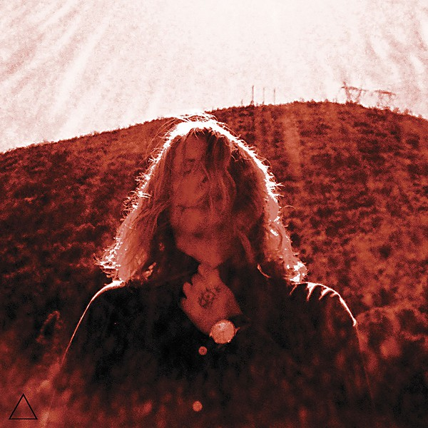

# Manipulator

By **Ty Segall**

## Album Data

- **Catalog:** Beets
- **Format:** Digital, Album
- **Album:** Manipulator
- **Artist:** Ty Segall
- **Albumartist:** Ty Segall
- **Genre:** Grunge
- **MusicBrainz Album Artist ID:** [07a17571-81fc-4cf8-a634-98f0d926d313](https://musicbrainz.org/artist/07a17571-81fc-4cf8-a634-98f0d926d313)
- **MusicBrainz Album ID:** [9ad70837-cea0-4f76-ab3b-75479a2823f6](https://musicbrainz.org/release/9ad70837-cea0-4f76-ab3b-75479a2823f6)
- **MusicBrainz Release Group ID:** [955fba0f-6aab-407a-b6cf-cce8b4f79717](https://musicbrainz.org/release-group/955fba0f-6aab-407a-b6cf-cce8b4f79717)
- **Year:** 2014
- **Catalog #:** 
- **Label:** Drag City
- **Total Tracks:** 10

## Album Tracks

### Track 01 - Break a Guitar

- **Artist:** Ty Segall
- **Format:** MP3
- **Genre:** Punk Rock
- **Length:** 3:38
- **MusicBrainz Track ID:** [c162a191-2898-429f-bf52-c81f30943f77](https://musicbrainz.org/recording/c162a191-2898-429f-bf52-c81f30943f77)
- **Title:** Break a Guitar
- **Track:** 01
- **Year:** 2017

### Track 02 - Freedom

- **Artist:** Ty Segall
- **Format:** MP3
- **Genre:** Punk Rock
- **Length:** 2:07
- **MusicBrainz Track ID:** [4633fbe9-5953-42a8-a437-879b5c842ddf](https://musicbrainz.org/recording/4633fbe9-5953-42a8-a437-879b5c842ddf)
- **Title:** Freedom
- **Track:** 02
- **Year:** 2017

### Track 03 - Warm Hands (Freedom Returned)

- **Artist:** Ty Segall
- **Format:** MP3
- **Genre:** Punk Rock
- **Length:** 10:21
- **MusicBrainz Track ID:** [a7ef21f3-1c56-45cc-99a7-751d9dc5de12](https://musicbrainz.org/recording/a7ef21f3-1c56-45cc-99a7-751d9dc5de12)
- **Title:** Warm Hands (Freedom Returned)
- **Track:** 03
- **Year:** 2017

### Track 04 - Talkin’

- **Artist:** Ty Segall
- **Format:** MP3
- **Genre:** Punk Rock
- **Length:** 3:51
- **MusicBrainz Track ID:** [9b4c09ed-03d0-49ec-893f-7f1a883adb6f](https://musicbrainz.org/recording/9b4c09ed-03d0-49ec-893f-7f1a883adb6f)
- **Title:** Talkin’
- **Track:** 04
- **Year:** 2017

### Track 05 - The Only One

- **Artist:** Ty Segall
- **Format:** MP3
- **Genre:** Punk Rock
- **Length:** 3:54
- **MusicBrainz Track ID:** [fc46f0d0-5a64-481d-a7c2-4f90be025cd3](https://musicbrainz.org/recording/fc46f0d0-5a64-481d-a7c2-4f90be025cd3)
- **Title:** The Only One
- **Track:** 05
- **Year:** 2017

### Track 06 - Thank You Mr. K

- **Artist:** Ty Segall
- **Format:** MP3
- **Genre:** Punk Rock
- **Length:** 2:52
- **MusicBrainz Track ID:** [280cb628-99ed-4ce9-88bd-f0d81a2bbd6b](https://musicbrainz.org/recording/280cb628-99ed-4ce9-88bd-f0d81a2bbd6b)
- **Title:** Thank You Mr. K
- **Track:** 06
- **Year:** 2017

### Track 07 - Orange Color Queen

- **Artist:** Ty Segall
- **Format:** MP3
- **Genre:** Psychedelic Rock
- **Length:** 3:04
- **MusicBrainz Track ID:** [1aee2de1-a7a6-4443-8601-439188ef7571](https://musicbrainz.org/recording/1aee2de1-a7a6-4443-8601-439188ef7571)
- **Title:** Orange Color Queen
- **Track:** 07
- **Year:** 2017

### Track 08 - Papers

- **Artist:** Ty Segall
- **Format:** MP3
- **Genre:** Punk Rock
- **Length:** 3:00
- **MusicBrainz Track ID:** [fd9dcdb3-75ef-4492-9f2a-8bc40c10141c](https://musicbrainz.org/recording/fd9dcdb3-75ef-4492-9f2a-8bc40c10141c)
- **Title:** Papers
- **Track:** 08
- **Year:** 2017

### Track 09 - Take Care (To Comb Your Hair)

- **Artist:** Ty Segall
- **Format:** MP3
- **Genre:** Punk Rock
- **Length:** 3:07
- **MusicBrainz Track ID:** [59f59dbc-7070-434f-8c8a-33ab2595ad84](https://musicbrainz.org/recording/59f59dbc-7070-434f-8c8a-33ab2595ad84)
- **Title:** Take Care (To Comb Your Hair)
- **Track:** 09
- **Year:** 2017

### Track 10 - Untitled

- **Artist:** Ty Segall
- **Format:** MP3
- **Genre:** Punk Rock
- **Length:** 0:12
- **MusicBrainz Track ID:** [f40cf943-212f-4a95-ba08-eea365fefb37](https://musicbrainz.org/recording/f40cf943-212f-4a95-ba08-eea365fefb37)
- **Title:** Untitled
- **Track:** 10
- **Year:** 2017

## See also

- [Ty Segall](Ty_Segall.md)
- [Roon: First Taste](../../Roon/Ty_Segall/First_Taste.md)
- [Roon: Freedom's Goblin](../../Roon/Ty_Segall/Freedoms_Goblin.md)
- [Roon: Fudge Sandwich](../../Roon/Ty_Segall/Fudge_Sandwich.md)
- [Roon: Manipulator](../../Roon/Ty_Segall/Manipulator.md)
- [Roon: Ty Segall](../../Roon/Ty_Segall/Ty_Segall.md)
- [Vinyl: ](../../Vinyl/Ty_Segall/Ty_Segall_index.md)
- [Vinyl: Ty Segall](../../Vinyl/Ty_Segall/Ty_Segall.md)
