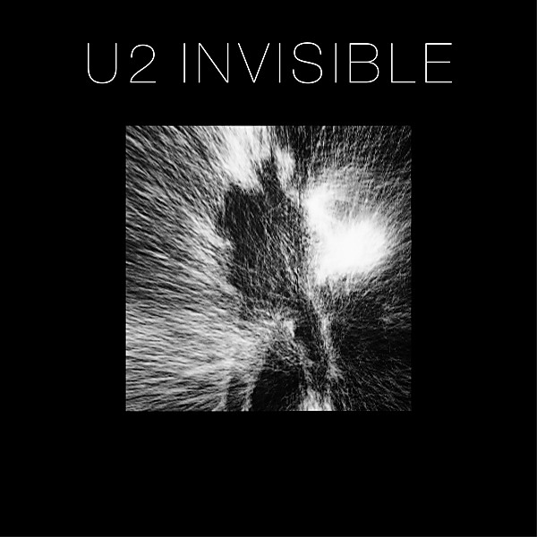

# Invisible (RED) Edit Version

By **U2**

## Album Data

- **Catalog:** Beets
- **Format:** Digital, Album
- **Album:** Invisible (RED) Edit Version
- **Artist:** U2
- **Albumartist:** U2
- **Genre:** Folk Rock
- **MusicBrainz Album Artist ID:** 
- **MusicBrainz Album ID:** 
- **MusicBrainz Release Group ID:** 
- **Year:** 2014
- **Catalog #:** 
- **Label:** Interscope Records
- **Total Tracks:** 11

## Album Tracks

### Track 01 - The Miracle (of Joey Ramone)

- **Artist:** U2
- **Format:** AAC
- **Genre:** Alternative Rock
- **Length:** 4:15
- **MusicBrainz Track ID:** [bae25e1d-a906-4906-85ee-6131d96ac08f](https://musicbrainz.org/recording/bae25e1d-a906-4906-85ee-6131d96ac08f)
- **Title:** The Miracle (of Joey Ramone)
- **Track:** 01
- **Year:** 2014

### Track 02 - Every Breaking Wave

- **Artist:** U2
- **Format:** AAC
- **Genre:** Alternative Rock
- **Length:** 4:12
- **MusicBrainz Track ID:** [9187c14d-a9c0-4a19-8516-43af7dcc3dc7](https://musicbrainz.org/recording/9187c14d-a9c0-4a19-8516-43af7dcc3dc7)
- **Title:** Every Breaking Wave
- **Track:** 02
- **Year:** 2014

### Track 03 - California (There Is No End to Love)

- **Artist:** U2
- **Format:** AAC
- **Genre:** Indie Rock
- **Length:** 3:59
- **MusicBrainz Track ID:** [6bb3c6da-1a20-4903-8186-f2997e45d860](https://musicbrainz.org/recording/6bb3c6da-1a20-4903-8186-f2997e45d860)
- **Title:** California (There Is No End to Love)
- **Track:** 03
- **Year:** 2014

### Track 04 - Song for Someone

- **Artist:** U2
- **Format:** AAC
- **Genre:** Gothic Rock
- **Length:** 3:46
- **MusicBrainz Track ID:** [6eb62ec8-b47a-445e-a492-0f99fb7ba3ab](https://musicbrainz.org/recording/6eb62ec8-b47a-445e-a492-0f99fb7ba3ab)
- **Title:** Song for Someone
- **Track:** 04
- **Year:** 2014

### Track 05 - Iris (Hold Me Close)

- **Artist:** U2
- **Format:** AAC
- **Genre:** Alternative Rock
- **Length:** 5:19
- **MusicBrainz Track ID:** [fd73bb55-d12e-4d13-aa7a-3147def5eb6b](https://musicbrainz.org/recording/fd73bb55-d12e-4d13-aa7a-3147def5eb6b)
- **Title:** Iris (Hold Me Close)
- **Track:** 05
- **Year:** 2014

### Track 06 - Volcano

- **Artist:** U2
- **Format:** AAC
- **Genre:** Gothic Rock
- **Length:** 3:14
- **MusicBrainz Track ID:** [94c65ddf-8fbc-4de0-a90e-c44d558829ae](https://musicbrainz.org/recording/94c65ddf-8fbc-4de0-a90e-c44d558829ae)
- **Title:** Volcano
- **Track:** 06
- **Year:** 2014

### Track 07 - Raised by Wolves

- **Artist:** U2
- **Format:** AAC
- **Genre:** Post-Punk
- **Length:** 4:05
- **MusicBrainz Track ID:** [bde2aaf4-8daf-477e-8ea0-554efe03592f](https://musicbrainz.org/recording/bde2aaf4-8daf-477e-8ea0-554efe03592f)
- **Title:** Raised by Wolves
- **Track:** 07
- **Year:** 2014

### Track 08 - Cedarwood Road

- **Artist:** U2
- **Format:** AAC
- **Genre:** Alternative Rock
- **Length:** 4:25
- **MusicBrainz Track ID:** [9ad23f5c-f708-484d-8ff8-7f832162365c](https://musicbrainz.org/recording/9ad23f5c-f708-484d-8ff8-7f832162365c)
- **Title:** Cedarwood Road
- **Track:** 08
- **Year:** 2014

### Track 09 - Sleep Like a Baby Tonight

- **Artist:** U2
- **Format:** AAC
- **Genre:** Alternative Rock
- **Length:** 5:01
- **MusicBrainz Track ID:** [049fe4ba-e28b-4611-a1b7-510e82cfd8f3](https://musicbrainz.org/recording/049fe4ba-e28b-4611-a1b7-510e82cfd8f3)
- **Title:** Sleep Like a Baby Tonight
- **Track:** 09
- **Year:** 2014

### Track 10 - This Is Where You Can Reach Me Now

- **Artist:** U2
- **Format:** AAC
- **Genre:** Bossa Nova
- **Length:** 5:05
- **MusicBrainz Track ID:** [18f59b3d-0d5d-4920-b131-8b864d36cf0a](https://musicbrainz.org/recording/18f59b3d-0d5d-4920-b131-8b864d36cf0a)
- **Title:** This Is Where You Can Reach Me Now
- **Track:** 10
- **Year:** 2014

### Track 11 - The Troubles

- **Artist:** U2
- **Format:** AAC
- **Genre:** Rock
- **Length:** 4:45
- **MusicBrainz Track ID:** [0811ba4f-ecfd-44d0-922e-2c9de3474f03](https://musicbrainz.org/recording/0811ba4f-ecfd-44d0-922e-2c9de3474f03)
- **Title:** The Troubles
- **Track:** 11
- **Year:** 2014

## See also

- [Songs of Innocence](Songs_of_Innocence.md)
- [Vinyl: Angel Of Harlem](../../Vinyl/U2/Angel_Of_Harlem.md)
- [Vinyl: Desire](../../Vinyl/U2/Desire.md)
- [Vinyl: ](../../Vinyl/U2/U2.md)
