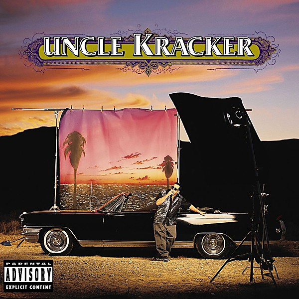

# Double Wide

By **Uncle Kracker**

## Album Data

- **Catalog:** Beets
- **Format:** Digital, Album
- **Album:** Double Wide
- **Artist:** Uncle Kracker
- **Albumartist:** Uncle Kracker
- **Genre:** Rock
- **MusicBrainz Album Artist ID:** 
- **MusicBrainz Album ID:** 
- **MusicBrainz Release Group ID:** 
- **Year:** 2000
- **Catalog #:** 
- **Label:** 
- **Total Tracks:** 00

## Album Tracks

### Track 02 - Better Days

- **Artist:** Uncle Kracker
- **Format:** AAC
- **Genre:** Stoner Rock
- **Length:** 4:50
- **MusicBrainz Track ID:** 
- **Title:** Better Days
- **Track:** 02
- **Year:** 2000

### Track 05 - Heaven (ft Kid Rock)

- **Artist:** Uncle Kracker
- **Format:** MP3
- **Genre:** Rock
- **Length:** 4:19
- **MusicBrainz Track ID:** 
- **Title:** Heaven (ft Kid Rock)
- **Track:** 05
- **Year:** 2000

### Track 08 - Whiskey And Water

- **Artist:** Uncle Kracker
- **Format:** MP3
- **Genre:** Rock
- **Length:** 4:42
- **MusicBrainz Track ID:** 
- **Title:** Whiskey And Water
- **Track:** 08
- **Year:** 2000

